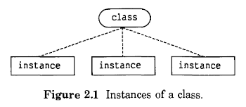
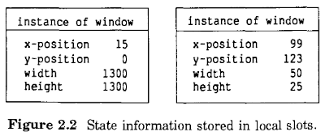
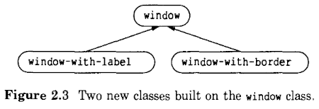
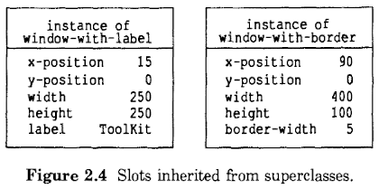
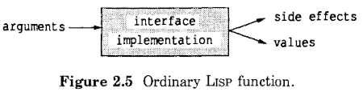
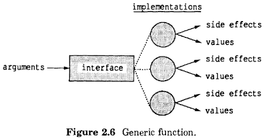
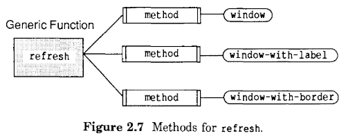
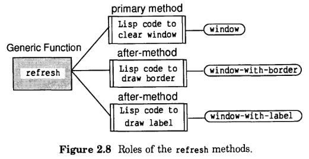
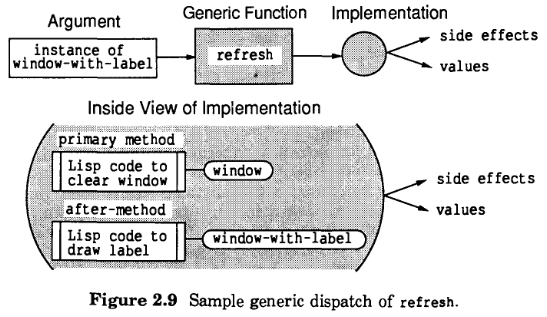

# 2 CLOS程序的元素

CLOS程序的元素包括类、实例、泛型函数和方法。这些元素都不能单独考虑，因为每个元素的目的都是以有用和可预测的方式与其他元素交互。我们首先介绍这些元素最重要的方面，并检查它们之间的关系。然后，我们将描述CLOS是如何与 COMMON LISP 集成的，重点是类(class)和类型(type)之间的共同点。

## 2.1 类和实例

编写CLOS程序的第一步是定义一种被称为类(class)的新型数据结构。类是一种 COMMON LISP 的类型。该类型的每一个对象都是该类的实例。每一个特定的类的实例与该类的其他实例具有相同的结构、行为和类型。

我们可以定义一个名为 `month` 的类，该类将会有代表一月、二月、三月等的实例。或者我们可以定义一个名为 `window` 的类来表示显示在终端屏幕上的窗口。当我们需要创建一个新窗口时，我们会创建一个该类的实例。图2.1显示了一个包含三个实例的类。

我们可以使用 COMMON LISP 的类型函数查询实例的类型。尽管所有实例都可以识别为同一类型，但每个实例都有一个单独的标识。这与 COMMON LISP 的模型是兼容的，在该模型中，两个对象可以具有相同的类型和相同的结构（例如两个具有相同内容的数组），但可以是两个不同的对象，每个对象都有自己的标识。

## 2.2 槽（slot）

我们说过，一个类的所有实例都具有相同的结构。该结构以槽的形式存在。槽有名字和值。槽的名字描述了它正在建模的特性，值描述了在给定时间内槽的状态。状态信息有可能通过访问器读取和写入。

CLOS提供两种槽：本地槽和共享槽。对于本地槽，每个实例都保存着其自己的槽值。对于共享槽，所有实例共享一个单一的槽值。由于本地槽的使用频率更高，我们在这里将重点介绍它们；我们将在[本地槽和共享槽](04-method.md#41-实现选择方法-vs-槽)中讨论共享槽。

名为 `window` 的类可能具有名为 `x-position`、`y-position`、`width` 和 `height` 的本地槽。这些状态信息可以描绘任何给定窗口的大小及其位置。图2.2显示了 `window` 类的两个实例的槽的名字和值。

请注意，同一个类的两个实例具有同名的槽集合。换句话说，它们具有相同的结构。但是，每个实例都在自己的本地槽中维护着自己的值；也就是说，每个实例都有自己的状态。

## 2.3 超类

CLOS使您能够根据已有的类构建出新的类；作为组件的类称为新类的超类。新类从其超类继承结构（槽）和行为。

这种编程风格非常适合为相互关联的多种对象建模。例如，我们可能希望有不同种类的窗口。除了普通窗口，我们可能还需要带标签的窗口和带边框的窗口。新的窗口种类与现有的窗口类类似，但它们具有额外的功能。图2.3显示了两个新类，带标签的窗口和带边框的窗口，它们构建在现有类 `window` 上。

要通过已有的组件构建出新的类，请在类的定义中包含一个类列表。它们被称为新类的直接超类。在图2.3中，每一个箭头从一个类指向该类的直接超类。事实上，类不仅是从它的直接超类构建的，而且是从它的每一个直接超类的超类构建的，以此类推。超类是子类的组件类。术语"子类"是超类的反义词。下面，我们将此术语应用于 `Window` 类：

> `window` 是 `window-with-border` 的直接超类
> `window` 是 `window-with-label` 的直接超类

> `window-with-border` 是 `window` 的直接子类
> `window-with-label` 是 `window` 的直接子类

图2.4显示了 `window-with-border` 的实例和 `window-with-label` 的实例。`window-with-label` 类继承其超类 `window` 的四个槽，并且还有一个名为 `label` 的槽。类似地，`window-with-border` 类继承了 `window` 类的槽，并且还有一个名为 `border-width` 的槽。因此，窗口的基本结构只定义一次（由 `window` 类定义），并由多种窗口继承。

槽在内存中的存储顺序取决于实现，通常是对程序员不可见的。

## 2.4 泛型函数

程序和用户使用泛型函数对实例进行操作。对于调用方来说，调用泛型函数与调用普通的 Lisp 函数在语法上完全相同。调用函数时，不需要知道该函数是定义为普通函数还是泛型函数。

从概念上讲，泛型函数执行高级操作，例如，对于不同类型的窗口，“刷新窗口”这个动作可能需要不同的工作；普通窗口只需要清除，而带有边框的窗口必须先清除，再重新绘制边框。对于不同类型的窗口，必须以不同的方式实现“刷新窗口”这个高级的目标。换句话说，每种类型的窗口都需要适合它的实现。

当我们比较普通函数和泛型函数的工作方式时，我们会发现语义上的差异。普通的 Lisp 函数定义指定了它执行的操作的接口和实现。如图2.5所示，当调用普通 Lisp 函数时，Lisp 系统定位并执行实现该函数的单个代码体。

泛型函数仅仅指定了接口。泛型函数的实现不存在于同一个地方；它分布在一组方法中。普通函数的实现不会因调用而异，而泛型函数的实现会因其参数的类别而异。

考虑刷新三种窗口的任务。我们可以定义一个名为`refresh`的泛型函数，它可以用于刷新任何类型的窗口。该接口是相同的，而不考虑`window`的类。然而，这三类窗口中的每一类都需要稍微不同的 `refresh` 实现。`window` 的实例被简单地清空，窗口覆盖的屏幕区域变为空白。对于 `window-with-border` 的实例，将清除窗口并重新绘制边框。类似地，对于 `window-with-label` 的实例，将清除窗口并重新绘制标签。图2.6显示了一个泛型函数可以有几个单独的实现。

调用 `refresh` 时，CLOS确定参数的类并为该类选择适当的实现。每个实现可能由一个或多个方法组成。确定要调用哪些方法然后调用它们的过程称为泛型调度。只要调用了泛型函数，泛型调度就会自动发生。

在 `refresh` 示例中，泛型调度仅使用一个参数（`window`）来选择实现。在[方法](#25-方法)中，我们将展示CLOS泛型调度可以使用多个参数来选择具体的实现。

## 2.5 方法

方法是泛型函数的底层实现。与普通的 Lisp 函数一样，方法接受参数、执行计算，可能会产生副作用，如生成输出和返回值。与普通 Lisp 函数不同，方法不直接调用；它们通过泛型调度过程进行调用。

程序员通过在方法的 lambda-list 中声明方法所处理的参数的类，将方法附加到该方法所实现的泛型函数以及一个或多个类。只有当泛型函数的参数属于适当的类时，才会调用该方法。

例如，图2.7显示泛型函数 `refresh` 可能有三个附加方法，一个用于 `window` 类，一个用于 `window-with-label` 类，一个用于 `window-with-border` 类。

我们说过，一个类的所有实例都有相同的行为。实例的行为通过方法来实现。类从其超类继承方法。例如，`window-with-border` 类和 `window-with-label` 类从 `window` 类”继承方法。

一组参数的实现与个体方法之间不一定存在一一对应关系。当调用泛型函数时，参数可能会选择由多个方法组成的实现。

## 2.6 方法的角色

CLOS可以将泛型函数的工作（对于某些给定的参数）拆分为几个方法。这种能力源于方法是继承的，并且方法可以有不同的角色。方法的角色说明了它在实现泛型函数中所起的作用。

*primary 方法* 承担泛型函数的大部分工作。有时候，一个 primary 方法会通过一组特定的参数完成泛型函数的所有工作。在某些情况下， primary 方法需要辅助方法的帮助，例如 before 方法和 after 方法。在调用 primary 方法之前先调用 before 方法；他们可以在调用其他方法之前进行一些设置工作。在调用 primary 方法之后再调用 after 方法；他们可以做清理工作或者别的计算。（CLOS还支持 around 方法，我们将在[around方法](05-generic-dispatch.md#53-around方法)中讨论。） 

 primary 方法返回泛型函数的值。before 方法和 after 方法仅用于副作用；它们不需要返回值。

鉴于类继承方法，这种机制允许在类及其超类之间进行分工。例如，一个类可以提供 primary 方法来执行大部分的工作，而其他类则提供辅助方法来执行额外的工作。

`refresh` 的实现可以很好地利用这个模型。在刷新时，这三种窗口都必须先清除掉。因此，我们可以为 `window` 类定义一个 primary 方法。对于 `window` 实例，只要这个 primary 方法就已经足够了。

`refresh` 的 primary 方法被 `window-with-border` 类和 `window-with-label` 类继承。这是可行的，因为在执行任何其他操作之前，都需要清除这两个类的窗口。`window-with-border` 实例的边框必须重新绘制；这可以通过 `window-with-border` 类的 after 方法来完成。因此，`window-with-border` 类提供了一个辅助方法来执行其特有的行为，但它从超类继承了 primary 方法。类似地，我们需要定义一个 after 方法，将其附加到 `window-with-label` 类，以重新绘制标签。

图2.8显示了每个方法都包含执行某些任务的 Lisp 代码，并且每个方法都有一个角色。`refresh` 的实现分布在三个不同的方法中。`window` 类的 primary 方法执行了整个工作中共享的部分，该方法由构建在 `window` 上的两个类继承。刷新 `window` 的实例时，CLOS只调用一个方法，即 `window` 类的 primary 方法。

图2.9显示了当要刷新的参数是 `window-with-label` 实例时所选实现的内部视图。

在图2.9中，CLOS选择了由两个方法组成的实现： `window` 类的 primary 方法，以及 `window-with-label` 类的 after 方法。

## 2.7 继承的控制者

继承是在一组类之间共享特性和行为。槽是继承特性的一个例子。类定义还可以指定其他的特性，例如槽的默认值；这些也是可以继承的。行为的继承表现为方法的继承。一个类继承自它的所有超类。

当您从一组类中组合一个程序时，继承必须以有序和可预测的方式进行。例如，假如有两个超类提供了相互冲突的特性，比如相同泛型函数的方法会发生什么。如何处理这种冲突？ 

这个概念在人类遗传学中有相似之处：婴儿可能有一个棕色眼睛的基因和一个蓝色眼睛的基因。婴儿的眼睛颜色是由棕色眼睛基因对蓝色眼睛基因的优势决定的。当两个类提供相互竞争的特征时，CLOS通过检查哪个类优先于另一个类来解决冲突。

当你设计类的组织时，你同时也指定了类之间的优先级关系。CLOS根据您的组织计算类优先级列表。“类优先级列表”控制着方法、槽和其他特征的继承方式。

每个类都有一个类优先级列表，其中包括类本身及其所有超类。类优先级列表中的类按照从最特定到最泛化的顺序排列。当这个列表中的一个类比另一个类更特定时，它就比另一个类有优先权(或优势)。因此，如果这两个类提供了相互竞争的特性，那么更具体的类将优先于不太具体的类。类优先级列表将在后面的[类优先级列表](06-inheritance.md#62-类优先级列表)中详细讨论。

## 2.8 CLOS模型概述

真实世界中的对象是由 Lisp 对象建模的，这些对象被称为实例。您可以使用泛型函数来操作这些对象。在调用泛型函数时，泛型调度会根据参数的类自动安排要调用的合适的实现。

实例的结构由它的类决定。每个实例维护着一组被命名的槽，并在其中存储着状态信息。某个类的所有实例都具有相同的结构和相同的行为。泛型函数的实现由一个或多个方法组成，这些方法是根据类进行选择的。

为了继承结构和行为，你可以在其他类的基础上构建出新的类;这是模块化设计的关键所在。类从它的超类继承槽和方法。

## 2.9 CLOS对COMMON LISP的扩展

CLOS是 COMMON LISP 的兼容性扩展。本节将比较 COMMON LISP 的类型(type) 和CLOS的类(class)，比较 `defstruct` 结构和类，并重点介绍CLOS提供的新功能。

我们首先讨论 type 和 class 之间的相似性。在 COMMON LISP 中，每个 Lisp 对象都有一个类型（type）。在CLOS中，每个 Lisp 对象都有一个类型 （type） 和一个类（class）。CLOS基于现有的 COMMON LISP 类型系统;它并没有发明一个全新的类型系统。

类（class）本身也是 COMMON LISP 的类型，这意味着您可以使用类作为 `typep` 的第二个参数。回想一下，`typep` 测试一个对象是否是给定的类型，其中“给定的类型”既包括该类型本身，也包括那些更泛化的类型（例如：一个整数，它既是 `'integer` ，也是 `'number`）。由于CLOS的类名本身也是类型说明符，所以，如果`class-name`是`instance`的类或超类，则求值`(typep instance class-name)`表达式将会回返回`t`。

COMMON LISP 允许您通过使用 `typecase` 根据对象的 type 选择操作。CLOS为基于对象的类（class）选择操作提供了自动支持。你编写了附加到类的方法; 当调用泛型函数时，CLOS根据参数的类自动选择适当的方法。

COMMON LISP 的 `defstruct` 使您能够定义具有定制的内部结构的新的数据类型。这个新的数据类型可以继承以前使用 `defstruct` 定义的类型。类似地，CLOS`defclass`工具使您能够定义具有定制的内部结构的新类。新类可以继承现有的类。

type 和 class 之间的相似之处提出了一个重要的问题。既然已经有了 type , 为什么还需要 class?下面的比较，虽然并不全面，但是指出了CLOS类最重要的优点。

- CLOS支持代码与对象类型之间的自动关联。COMMON LISP `typecase` 机制提供了一种将代码体与对象类型相关联的方法。然而，这种联系是局部的;有必要在每个操作依赖于对象类型的地方显式地使用 `typecase`。要升级程序以支持额外的对象类型，您需要编辑每一个 `typecase` 表达式，以在新类型和适合于这些类型的操作之间创建链接。 CLOS帮助您抽象适合于不同类型的操作。调用者可以使用对象上的操作，而不需要知道这些操作是如何为不同类型的对象实现的。 CLOS使您能够定义方法，这些方法在本质上链接到一个对象类。选择适合对象类型的操作(泛型调度)的过程是完全自动的。CLOS提供了一种方便的方式将代码永久链接到对象的类型，并消除了在 `typecase` 表达式中维护链接的负担。

- CLOS提供了多继承。使用 `defstruct`，您可以使用 `:include` 选项从一个组件 type 构建新的类型。相反，`defclass` 允许您从任意数量的组件类构建一个新类。CLOS的多重继承比 `defstruct` 的单一继承提供了更多的灵活性和更强大的能力。
- CLOS提供了灵活的行为继承。CLOS支持结构的继承，其方式与 COMMON LISP `defstruct` 非常相似。尽管 `defstruct` 和类都从它们的组件继承槽，但用于继承行为的CLOS机制要比 COMMON LISP  受限制的 `defstruct` 机制强大得多。

一个 COMMON LISP 的 `defstruct` 结构体可以使用任何访问器来读写它的组件所提供的槽;这就是行为继承的范围。相反，CLOS支持一种更加透明和灵活的行为继承方法:子类从其超类继承方法。子类可以定义自己的 primary 方法来覆盖掉继承的行为。子类可以通过添加 before 方法或 after 方法来修改继承的行为，定制通过继承得到的 primary 方法的行为。此外，CLOS还提供了一些先进的技术，可以进一步控制行为的继承。
