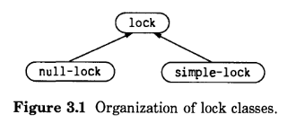
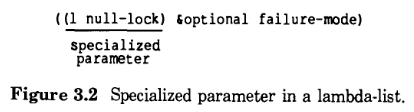
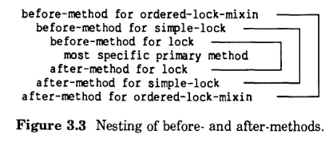

# 3 开发一个简单的CLOS程序：锁

本章通过一个示例应用程序的开发演示了使用CLOS编程的强大功能。我们首先定义类，并设置反映类之间如何关联的组织。然后我们定义接口，该接口指定客户端如何创建和操作这些类的对象。最后，我们定义了实现;这是接口下面的 Lisp 代码。接口是一组泛型函数，实现由这些泛型函数的方法组成。接口声明了可以对这些对象执行哪些操作，而实现声明了操作在内部如何进行。

在这一章中，我们从不同的角度来看待程序: 我们像一个程序员那样设计和开发它; 我们像客户一样使用它; 最后我们分析它的各个部分是如何相互作用的，就像CLOS本身一样。

## 3.1 锁的概述

这个示例应用程序的目标是实现锁——用于控制对某些共享资源的并发访问的对象。例如，在一个会议中，在任何给定的时间只有一个人是可以发言的。比如，“请史密斯先生发言”，这个表述清楚地表明，“发言权”(共享资源)受到保护，不能被其他人同时使用。在本例中，我们使用术语“捕获”来描述加锁或获得锁的行为，而“释放”则表示放弃锁。

锁只有在一个环境中才有意义，在这个环境中，多个进程可以在一个给定的时间争夺一个资源。在这里，进程被定义为单个 Lisp 环境中的多个独立的控制线程。锁用于确保以一致的方式访问共享资源。在访问资源之前，进程应该抢占与之关联的锁。对资源的使用完成后，该进程应该释放锁。

我们认识到进程并不是 COMMON LISP 的一部分，这个示例程序在没有多进程的 COMMON LISP 实现中是没有意义的。然而，我们的目标不是开发一个在所有环境下都能工作的程序; 相反，我们只想展示一个简单的面向对象风格的例子。因此，即使锁在您的 COMMON LISP 环境中没有用处，也请继续阅读。

如果一个锁已经被捕获但还没有释放，我们称它为“busy”，如果它可以被捕获，我们称它为“free”。当一个锁 busy 时，捕获它的进程称为它的“owner”（所有者）。

我们将把锁实现为 Lisp 对象。锁的接口必须包含以下操作:

| Operations | Describe                                |
| ---------- | --------------------------------------- |
| Create     | 创建一个新的锁                             |
| Seize      | 捕获一个锁。如果成功，返回一个锁对象。         |
| Release    | 释放一个锁，如果该锁属于正在试图释放它的同一进程。|

锁有很多种可能的类型，我们希望我们的锁程序是可扩展的，因为我们计划稍后支持更复杂的锁类型。例如，我们最终可能需要一个可以避免死锁情况的锁。僵局发生在一个人拿着黄油盘并伸手去拿黄油刀的同时，另一个人拿着黄油刀并伸手去拿黄油盘。(双方同时陷入等待，谁也无法完成)

我们首先定义两种基本类型的锁，稍后可以将它们用作其他类型锁的构建块。

| Type        | Describe   |
| --------    | --------   |
| Simple lock | 这种锁有一个名字。锁不是忙就是空闲的。如果锁繁忙，它将跟踪它的所有者，即进程。|
| Null lock   | 这种锁也有一个名字，但它不对 busy 还是 free 的状态保持跟踪。<br>实际上，Null lock 总是空闲的。Null lock 支持普通的锁操作，而不需要保护自己不被其他进程捕获。<br>这种锁允许程序一致地处理有时需要避免同时访问而有时又允许同时访问的资源。<br>程序照常执行捕获和释放锁的动作，而锁的类型(无论是 Null lock 还是其他类型的锁)<br>决定资源是否受到保护。|

## 3.2 定义对象的种类——类

现在，我们必须将 Null lock 和 Simple lock 的英文描述翻译成CLOS语言了

- 设计一个使用继承的程序
- 使用槽存储状态信息
- 用 `defclass` 宏定义类
- 请求读写槽的方法
- 给槽一个默认的初始值

**选择表示锁的类**

虽然乍一看似乎我们应该定义两个类(一个表示简单锁，另一个表示空锁)，但我们可以通过在图3.1所示的组织中定义三个类来更好地利用继承。



`simple-lock` 类和 `null-lock` 类在它们的定义中包含了`lock`类;我们说它们是在 `lock` 类的基础上构建的。它们都继承自 `lock` 类。这里有一个术语提示:

> lock 是 null-lock 的直接超类
> lock 是 simple-lock 的直接超类
> null-lock 是 lock 的直接子类
> simple-lock 是 lock 的直接子类

我们称 `lock` 为一个基础类。术语“基础类”没有特殊的技术意义(`lock` 类的行为就像任何其他类一样)，仅仅是描述了类的用途。`lock` 类是所有锁的基础;它的目的是贡献所有锁的共同特征。所有锁共享的主要特征是它们都是锁。通过在名为 `lock` 的类上构建所有的锁类，我们可以使用`(typep object 'lock)`来确定一个对象是否是一个锁。

此外，`simple-lock` 和 `null-lock` 都有名字，“名字”特征是由 `lock` 类提供的，并被各种锁继承。提供基础类的另一个原因是便于定义默认方法。基础类的方法将成为默认方法。继承了基础类的任何子类都可以选择使用默认方法，也可以选择覆盖掉默认方法，或者通过 before 方法或 after 方法在继承得到的默认方法的基础上支持附加的行为。总之，我们定义 `lock` 类有三个原因:

- 它使我们能够使用`(typep object 'lock)`来检查一个对象是否为锁
- 它为所有锁提供"名字"特征
- 它支持所有锁的默认行为

我们不打算让这个类独立存在，因为我们并不打算创建它的实例。`lock` 类将没有一组完整的方法来支持锁协议。

**使用defclass**

`lock` 类的定义如下：

```lisp
(defclass lock ()
  ((name :initarg :name :reader lock-name))
  (:documentation "The foundation of all locks."))
```

对这个表达式求值将会创建一个名为 `lock` 的新类，其中有一个名为 `name` 的槽。它还创建了泛型函数 `lock-name`，以及方法 `lock-name`，该方法允许您读取任何类型为 `lock` 的对象的 `name` 槽的值。接下来，我们检视类定义的每一部分，看看它做了什么:

> `defclass` 

用于定义新类的宏

> `lock`

类的名字

> `()`

直接超类的列表，这里的列表是空的，因为我们没有为 lock 指定任何超类

> `((name :initarg :name :reader lock-name)) `

槽指示符的列表。每个槽指示符可以是一个符号(槽名)或者是一个列表(槽名后跟着槽选项)。这里我们有一个名为 `name` 的槽，有两个槽选项:

> `:initarg :name`	

这个选项使得在创建实例时可以初始化这个槽的值。要初始化 `name` 槽，可以给`make-instance`指定`:name`关键字参数。(注意，`make-instance`是CLOS函数，用于创建新实例;我们将在[使用make-instance或构造函数](#331-使用make-instance或构造函数)中进行讨论。)

> `:reader lock-name`

这个选项允许使用泛型函数 `lock-name` 来读取这个槽的值。这个槽选项导致CLOS系统为 `lock-name` 自动生成了一个方法，`lock-name` 被称为读取器泛型函数。

> `(:documentation "The foundation of all locks.")` 

这是一个类选项;它适用于整个类。`:documentation`选项提供一个文档字符串，描述类的用途。您可以通过调用 `documentation` 函数来检索类的文档字符串。

**从超类继承**

`null-lock` 的定义说明了如何在超类基础上定义一个子类。这里的 `null-lock` 类构建在一个超类即`lock` 类之上。

```lisp
(defclass null-lock (lock)
  ()
  (:documentation "A lock that is always free."))
```

`null-lock`类从它的超类锁继承了以下内容:

- `name` 槽	- 每一个 `null-lock` 的实例都有一个叫做 `name` 的槽

- 槽选项 `:initarg :name` - 您可以在创建 `null-lock` 实例时初始化 `name` 槽。

- `lock-name`方法 - 您可以在`null-lock`的实例上使用读取器 `lock-name` 来读取`name`槽的值。

**访问器**

现在我们定义类`simple-lock`。一个 `simple-lock` 可以跟踪它是忙碌还是空闲。`simple-lock`的定义中有一个 `owner` 槽，该槽通过记住当前哪个进程拥有该锁来指示 `simple-lock` 是忙碌还是空闲。一个空闲的锁将其 `owner` 槽设置为 `nil`，一个忙碌的锁将其 `owner` 槽设置为当前拥有该锁的进程。

```lisp
(defclass simple-lock (lock)
  ((owner :initform nil :accessor lock-owner))
  (:documentation "A lock that is either free or busy."))
```

`simple-lock`类从`lock`类继承了与`null-lock`完全相同的特征和行为。请注意，`simple-lock` 类从它的超类继承了`name`槽，并添加了自己的槽，即`owner`槽。`simple-lock`的定义还包括两个新的槽选项:

`:initform nil`

这个槽选项允许您为槽提供一个默认的初始值。在这里，`owner` 槽的默认初始值为 `nil`。这意味着，当创建 `simple-lock` 时，它是空闲的。

`:accessor lock-owner`

这个槽选项允许您访问 `owner` 槽，以便读取或写入槽的值。CLOS生成两个泛型函数:一个称为 `lock-owner` 的读取器泛型函数和一个相应的写入器泛型函数。CLOS还为每个泛型函数定义了方法。因此，您可以通过使用泛型函数 `lock-owner` 来读取 `owner` 槽的值，也可以通过使用带有 `lock-owner` 的 `setf` 来写入槽的值。

这个读取器泛型函数的名字是符号 `lock-owner` 。要调用读取器，请使用普通的函数调用语法，例如:

    (lock-owner lock-object)
	
写入器的泛型函数名字是 `(setf lock-owner)`。这个列表不是一个可以求值的表达式;它是函数的名字——换句话说，它是“函数说明符”。要调用 writer，应该使用下面的`setf`语法:

    (setf (lock-owner lock-object) new-value)
	
槽选项`:reader`和 `:accessor` 是相似的。`reader` 选项仅为读取器泛型函数生成方法。`:accessor` 选项生成两个方法:一个用于读取器，一个用于写入器。术语 *访问器泛型函数* 是一个综合性术语，它包括读取器和写入器。通常，如果要读取槽，需要定义读取器;如果要读写槽，则需要定义两种访问器。

**锁类中的槽**

下面我们回顾一下如何使用 `name` 和 `owner` 槽，并将其与所选择的槽选项关联起来:

`name`： 每个锁都有一个名字。在创建锁时，将其作为参数传递给 `make-instance` 来初始化名字。我们没有为 `name` 槽提供默认的初始值，因为这么做没有意义; 每个锁都应当有一个符合其用途的名字，so no default name would be appropriate in enough cases to make defaulting  worthwhile.

我们可以使用读取器 `lock-name` 来确定锁的名字。我们没有提供改变锁名的方法，没有针对锁名的写入方法。

`owner`： 每个 `simple-lock` 都有一个所有者。当创建 `simple-lock` 时，`owner` 槽总是初始化为`nil`。我们不允许这个槽被 `make-instance` 的参数初始化，因为我们希望所有新创建的简单锁都是空闲的。

我们可以使用读取器 `lock-owner` 来找出一个简单锁的所有者。我们可以使用 `lock-owner` 对应的写入器方法来更改一个简单锁的所有者。写入器的名字是`(setf lock-owner)`。这个写入器方法在 `seize` 方法中很有用，但是我们不希望它成为接口的一部分。

尽管`:initform`和`:initarg`的名字类似，但它们用于不同的目的。`:initarg`选项允许您为`make-instance`提供一个参数来初始化槽的值。因此，使用这个槽选项使得`make-instance`的调用者能够为槽指定一个初始值。对于 `name` 槽，我们使用`:initarg`。

相反，`:initform`为槽提供了一个默认的初始值。该槽被初始化为`:initform`选项中指定的值，而不是由`make-instance`的参数初始化。对于`owner`槽，我们使用`:initform`。

## 3.3 创建新对象——实例

如果我们创建一些锁并对它们进行操作，我们编写的代码会感觉更真实。在下面的小节中，我们将创建`simple-lock`和`null-lock`的实例，并对它们进行实验。

**使用make-instance或构造函数**

创建新实例的函数是`make-instance`。下面我们使用`make-instance`创建一个空锁，并将它的`name` 槽初始化为`"null lock"`:

```lisp
(setq *null-lock*
      (make-instance 'null-lock :name "Null lock"))
=> #<NULL-LOCK 802335>
```

下面我们使用`make-instance`来创建一个 simple-lock，并将它的 `name` 槽初始化为`"Simple lock"`:

```lisp
(setq *simple-lock*
      (make-instance 'simple-lock :name "Simple lock"))
=> #<SIMPLE-LOCK 802393>
```

你可以使用`make-instance`创建一个类的实例。第一个参数是类的名字。后面的参数是初始化参数，后面跟着值。在这里，初始化参数`:name`用一个值初始化了 `name` 槽。

我们建议您定义构造函数，让客户端使用它来创建实例。构造函数是一种定制的方法，用于创建给定类的实例;通常它的名字描述了它所创建的实例的类。构造函数提供了一个比`make-instance`更抽象的外部接口，因为它的名字描述了它的高级目的(制作 null-lock )，而不是它的内部实现(制作一个`null-lock`类的实例)。

另一个优点是构造函数可以有必要的参数。相反，`make-instance`的所有参数(除了第一个)都是可选的。我们可能更倾向于要求用户初始化锁的名字。

你可以使用`defun`来定义构造函数，然后在函数体中调用`make-instance`函数。例如，这里定义了两个构造函数，一个用于创建`null-lock`，另一个用于创建`simple-lock`:

```lisp
(defun make-null-lock (name)
  (make-instance 'null-lock :name name))

(defun make-simple-lock (name)
  (make-instance 'simple-lock :name name))
```

**使用访问器**

我们将把`make-null-lock`和`make-simple-lock`作为接口的一部分，供客户端在创建新锁时使用。因此，客户端使用构造函数而不是`make-instance`:

```lisp
(make-null-lock "Null lock")
(make-simple-lock "Simple lock")
```

我们可以尝试使用通过带`:reader`和`:accessor`选项的`defclass`自动生成的 reader 和 writer 泛型函数。

我们有一个读取器泛型函数`lock-name`，以及它的方法。该方法附加到`lock`类，并且被`null-lock`和`simple-lock`继承，因为它们都构建在`lock`之上。

```lisp
(lock-name *null-lock*)   => "Null lock"
(lock-name *simple-lock*) => "Simple lock"
```

我们还有一个读取器泛型函数名为`lock-owner`，以及相应的写入器泛型函数名为`(setf lock-owner)`。每个访问器都有一个附加到`simple-lock`类的方法。我们可以在`simple-lock`的实例上使用这些访问器。

在下面的例子中，我们在新创建的简单锁上使用`lock-owner`，这表明`owner`槽的初始值为`nil`。然后，我们调用写入器泛型函数将槽的值设置为`3401`，然后再次调用读取器来查看该值是否确实为`3401`。

```lisp
(lock-owner *simple-lock*)               => nil
(setf (lock-owner *simple-lock*) 3401)   => 3401
(lock-owner *simple-lock*)               => 3401
```

我们不能在`null-lock`的实例上使用`lock-owner`者或`(setf lock-owner)`。对于这些泛型函数，`null-lock`没有附加任何方法，空锁也不会为它们继承任何方法。因此，如果我们试图在`null-lock`的实例上使用这些泛型函数，CLOS将发出"no applicable method"错误的信号。

```lisp
(lock-owner *null-lock*)
ERROR:  No applicable method for LOCK-OWNER
for the argument #<NULL-LOCK 802335>

(setf (lock-owner *null-lock*) 3401)
ERROR:  No applicable method for (SETF LOCK-OWNER)
for the argument #<NULL-LOCK 802335>
```

**查询锁的类型**

现在我们有了实例，我们可以演示CLOS与现有的 COMMON LISP 类型层次结构巧妙地集成在一起。所有类的名字都是 COMMON LISP 类型说明符，因此可以使用`type-of`和`typep`来查询Lisp对象的类型。实例的类型就是它的类。

```lisp
(type-of *null-lock*)               => NULL-LOCK
(type-of *simple-lock*)             => SIMPLE-LOCK

(typep *simple-lock* 'simple-lock)  => t
(typep *simple-lock* 'lock)         => t
(typep *simple-lock* 't)            => t
```

我们使用`typep`如图所示,表明锁`*simple-lock*`不是只有`simple-lock`类型,但它也是`lock`类型和`t`类型的。当一种类型是另一种类型的子类型时，这完全类似于`typep`对于其他COMMON LISP 类型说明符的工作方式。例如，`integer`类型的对象也是`number`类型，因为`integer`是`number`的子类型。类似地，所有对象都是`t`类型。

这一点的意义与继承有关。实例`*simple-lock*`是`simple-lock`, `lock`和`t`的类型。这意味着每一个类都可以为`*simple-lock*`贡献结构和行为。因此，我们可以使用`typep`来找出实例中的行为是否受到特定类的影响。

类似地，要找出一个类与另一个类的关系，可以对类使用`subtypep`:

```lisp
(subtypep 'simple-lock 'lock)      => t
(subtypep 'null-lock 'lock)        => t
(subtypep 'null-lock 'simple-lock) => nil t
```

结果证实了我们已经知道的:`simple-lock`是`lock`的子类型，`null-lock`是`lock`的子类型，而`null-lock`不是`simple-lock`的子类型。

`subtypep`的第一个值表示第一个参数是否是第二个参数的子类型。`subtypep`的第二个值表示第一个值的确定性。如果不知道这两种类型之间的关系，则值将为`nil nil`。这种情况可能发生在COMMON LISP 类型中，但不可能发生在两个类中。当`subtypep`的两个参数都是类名时，第二个值总是`t`。

## 3.4 定义接口——泛型函数

通过为客户机提供创建新锁的方法，我们已经完成了接口的一部分。每种锁都有自己的构造函数来创建新锁。构造函数`make-simple-lock`创建一个简单锁，`make-null-lock`创建一个空锁。构造函数是普通函数，而不是泛型函数。

一旦创建了锁，它必须支持两个锁操作:`seize`和`release`。我们将把这些操作作为泛型函数来实现。

**使用defgeneric来文档化接口**

我们可以使用`defgeneric` 表达式来文档化每一个泛型函数的接口。该接口包含了三个概念，每一个概念都以`defgeneric`表达式表示:

| 接口        | defgeneric 的描述     |
| ---        | ---                  |
| 预期的参数   | lambda-list 中的参数  |
| 它能做什么   | 文档字符串            |
| 它的返回值   | 文档字符串            |

您可以使用`defgeneric`来文档化泛型函数，以便程序员调用它或为它定义额外的方法。`defgeneric`表达式还为泛型函数设置了准则，以后对程序进行扩展时必须遵循这些准则。

`defgeneric`表达式将泛型函数描述为一个整体。`seize`和`release`的`defgeneric`表达式在文档字符串中提供了英文文本，描述了泛型函数的总体目的。文档字符串不是程序的功能性部分;它实际上什么都不做。但是，如果没有这些文档，想要阅读代码并了解程序如何工作的人就必须查看方法的定义，并试图根据方法集来辨别泛型函数的总体目的。

```lisp
(defgeneric seize (lock)
  (:documentation
   "Seizes the lock.
Returns the lock when the operation succeeds.
Some locks simply wait until they can succeed, while
other locks return NIL if they fail."))

(defgeneric release (lock &optional failure-mode)
  (:documentation
   "Releases the lock if it is currently owned by this process.
Returns T if the operation succeds.
If unsuccessful and failure-mode is :no-error, returns NIL.
if unsuccessful and failure-mode is :error, signals an error.
The default for failure-mode is :no-error."))
```

在 Lisp 中，lambda-list 是函数的一部分，用于指定函数参数的名字。用于`seize`的`defgeneric`表达式指定一个必需参数（其名字为`lock`），用于`release`的`defgeneric`表达式指定了一个名为`lock`的必需参数和一个名为`failure-mode`的可选参数。

如图所示，文档字符串看起来有些笨拙，但将它们靠左对齐是有原因的。如果我们缩进它们，`documentation`函数也会以缩进的方式显示它们，这不是我们想要的。没有必要将文档字符串的第一行靠左对齐，但是对于第一行之后的字符串，我们选择这种样式，只是为了与后面的行保持一致。

**创建一个泛型函数**

`defgeneric` 表达式创建一个新的泛型函数。使用`defgeneric`并不是定义泛型函数的唯一方式。另一种方式是 直接定义方法。如果为泛型函数定义了一个方法，而该泛型函数本身还不存在，那么CLOS将会自动创建它。泛型函数的 lambda-list 是由该方法的 lambda-list 导出的。稍后你可以使用`defgeneric`来指定泛型函数的 lambda-list、文档字符串和其他任何选项;CLOS根据新的定义修改现有的泛型函数。

虽然通过`defgeneric`显式地文档化接口不是必需的，但这样做通常会使其他人更容易了解你的程序是如何工作的，并为希望扩展程序的程序员提供指导。

**参数模式的建立**

`defgeneric`表达式建立了一个参数模式，该模式必须由该泛型函数的所有方法遵循。因此，`defgeneric` 表达式的lambda-list 是程序的一个功能部分。CLOS要求所有方法的 lambda-list 和泛型函数的 `defgeneric` 表达式具有相同的“形状”或“完全相等”。lambda-list 必须具有相同数量的必需参数和相同数量的可选参数。关键字参数 &key 的一致性的特殊的规则。完整的细节，见[lambda-list的一致性](#72-lambda-list的一致性)。

**命名问题**

泛型函数的形参名字应该暗示泛型函数可以操作的对象的类。在这里，我们使用名字“lock”来表示泛型函数可以用于任何锁。“lock”碰巧也是类名，但是并没有强制性的要求泛型函数的参数名必须是类名。

同样的原则也适用于泛型函数的名字。名字应该告诉我们一些关于函数用途的信息，并且应该回答“它有多通用?”例如，稍后我们可以在协议中添加一个泛型函数来重置锁，这对调试很有用;一个进程可以重置另一个进程拥有的锁。“reset-lock”这个名字要比“reset”好，因为“reset”太笼统了。给泛型函数起一个过于笼统的名字的潜在缺陷与泛型函数的所有方法都必须具有一致的 lambda-list 的要求有关。如果我们将一个泛型函数命名为“reset”，而几个不同的程序想要编写方法来重置不同类型的设备，那么不同的程序很可能会建立不同的参数模式，这是不允许的。

**锁协议**

泛型函数定义单个操作的接口。在设计阶段，这是一个有价值的概念，因为它帮助您将重点放在接口上，而将实现的细节留到后面。在程序维护期间，它也是有价值的。程序开始时出现的一组 `defgeneric` 表达式可以用来记录程序各个部分的角色。

泛型函数组合在一起可以称之为协议。协议包含了程序中对象的完整行为。例如，锁协议的基础如下:

> 必须有创建新锁的方法，而且所有现有锁都必须支持捕获和释放操作。

锁协议必须传递关于每个操作的语义的更多信息:参数、操作内容和返回值。对于泛型函数，此信息包含在各个`defgeneric`表达式中。

协议的思想为我们提供了另一种应用程序的视角。“什么是锁?”这个问题可以用“锁是遵守锁协议的对象”来回答。现在我们有了锁的操作定义。这种观点允许对空锁进行自然而准确的描述:“空锁遵守锁协议，实际上并不保护任何东西不受同步访问的影响。”请注意，根据这个定义，基础类`lock`的实例并不是锁，因为它不遵守锁协议。

当我们根据协议来定义锁时，我们采取的是外部视角。如果我们从内部的视角来看，可以将锁义为“包含了`lock`类的任何类的实例”。内部和外部视角都是有效和有用的。使用锁的软件开发人员受益于外部视角。在定义构成锁程序的类和方法时，锁的实现者采用的是内部视角。然而，实现者也不能忽略外部的视角，因为实现必须确保遵循已发布的锁协议。

我们讨论的不是协议的形式化概念，而是程序员在设计和描述面向对象程序时发现的有用的非正式概念。CLOS不包括任何强制协议的机制。

## 3.5 定义实现——方法

在本节中，我们将为空锁和简单锁定义方法。我们将详细讨论方法，包括何时调用方法、它接收什么参数以及方法如何为参数提供默认值。在整个讨论中，请记住 argument （实参）和 parameter （形参）这两个术语之间的区别。您在调用 Lisp 函数时向它提供 argument (实参)，并在定义函数时为函数的参数(形参)命名。在函数体中，可以使用相应的形参来引用实参。因此，形参是在函数执行期间绑定到实参的变量。关于不同类型参数的详细信息，请参阅 Steele 的 COMMON LISP: the Language，第59-61页。

泛型函数和方法使用相同的术语。`defgeneric`表达式的 lambda-list 命名了泛型函数的参数，`defmethod`表达式的lambda-list 命名了方法的参数。

**空锁的方法**

实现空锁的目的是在执行锁操作的程序中禁用锁。该程序遵循其正常的捕获和释放例程，而不需要特殊的“调试模式”(在异常情况下关闭锁)。这些方法的存在使得空锁可以在任何程序需要锁的地方使用。

空锁上的锁操作方法很简单。它们是 primary 方法，它们完成了它们实现的泛型函数的所有工作。每种方法都遵循其泛型函数的接口。由于这些方法实际上并不捕获或释放任何东西，所以它们总是成功的，并且它们总是返回指示成功的值。

```lisp
(defmethod seize ((l null-lock))
  l)                               ; 返回 lock, 无需等待

(defmethod release ((l null-lock) &optional failure-mode)
  (declare (ignore failure-mode))  ; 对空锁做释放操作，永远也不会失败
  t)
```

**方法的lambda-list**

在面向对象的程序中，理解方法的作用范围是很重要的。这个方法什么时候适用? lambda-list 通过使用专门化参数来声明方法的范围，这些参数将方法附加到一个或多个类。当泛型函数的参数满足 lambda-list 中的专门化参数的要求时，方法就是适用的。

图3.2显示了release方法的 lambda-list，它有一个专门的参数`l`。



方法的 lambda-list 是一个普通的 lambda-list，只有一个区别。它区分了两种参数:

- 专门化参数通过说明此方法应用的参数的类来指示方法的适用性。专门化参数是一个包含变量和类名的列表。这个参数被认为是那个类的专门化。您可以对任何必需的参数进行专门化，但不能对`&optional`、`&key`或`&rest`参数进行专门化。
- 普通参数不能表示方法的适用性;它只是将一个变量绑定到泛型函数的参数上。

尽管专门化参数与带有默认值的普通参数具有相同的语法，但是不存在歧义。在方法中，必需参数可能专门化，但没有默认值。可选参数不能专门化，但可以有默认值。

**方法的适用性**

调用泛型函数时，CLOS会选择一组适用的方法。如果泛型函数的参数与该方法的专用参数匹配，则该方法适用。要使参数匹配，它必须是类指示的类型。这包括类本身的实例和基于该类构建的类（子类）的实例。

在图3.2的 lambda-list 中，只有第一个参数是专门化的。参数特指名为 `null-lock` 的类，表明当泛型函数的第一个参数是 `null-lock` 的实例或其子类的实例时，该方法是适用的。换句话说，以下表达式必须为真： 

    (typep argument 'null-lock)
	
有时我们说类“继承方法”这是用来描述“实例可以使用其超类的方法”这一事实的自然方式。这个模型允许我们描绘一个类和附加到该类的方法之间的链接。

请务必记住，方法可以包含任意数量的专用参数。一个方法可以有多个类的链接；它链接到被用作参数专门化的所有类。我们将在第75页的“多重方法”中讨论这种编程风格。对于具有多个专用参数的方法，“方法适用性”模型比“继承方法”模型更合适。我们可以用一句话来表达方法的适用性规则： 

> **方法的适用性规则**
> 
> 如果泛型函数的相应参数满足其每个专用参数，则该方法适用。

许多方法只有一个专用参数。与我们在锁程序中定义的所有方法一样，访问器方法也属于这一类。对于只有一个专用参数的方法，我们将继续使用“方法继承”模型。

**传递给方法的实参**

当CLOS选择泛型函数的实现并调用方法时，它会将提供给泛型函数的所有参数传递给每个方法。lambda-list 中的变量绑定到参数。在方法体中，可以通过使用泛型函数或普通函数来操作绑定到对象的变量。

例如，当对 `null-lock` 的实例调用 `release` 时，将调用我们为 `release` 定义的方法。变量 `l` 绑定到泛型函数的第一个参数 `lock`。

变量 `failure-mode` 绑定到第二个参数。该方法选择忽略此变量，因为它不需要使用它。即使该方法不使用此参数，也必须通过在 lambda-list 中包含参数来显式允许它。这是必要的，因为该方法接收传递给泛型函数的所有参数。

**锁和进程**

在定义简单锁的方法之前，我们需要进一步讨论进程。我们的示例假设进程实际上不是并发执行的，而是交错执行的，就像使用单个处理器的时间切片时发生的那样。

由于 COMMON LISP 目前没有包含处理进程的函数，为了本例的目的，我们假设有三个原语，它们支持共享地址空间中的多个进程。这些原语不是CLOS或 COMMON LISP 的一部分。

`without-process-preemption` &body *body*

这个特殊形式的 body 运行时没有进程被调度器抢占的风险。换句话说，body 是进程调度方面的一个原子操作。

`process-wait` *reason function &rest arguments*

这个函数是等待的原语。当前的进程将进入等待，直到函数对参数的应用重新返回非`nil`。此时`process-wait`返回将 `function` 应用到 `arguments` 的值。参数`reason`是一个描述等待原因的字符串。

`*current-process*`

这个变量的值是当前执行进程的标识符。

现在我们定义`setf-if`宏，我们将在 `seize` 和 `release` 方法中使用它。`setf-if` 宏将广义变量的值与期望值进行比较。如果这两个值相同，`setf-if` 将变量的值设置为一个新值并返回`t`;否则，它不会改变值并返回`nil`。`setf-if` 使用 `without-process-preemption` 来确保操作是自动发生的，以确保在 `setf-if` 测试变量和更改变量的同时，其他进程不能更改变量。

```lisp
;; If value of place is old-value, set it to new-value
;; Return t if the setf worked, nil otherwise
(defmacro setf-if (place old-value new-value)
  `(without-process-preemption
       (cond ((eql ,place ,old-value)
              (setf ,place ,new-value) t)
             (t nil))))
```

请注意，一个真正的多进程系统将包含它自己的`setf-if`操作的定义，这无疑将更有效，并将更好地处理求值顺序问题。

**简单锁的方法**

首先，我们定义 `check-for-mylock` 来检查常见的进程试图抢占它已经拥有的锁的错误。在这种情况下，下面的 `check-for-mylock` 方法会发出错误信号。我们将在`seize`方法中用到`check-for-mylock`。

```lisp
(defmethod check-for-mylock ((l simple-lock) process)
  (when (eql (lock-owner l) process)
    (error "Can't seize ~A because you already own it." l)))
```

下面的 `seize` 方法使用了 `do` 迭代，直到 `setf-if` 成功。在每一次迭代中，`setf-if` 通过使用 `lock-owner` 来确定锁的 `owner` 槽是否为 `nil` 来确定锁是否是空闲的。如果锁是空闲的，`setf-if` 将其所有者设置为当前进程，从而捕获它。(这是由`setf-if`自动完成的。)如果锁第一次没有释放，则调用`process-wait`来等待，直到 `lock-owner` 返回`nil`，这表示锁当前是空闲的。然后`setf-if`表达式再次尝试。

```lisp
(defmethod seize ((l simple-lock))
  (check-for-mylock l *current-process*)
  (do ()
      ((setf-if (lock-owner l) nil *current-process*))
    (process-wait "Seizing lock"
                  #'(lambda () (null (lock-owner l)))))
  l)
```

注意，do的主体不是必需的，因为如果没有它，终止测试本身也将重复迭代，直到`setf-if`成功。问题是，在最终成功之前，`setf-if`可能会占用大量的机器时间。相反，在do语句体中使用`process-wait`则允许其他进程运行，并且只在可能成功时才尝试`setf-if`。

下面的`release`方法使用`setf-if`作为一种方便的方法来确保试图释放锁的进程是锁的当前所有者。如果不是的话，`setf-if`不会释放锁。

```lisp
(defmethod release ((l simple-lock)
                    &optional (failure-mode :no-error))
  (or (setf-if (lock-owner l) *current-process* nil)
      (ecase failure-mode
        (:no-error nil)
        (:error (error "~A is not owned by this process" l)))))
```

**方法的默认可选参数**

`simple-lock`的`release`方法的 lambda-list 为可选参数`failure-mode`提供了一个默认值。方法的 lambda-list 可以为任何可选参数提供默认值，但不能为必需参数提供默认值。`defgeneric`表达式不能为其`lambda-list`中的任何参数提供默认值。

## 3.6 专门化锁的行为

至此，我们已经完成了应用程序锁的需求。定义了接口，完成了实现。在本节中，我们将通过专门化锁的打印表示和描述来进行最后的修改。我们将描述系统提供的用于打印和描述一个对象的默认方法，并讨论为什么提供一个方法来覆盖默认行为是很有用的。我们还将展示方法如何具有不同的角色并协同工作。

**控制锁的打印表示**

空锁和简单锁的打印表示如下所示:

```
#<NULL-LOCK 738592>
#<SIMPLE-LOCK 220478>
```

这个输出给出了锁的类型和存储实例的内存地址。但是，它没有给出锁的名字。我们可以改变锁的打印方式，让打印出来的锁的表示法包含锁的名字、类型和在内存中的地址:

```
#<NULL-LOCK "Debug lock" 738592>
#<SIMPLE-LOCK "Database lock" 220478>
```

CLOS指定每当调用一个打印函数(比如print、prin1、princ、write、format等)时，Lisp 总是会调用泛型函数 `print-object`。这个泛型函数为程序提供了一个钩子，用来控制各种对象类的打印表示。

每个CLOS实现都为打印对象提供一个默认方法。默认方法由所有用户定义的类继承。但是，任何类都可以提供一个方法来重写默认方法。

我们通过专门化打印对象来使用这个钩子。从概念上讲，专门化泛型函数意味着使该泛型函数针对给定的一组参数以自定义的方式运行。我们通过定义泛型函数的方法来专门化泛型函数。在这种情况下，我们将提供一个方法来覆盖继承的方法，然后锁将以定制的方式打印。

在编写方法之前，你必须了解泛型函数的接口。`print-object` 的接口记录在CLOS规范中。CLOS指定泛型函数 `print-object` 在流上打印一个对象，然后返回该对象。它接受两个必需的参数，一个对象和一个流。当 Lisp 调用 `print-object` 时，流参数将是一个真正的流，而不是 `t` 或 `nil`。（这与 print 不同，它接受 `t`或 `nil` 作为流参数。） 

**专门用于锁的print-object**

我们希望当第一个参数是一个锁的时候，选择该方法来打印对象。换句话说，我们希望所有类型为锁的对象都继承这个方法。由于只有第一个参数将用于方法选择，因此该方法的 lambda-list 有一个专用参数和一个普通参数。

```lisp
(defmethod print-object ((l lock) stream)
  (format stream "#<~S ~A ~D>"
          (type-of l)
          (if (slot-boundp l 'name)
              (lock-name l)
            "(no name)")
		      #+genera (sys:%pointer l)
          #+sbcl (sb-kernel:get-lisp-obj-address l)
          #+clisp (system::address-of l))
  l)

```

一旦定义了这个方法，每当打印一个锁时都会使用它，结果正是我们想要的。

函数 `sys:%pointer` 不是 COMMON LISP 的一部分； 在某些实现中，它是一个返回内存中对象地址的函数。`print-object` 方法打印对象的地址很有用，因为它将这个对象与其他对象区分开来，这有助于调试。但是，由于垃圾回收，对象的地址可能会发生变化。

打印对象的方法不应发出错误信号； 应该可以毫无错误地获得任何 Lisp 对象的打印表示。`lock` 的 `print-object` 方法使用 `slot-boundp` 在调用 `lock-name` 之前检查锁是否有名字。如果`name`槽未绑定，`lock-name`访问器将发出错误信号； 请参见[读取未绑定槽](#)。

记住此方法的作用范围很重要。我们知道它附加到 `lock` 类，因此可以使用该类的内部细节的知识。我们还知道它是由类 `simple-lock` 和 `null-lock` 继承的，并将用于 `simple-lock` 和 `null-lock` 的实例。此方法不能使用任何子类的内部细节。例如，这个方法可以使用读取器泛型函数 `lock-name`，因为 `lock` 类 有这个方法； 但是，它不能使用读取器泛型函数 `lock-owner`，因为唯一具有 `lock-owner` 方法的类是 `simple-lock`。如果此方法确实使用了 `lock-owner`，并且 `print-object` 的参数是`null-lock`，则将在运行时发出错误信号以指示 `lock-owner` 没有适用的方法。

虽然这个方法必须限制它自己对锁类的了解，但我们知道这个方法是由其他类继承的。人们在第一次学习编写面向对象程序时经常犯的一个错误是，假定该方法只会被`lock`的实例调用，而不会被`lock`的子类的实例调用。该方法可能做出了错误的假设，并产生了声明实例是一个`lock`的输出，而不是认识到对象可能是一个基于`lock`构建的子类的实例。但是，通过使用`type-of`查询对象的类型，我们意识到有几个不同的类将继承这个方法。

**默认方法是什么?**

系统的`print-object`方法是所有用户定义类的对象的默认方法。我们为`lock`类提供了一个打印对象的方法。这是所有锁的默认方法，因为所有锁都建立在`lock`的基础上。

和术语“基础类”一样，术语“默认方法”也没有技术意义。这些术语只是描述类或方法的预期用途。一个基础类通常是一组类的基础。默认方法是由一组类继承的。许多基础类提供默认行为;因此，默认方法通常被附加到基础类。

**专门化锁的描述**

除了控制锁的打印表示之外，为人们提供一种更详细地检查锁的方法也是有用的。

一种方法是专门化用于描述的泛型函数。另一种方法是为新的泛型函数编写一个方法，比如 `show-lock`。两种方法都可以完成相同的任务，但通常最好是扩展一个熟悉的 COMMON LISP 函数，而不是引入一个新函数。这种方法只有在函数是泛型函数时才有效。（注：在现代的 Lisp 实现中，`describe` 是普通函数而非泛型函数，所以，这一节的代码无法在现代 Lisp 实现中运行）。

与`print-object`类似，`describe` 是一个由CLOS提供的泛型函数，因此用户可以针对给定的对象类专门化其行为。系统提供的默认方法是可用的，但您可以提供一个方法来覆盖它。

`describe` 接口表示它接受一个参数，将参数的描述输出到标准输出，并且不返回任何值。这个方法专门用于描述锁:

```lisp
(defmethod describe ((l lock))
  (format t "~&~S is a lock of type ~S named ~A."
          l (type-of l)
          (if (slot-boundp l 'name)
              (lock-name l)
              "(no name)"))
  (values))
```

这个 primary 方法适用于所有锁。它被空锁和简单锁继承。我们使用`slot-boundp`来确保如果`name`槽被取消绑定，描述方法不会发出错误信号。

**描述简单锁的after方法**

`describe`的 primary 方法并没有给出适合于 `simple-lock` 的描述。`simple-lock`的一个关键元素是它的所有者(如果它当前是 busy 的话)。`lock`提供的描述方法不能提供此信息，因为`lock`类并没有所有者。

我们想专门化`simple-lock`的`describe`的行为，这样它既能提供与`lock`的`describe`方法相同的信息，而且还能描述`simple-lock`的所有者。

我们可以为用于`simple-lock`类的`describe`提供一个 primary 方法，以覆盖从`lock`类继承的方法。当然，为了显示锁的类型和名字，并确保没有返回值，我们必须复制代码。然而，代码的重复与面向对象的编程风格是对立的。我们不应该重写该方法，而是应该设法继承它并向它添加额外的行为。

我们可以通过为`simple-lock`类提供一个 after 方法来实现这一点。after 方法负责描述简单锁的所有者。

在简单锁上调用泛型函数 `describe` 时，泛型调度过程首先调用由 `lock` 类提供的 primary 方法，然后调用由 `simple-lock` 提供的 after 方法。泛型函数返回 primary 方法返回的值，这正是我们想要的。after 方法返回的任何值都将被忽略。after 方法用于执行副作用，而不是返回值。after 方法限定符是关键字`:after`。这个方法限定符给出了方法的角色。到目前为止，我们只看到了没有方法限定符的 primary 方法。如果一个方法有任何限定符，它们会紧跟在泛型函数的名字之后。

```lisp
(defmethod describe :after ((l simple-lock))
  (let ((owner (lock-owner l)))
    (format t (if owner
                  "~&It is now owned by process ~A.~%"
                  "~&It is now free.~%")
            owner)))
```

当为简单锁调用`describe`泛型函数时，将会调用两个方法。当为空锁调用 `describe` 泛型函数时，只会调用一个方法，`describe` 只有一个接口，但它有多种实现。这就是术语泛型函数的含义。

在这种方法中，我们假设`owner`槽是绑定的。如果不是，此方法将发出错误信号。有序锁的语义要求 `owner` 槽要么是进程要么是`nil`。

**系统默认的describe方法**

`describe` 的默认方法的行为取决于实现。通常，默认方法给出对象的类型以及其槽的名字和值。为什么描述锁的默认方法是不可取的？ 

我们的方法不仅仅是显示槽的名字和值，而是更进一步，传达了槽及其值背后的语义。我们的 `describe` 方法提供的输出给出了锁的英语概念描述。我们的`describe` 方法的输出如下所示： 

```
#<SIMPLE-LOCK File lock 2417> is a lock of type
SIMPLE-LOCK named File lock.
It is now owned by Process 3299.
```

典型的系统提供的默认的 `describe` 方法输出如下所示： 

```
#<SIMPLE-LOCK "File lock" 2417> is of type SIMPLE-LOCK,
with slots:
						NAME:							"File lock"
						OWNER:						 3299
```

提供为对象类定制的描述方法还有另一个优点。通常，需要隐藏对象实现的细节。默认方法只能通过公开其实现来描述对象。通过提供 `describe` 方法，可以控制用户查看对象的方式。

## 3.7 锁的继承性分析

到目前为止，我们一直在编程，对继承应该如何工作有着深刻的理解。在这一点上，值得更详细地检查继承，并明确它背后的一些机制。

**覆盖继承的特征**

我们的锁组织包括基柮类 `locak` 和基于 `lock` 的两个类。`simple-lock`和 `null-lock` 都继承自 `lock` 类。此外，所有用户定义的类都继承自 `standard-object` 类。

`standard-object` 类是一个预定义的类，其目的是支持默认行为。也就是说，几个系统提供的默认方法附加到 `standard-object` 类。

考虑一下当 `print-object` 泛型函数以一个空锁实例作为其参数被调用时会发生什么。`null-lock` 类有两个适用于打印对象的 primary 方法：附加到 `lock` 的方法和附加到 `standard-object` 的方法。

| Class | print-object 方法 |
| ----  | ----             |
| lock  | primary          |
| standard-object | primary |

在这里，我们看到两个提供了竞争特性的`null-lock`的超类； 也就是说，相同的泛型函数的 primary 方法。这是一个冲突，但它的解决方法是简单明了的。其中一种方法比另一种更匹配。方法的优先级与其适用的类的优先级直接相关。在`null-lock`的类优先级列表中，`lock`类在`standard-object`之前，所以`lock`提供的方法会覆盖`standard-object`提供的方法。

`lock` 比 `standard-object` 更匹配的原因是一个类优先于它的超类。`standard-object`类是`lock`类的超类。

**空锁和简单锁的类优先级列表**

类优先级列表是冲突特征的仲裁者。CLOS根据程序员设置的类组织确定每个类的类优先级列表。在这个过程中，CLOS必须回答两个问题： 

- 这个类继承了哪些类？ 一个类继承自其自身及其所有超类。这包括它的直接超类、它们的每个直接超类等等。CLOS从一组类定义中派生出这些信息。
-  这些类之间的优先顺序是什么？ 这个问题的答案也来源于类定义。CLOS使用一种算法来确定优先级，该算法始终遵循以下类优先级规则： 

> **类的优先规则 1：**
> 一个类总是优先于它的超类。

我们已经提到所有用户定义的类都有 `standard-object` 作为超类。此外，所有类都将 `t` 作为超类。类` t `是所有类的根。正如所有类型都是`t`的子类型一样，所有类都是 `t` 的子类。

考虑简单锁的例子。这个类继承自它自己、simple-lock 及其超类、lock、standard-object 和 t。当CLOS将规则 1 应用于这些类定义中的每一个时，结果是一组排序约束： 

> simple-lock 优先于 lock
> simple-lock 优先于 standard-object
> simple-lock 优先于 t
> lock 优先于 standard-object
> lock 优先于 t
> standard-object 优先于 t

类优先级列表必须满足所有这些约束。生成的 `simple-lock` 类优先级列表是:

    (simple-lock lock standard-object t)
	
与此类似，`null-lock` 类的类优先级列表是：

    (null-lock lock standard-object t)
	
确定这两个类的类优先级列表是一件简单的事情。对于具有多个直接超类的类来说，这更加困难。我们在 48 页的[有序锁的类优先级列表]()中引入了另一个类优先级规则来解决这种情况。

**泛型调度过程**

当调用泛型函数时，CLOS负责选择适合参数的实现。这需要找到适用的方法，然后按优先顺序对它们进行排序，最后调用其中的一个或多个。此过程称为泛型调度。每当调用泛型函数时，它都会自动发生。

您首先负责定义类和方法，并了解泛型调度的工作原理。CLOS负责处理泛型调度背后的机制。

| 你所做的 |CLOS做的 |
| ----------- | ------------ |
| 定义一个类 | 根据类定义计算类优先级列表 |
| 定义方法   | 保存调用泛型函数时使用的方法 |
| 调用泛型函数 | 确定参数的类型<br>找到一组适用的方法<br>根据类优先级列表从最具体到最一般对方法进行排序<br>调用before方法<br>调用最匹配的 primary 方法<br>调用after方法<br>从 primary 方法返回值 |

尽管调用泛型函数听起来像是一个缓慢而复杂的过程，但良好的CLOS实现会对其进行优化，预先计算许多步骤。事实上，在某些实现中，调用泛型函数几乎与调用普通函数一样快。这样的优化可以使CLOS足够高效，例如，可以在操作系统(注：Genera )中使用。

我们在第 50 页的[before方法和after方法的顺序]()中讨论了before方法和after方法的执行顺序。

## 3.8 扩展锁程序

锁应用程序的设计现在已经完成，简单锁和空锁的实现已经完成。我们现在试图向已有的锁应用程序添加一种新的锁。在本节中，我们将说明如何定义一个“mixin类”作为构建块，以及在mixin和另一个类上构建的“聚合类”。

**使用有序锁避免锁死**

某些操作要求您访问多个共享资源。您可能希望从一个数据结构中删除一个项，然后将其添加到另一个数据结构中。如果数据结构是共享资源，并且具有防止同时访问的锁，则在执行添加和删除操作时，您必须拥有这两个资源上的锁。

这里是另一个场景：要获得黄油，你需要同时握住黄油盘和黄油刀。当你拿着黄油盘和刀时，你是在保护它们不被其他人同时使用（换句话说，你“拥有”这两个黄油资源的锁）。

当您需要同时拥有两个锁时，存在死锁风险。假设一个人拿着黄油盘正在等待黄油刀。与此同时，另一个人拿着黄油刀，正在等黄油盘。任何一个人都得不到黄油。在这种情况下，两个人都会意识到死锁已经发生，一个人可能会释放等待中的一个资源。以允许另一个人先获得黄油，然后释放这两个资源供其他人使用。在这个解决方案中，人们需要检测到并解决锁死。

当一个进程需要获取多个简单锁时，就存在着锁死的风险。请记住，如果一个简单的锁不能立即抓住一个资源，它将等待资源释放。

我们可以寻求避免死锁，而不是实现死锁检测和解决。我们会使用一种技术，其中所有进程都必须按照规定的顺序获取一组锁。我们可以在餐桌上采用这种方法，制定一条规则，即要获得黄油，必须先拿起黄油盘，然后再拿起黄油刀。如果所有人都遵守这条规则，那么就不会有人拿着黄油刀等待黄油盘，所以就不会发生僵局。

我们可以发明一种新的锁，称为有序锁，以帮助程序员使用这种技术。这使您能够将顺序分配给一组锁。有序锁机制是一种编程工具，它提供运行时错误检查，以确保不违反顺序。它检查正在运行的代码以查看程序是否存在死锁风险，并在这种情况下发出错误信号。

因此，如果我们预期进程在执行操作之前需要同时抓住锁-a和锁-b，我们可以使用有序锁。每个有序的锁都有一个锁级别。有序锁机制加强了这样的规则:如果进程已经拥有更高级别的锁，那么它就不能获取有序锁。我们可以给锁-a分配一个级别为1的锁，给锁-b分配一个级别为2的锁，以确保锁-a必须在锁-b之前被抓住。在这个方案中，所有的程序都应该写抢占锁-a，然后抢占锁-b，执行操作，最后释放两个锁。如果任何进程拥有锁-b并试图捕获锁-a，或有序锁机制会在运行时发出错误信号。这种方法确保没有进程可以处于拥有锁-b并等待锁-a的状态。

**定义混入类**

我们预计需要有序的空锁和有序的简单锁。这两个类的共同行为是有序锁行为。在这里，创建一个支持有序锁行为的混入 (mixin) 类非常有用。我们称这个类为`ordered-lock-mixin`。

这个混入类不是孤立的;我们不创建它的实例。相反，我们定义了两个聚合类，将这个混入类与其他锁类组合在一起，并创建它们的实例。聚合类被命名为`ordered-null-lock`和`ordered-lock`。术语“混入”和“聚合”是描述类的预期用途的非正式名字。

我们没有为`ordered-lock-mixin`指定任何超类。它有一个名为`level`的槽。可以在创建实例时初始化该槽，并使用读取器函数`lock-level`读取它的值。一旦创建了一个有序锁，我们就不希望改变它的级别，因此没有为`level`槽提供写入器。我们的实现只允许进程在没有拥有更高级别上的另一个有序锁的情况下获取有序锁。

```lisp
(defclass ordered-lock-mixin ()
  ((level :initarg :level
          :reader lock-level
          :type integer))
  (:documentation "Avoids deadlock by checking lock order."))
```

混入类的目的是定制其子类的行为。通常，其子类不会干扰或重写继承的行为。相反，子类通常会提供 before 方法和 after 方法，用定制的行为来扩充继承的 primary 方法。混入类还可能为其他泛型函数提供 primary 方法。

注意新的槽选项`:type`。这个槽选项声明您希望槽的值是某种类型的。一些实现忽略槽上的类型声明，而一些实现在使用了类型声明后可能获得效率提升。类型声明也是记录槽的一种方式。但是，当值存储在槽中时，不能依赖CLOS进行类型检查。尽管一些CLOS实现可能会选择进行类型检查，但并不要求它们这样做。此行为与 COMMON LISP 本身一致，后者具有松散的类型检查行为。

**定义聚合类**

在这里，我们通过包含所需的超类集来定义两个聚合类:

```lisp
(defclass ordered-lock (ordered-lock-mixin simple-lock)
  ()
  (:documentation
   "Avoids deadlock by ensuring that a process seizes
locks in a specific order.
When seizing, waits if the lock is busy."))

(defclass ordered-null-lock (ordered-lock-mixin null-lock)
  ()
  (:documentation
   "Avoids deadlock by ensuring that a process seizes locks
in a specific order. Does not actually seize anything,
but does check that the lock ordering is obeyed."))
```

聚合类包括一组超类，它们共同构成一个完整的整体，一个可以独立存在的类。这里，聚合类`ordered-lock`的大部分行为源自类`simple-lock`，并使用`ordered-lock-mixin`类的有序锁行为对其进行定制。聚合类很少提供额外的方法，因为这会增加耦合，使程序的模块化程度降低。理想情况下，所有的槽和方法都由基本类或混入类提供。这里的聚合类不需要任何进一步的修改。

我们需要为这两种新的锁类型定义构造函数:

```lisp
(defun make-ordered-null-lock (name level)
  (make-instance 'ordered-null-lock
                 :name name
                 :level level))

(defun make-ordered-lock (name level)
  (make-instance 'ordered-lock
                 :name name
                 :level level))
```

**有序锁的“类优先级列表”**

对于空锁和简单锁，CLOS可以通过仅引用 *规则1* 来确定类的优先级列表: **类总是优先于其超类** 。

但是，当一个类有多个直接超类时，这个规则就不足以确定类的优先级列表了。规则1没有指出如何对直接超类排序。例如，在确定 `ordered-lock` 的类优先级列表时，`ordered-lock-mixin` 的优先级是否高于 `simple-lock`，或者相反?CLOS在这种情况下使用另一个规则:

> **类的优先规则2**
> 每个类的定义设置了它的直接超类的优先顺序。

在`defclass`表达式中，直接超类的顺序声明了它们的相对优先级。例如，`ordered-lock` 的类定义包括两个直接超类:`ordered-lock-mixin`和`simple-lock`。因为`ordered-lock-mixin`在列表中首先(最左边)出现，所以它比`simple-lock`更匹配。

当我们考虑到这两条规则时，我们可以确定这两个聚合类的类优先级列表。`ordered-lock`的类优先列表为:

<pre>
    (ordered-lock ordered-lock-mixin simple-lock lock standard-object t)
</pre>

`ordered-null-lock`的类优先级列表是：

<pre>
    (ordered-null-lock ordered-lock-mixin null-lock lock standard-object t)
</pre>

**为有序锁专门化describe**

在深入研究有序锁的实现之前，我们专门化`describe`以显示有序锁的锁级别。因为锁级别是有序锁的一个关键方面，所以用`describe`来提供该信息非常重要。

```lisp
(defmethod describe :after ((l ordered-lock-mixin))
  (format t "~&Its lock level is ~D." (lock-level l)))
```

当我们尝试描述有序锁的一个实例时，CLOS找到了以下适用的方法:

| Class              | Method describe |
| ---                | ---             |
| ordered-lock-mixin | after           |
| simple-lock        | after           |
| lock               | primary         |
| standard-object    | primary         |

有两种适用的 primary 方法。`lock` 提供的 primary 方法是这两个方法中更匹配的一个，所以会调用它。

有两个可供调用的 after 方法。两者都会被调用。它们以“越具体的越往后”的顺序调用。这里首先调用`simple-lock`的`after`方法，因为它不那么具体。当它返回后，再调用`ordered-lock-mixin`的`after`方法。

```lisp
(setq *lock-C* (make-ordered-lock "C" 3))
=> #<ORDERED-LOCK C 29451>

(describe *lock-C*)
#<ORDERED-LOCK C 29451> is a lock of type ORDERED-LOCK named C.
It is now free.
Its lock level is 3.
=> no values
```

**before 方法和 after 方法的次序**

泛型调度过程查找所有适用的方法，其中可能包括几个`before`方法、`primary`方法和`after`方法。泛型调度过程调用以下方法： 

1. 所有的 before 方法以最具体的排第一的顺序排列。这允许一个更匹配的类在任何其他事情发生之前执行操作，其中“任何其他事情”包括继承的 before 方法、primary 方法和 after 方法。
2. 最具体的 primary 方法。如果需要，这允许更匹配的类重写继承的 primary 方法。
3. 所有 after 方法以最具体的排最后的顺序排列。这允许一个更匹配的类在其他所有事情发生之后执行操作，其中“其他所有事情”包括 before 方法、primary 方法和继承的 after 方法。

换句话说，一个类可以在从非特定类继承的行为之前做一些事情;它还可以在从非特定类继承的行为发生后做一些事情。对于熟悉 Lisp 的程序员来说，这种嵌套应该很自然。

想象一下，`ordered-lock-mixin`、`simple-lock` 和 `lock` 类都提供了一个 before 方法和 after 方法。图3.3显示了调用方法的顺序。



在实践中，这些 before 或者 after 方法中的任何一种都可以存在或不存在。调用泛型函数时，唯一的要求是必须至少有一个适用的 primary 方法。如果没有，则发出错误信号。

**实现有序锁的行为**

我们应该通过跟踪进程拥有哪些有序锁来实现有序锁行为。当一个进程试图捕获一个有序锁时，我们应该首先检查该进程是否已经拥有一个更高级别的有序锁。如果是这样，则该锁被认为是“无序”和无效的：发出错误信号，我们不允许进程获取该锁。否则，锁被认为是“有序的”和有效的，所以我们允许进程捕获它。

我们使用哈希表来跟踪每个进程拥有的有序锁。前两个函数用于在进程捕获或释放有序锁时更新表；后两个函数检查表。

```lisp
(defvar *process-lock-table* (make-hash-table)
  "Each key is a process identifier;
value is a list of ordered locks it owns")

(defun add-process-lock (process lock)
  (without-process-preemption
      (push lock
            (gethash process *process-lock-table*))))

(defun delete-process-lock (process lock)
  (without-process-preemption
      (let ((hash-entry
              (gethash process *process-lock-table*)))
        (setf (gethash process *process-lock-table*)
              (delete lock hash-entry)))))

(defun get-process-locks (process)
  (without-process-preemption
      (gethash process *process-lock-table*)))

(defun get-highest-lock (process)
  (first (get-process-locks process)))
```

在这段代码中，我们假设`gethash`和`setf gethash`操作不是原子性的，所以我们在使用这些函数时使用了`without-process-preemption`。请注意，获取最高锁取决于第一个锁是否为最高级别的锁。我们依赖于 `add-process-lock` 的调用者总是将一个更高级别的锁添加到表中: 这就是有序锁的意义所在。`delete-process-lock` 函数可以删除给定进程中的任何锁，但不会改变其余锁的顺序。

哈希表是一种简单而有效的方法，用于存储进程与其所拥有的有序锁之间的关联。在一些 Lisp 实现中，进程本身将被实现为某个类的实例。在这种情况下，可能每个进程都有一个槽，其中存储了一个有序锁的列表; 这将取代哈希表机制。

这里定义的函数是进程及其有序锁列表之间关联的接口。我们将在实现有序锁的方法中使用该接口。没有什么能阻止我们在某一天从哈希表切换到另外一种表示法。我们可以重新定义这些函数，以不同的方式完成它们的工作，而不影响到函数的调用者。例如，我们可以将它们从普通函数更改为泛型函数和方法，而无需改动调用者。

**有序锁的方法**

在允许进程捕获一个有序锁之前，我们检查它当前是否拥有一个更高级别的锁。我们通过为`seize`定义一个`before`方法来做到这一点。如果`before`方法确定进程可以有效地捕获锁，那么它就直接返回。这个方法不做任何实际的锁，但是假设另一个方法会处理这个问题。如果`before`方法确定进程获取此锁是无效的，则会发出错误信号。由于错误永远不会返回，因此不会调用其他方法。泛型函数`seize`的调用由于调用`error`导致的非本地退出而中止。因此，如果需要，这个方法可以防止锁被捕获。

```lisp
(defmethod seize :before ((l ordered-lock-mixin))
  "Checks validity of this process seizing this ordered lock.
If invalid, signals an error.
If valid, does nothing and allows primary method to run."
  ;; First check for the mylock mistake to give the specific
  ;; error for that case, instead of the "Out of order" error,
  (check-for-mylock l *current-process*)
  ;; Now check for a possible infraction of ordered locking,
  (let ((highest-lock (get-highest-lock *current-process*)))
    (when (and highest-lock
               (<= (lock-level l) (lock-level highest-lock)))
      (error "Out of order: Can't seize ~A while owning ~A"
             l highest-lock))))
```

当一个进程捕获了一个有序的锁后，需要更新`*process-lock-table*`来将这个锁与进程关联起来。我们用一个 after 方法来完成这个更新:

```lisp
(defmethod seize :after ((l ordered-lock-mixin))
  "Adds the lock to the *process-lock-table*"
  (add-process-lock *current-process* l))
```

同样，在释放一个有序锁之后，我们必须更新 `*process-lock-table*`。我们需要另一个 after 方法来处理这个更新:

```lisp
(defmethod release :after ((l ordered-lock-mixin)
                           &optional failure-mode)
  "Deletes a lock from the *process-lock-table*"
  (declare (ignore failure-mode))
  (delete-process-lock *current-process* l))
```

`ordered-lock-mixin`类提供了一个 before 方法来检查情况(实际上是检查“mylock”和“out of order”错误)和一个 after 方法来记录情况(锁和进程之间的新关联)。这些是 before 和 after 方法的典型用法。

这是有序锁的简化实现，因为此代码不处理在不合适的时间发生中止的可能性，从而使进程表与锁的实际状态不一致。这些细节被省略了，因为它们与面向对象编程的讨论无关。

## 3.9 客户端如何用锁来编程

到目前为止，我们的锁还没有与任何共享资源连接。使资源可被锁定的一种方法是将锁合并到表示资源的数据结构中。然后编写用于访问数据结构的函数，这些函数首先捕获锁，然后访问数据结构，最后释放锁。

**给共享队列加锁**

思考一下后台打印服务可能是如何工作的。当用户请求打印输出时，后台打印程序将打印请求存储在队列中，直到打印机准备就绪，然后将请求发送到打印机。后台打印程序维护打印请求队列。多个进程可以访问此队列，因此确保以一致的方式更新队列非常重要。这是我们锁应用程序的客户端程序的一个很好的候选者。

一个简单锁是这里最合适的锁。这些进程不需要一次拥有多个锁，所以不存在锁死的问题。

我们可以通过定义一个类来实现打印请求队列，该类包括一个用于锁的槽和一个用于打印请求列表的槽：

```lisp
(defclass print-request-queue ()
  ((lock :accessor print-queue-lock
         :initform (make-simple-lock "Print Queue"))
   (requests :accessor print-requests :initform nil))
  (:documentation "Queue of pending print requests."))
  
(defun make-print-queue ()
  (make-instance 'print-request-queue))
```

这里我们创建打印请求队列并定义了构造函数`make-print-queue`。构造函数不接受任何参数，因此这两个槽被初始化为它们的默认初始值。`lock`槽用一个名为“Print Queue”的简单锁初始化，请求槽初始化为空列表。

```lisp
    (defvar *print-queue* (make-request-queue))
```
	
下面的函数用于修改队列, 负责捕获锁、修改数据结构和释放锁。`unwind-protect`确保即使操作中止，锁也会被释放。

```lisp
(defun enqueue-print-request (r)
  (let ((lock (print-queue-lock *print-queue*)))
    (unwind-protect
         (progn (seize lock)
                (push r (print-requests *print-queue*)))
      (release lock :no-error))))
```

`dequeue-print-request`函数将请求作为参数，而不是简单地从列表中弹出第一个请求。这允许调用者和后台打印程序选择首先打印哪个请求。

```lisp
(defun dequeue-print-request (r)
  (let ((lock (print-queue-lock *print-queue*)))
    (unwind-protect
         (progn
           (seize lock)
           (delete r (print-requests *print-queue*))))
    (release lock :no-error)))
```

(注：上面的 `enqueue-print-request` 和 `dequeue-print-request` 分别模拟了提出打印请求的客户端应用以及处理打印请求的打印管理程序。前者模拟将自己的打印请求放入队列，而后者模拟处理打印请求，然后将它从队列中删除。不论是入队还是出队，都需要先捕获锁，才能继续操作。)

**支持锁的典型应用：with-lock**

当我们退一步看第一个客户端程序时，我们看到`enqueue-print-request`和`dequeue-print-request`都演示了锁的规范用法：首先抓住锁，然后执行操作，然后释放锁。

我们可以写一个宏`with-lock`添加到应用当中，让锁的使用更加方便：

```lisp
(defmacro with-lock ((lock) &body body)
  (let ((lock-var (gensym)))
    `(let ((,lock-var ,lock))
       (unwind-protect
            (progn (seize ,lock-var)
                   ,@body)
         (release ,lock-var :no-error)))))
```

这个宏允许客户端程序的开发人员大大简化上述两个函数：

```lisp
(defun enqueue-print-request (r)
  (with-lock ((print-queue-lock *print-queue*))
    (push r (print-requests *print-queue*))))

(defun dequeue-print-request (r)
  (with-lock ((print-queue-lock *print-queue*))
    (setf (print-requests *print-queue*)
          (delete r (print-requests *print-queue*)))))
```

**专门化描述打印队列的方法**

为客户端程序专门化`print-request-queue`类的`describe`是一种很好的方式。请注意，此方法在描述打印请求队列之前不会捕获该队列。这意味着，如果队列具有一个 owner，则该进程当前可能正在修改队列，因此待处理的打印请求队列可能正在被更改。

不捕获队列的原因是，我们认为 `describe` 显示锁的所有者是否忙比等到队列空闲时更有价值。如果我们等待队列变为空闲，那么当一个进程在捕获锁的同时在等待的情况下，将无法使用 `describe` 进行调试，因为 `describe` 也在等待。

```lisp
(defmethod describe ((queue print-request-queue))
  (let ((owner (lock-owner (print-queue-lock queue)))
        (requests (print-requests queue)))
    (if owner
        (format t "~&Process ~A owns queue.~% owner"))
    (format t (if (null requests)
                  "~&There are no print requests.~%"
                  "~&Pending print requests:~%"))
    (dolist (x requests)
      (format t "~&~A " x))))
```

## 3.10 回顾锁类

想象一下，您要向另一个程序员描述锁程序的结构。在描述面向对象程序的组织时，您可能需要回答以下问题： 

- 类的集合是什么
- 每个类对整体有什么贡献
- 各个类之间如何互动

一旦我们收集了这些信息，我们将仔细研究有序锁类，看看它是如何工作的。

**锁的集合是什么？**

最前面的两个类是基础构建块，不打算独立使用。其余四个类支持完整的锁协议，可以独立运行。这一区别很重要。

| Class              | Describe      |
| ---                | ---           |
| lock	             | 所有锁的基础    |
| ordered-lock-mixin | 有序锁的组成部分 |
| simple-lock        | 具有 busy 和 free 两个状态. <br>当它 busy 时，它保存它的拥有者。<br>构造函数是 `make-simple-lock` |
| null-lock          | 总是空闲的，它遵守锁协议，不捕获任何东西。<br>构造函数是 `make-null-lock` |
| ordered-lock       | 具有 busy 和 free 两个状态的有序锁。<br>构造函数是 `make-ordered-lock` |
| ordered-null-lock  | 支持有序锁的空锁，它总是 free 状态，不捕获任何东西。<br>
                       构造函数是 `make-ordered-null-lock` |

**每一个类的贡献是什么**

类可以贡献槽和方法。此外，槽选项也是可继承的；也就是说，它们可以影响到它们的子类。例如，槽选项：`:initarg`和`:initform`由子类继承。如果类提供了访问器方法，那么它们也适用于子类。这里我们集中讨论支持锁协议的槽和方法。我们首先列出每个类提供的槽： 

| Class              | slot  |
| ---                | ---   |
| lock               | name  |
| ordered-lock-mixin | level |
| simple-lock        | owner |
| null-lock          | none  |
| ordered-lock       | none  |
| ordered-null-lock  | none  |

现在我们列出 `seize` 和 `release` 方法：

| Class              | seize         | release |
| ---                | ---           | ---     |
| lock               | none          | none    |
| ordered-lock-mixin | before, after | after   |
| simple-lock        | primary       | primary |
| null-lock          | primary       | primary |
| ordered-lock       | none          | none    |
| ordered-null-lock  | none          | none    |

现在我们列出 `describe` 和 `print-object` 方法。请注意，我们在这里包含了`standard-object`类，因为它为这些泛型函数提供了方法： 

| Class              | describe| print-object |
| ---                | ---     | ---          |
| standard-object    | primary | primary      |
| lock               | primary | primary      |
| ordered-lock-mixin | after   | none         |
| simple-lock        | after   | none         |
| null-lock          | none    | none         |
| ordered-lock       | none    | none         |
| ordered-null-lock  | none    | none         |

**类之间如何交互？**

类之间的交互是通过继承实现的。理解一个类如何从其超类继承的关键是该类的类优先级列表。我们已经把每个类对整体的贡献编入目录。现在我们可以通过查看任何一个类的优先级列表并收集列表中每个类的贡献来详细描述它。

每个类的类优先级列表包括类本身及其所有超类，按从最特定到最泛化的顺序排列。尽管所有用户定义的类在其类优先级列表的末尾都有 `standard-object` 和`t`，但我们在这里省略了这些系统提供的类，因为它们是给定的。

| Class              | Class Precedence List                                 |
| ---                | ---                                                   |
| lock               | (lock)                                                |
| ordered-lock-mixin | (ordered-lock-mixin)                                  |
| simple-lock        | (simple-lock lock)                                    |
| null-lock          | (null-lock lock)                                      |
| ordered-lock       | (ordered-lock ordered-lock-mixin simple-lock lock)    |
| ordered-null-lock  | (ordered-null-lock ordered-lock-mixin null-lock lock) |

**检视有序锁**

我们使用前面几节中收集的信息来更仔细地查看有序锁类。它有什么槽？查看其类优先级列表中的每个类，以查看它们提供了哪些槽。下表显示了 `ordered-lock` 有三个槽：`level`、`owner`和`name`。（`standard-object`和`t`类没有槽，因此未显示。） 

| Class              | Slot  |
| ---                | ---   |
| ordered-lock       | none  |
| ordered-lock-mixin | level |
| simple-lock        | owner |
| lock               | name  |

有序锁类如何实现泛型函数`seize`？查看其类优先级列表中的类，查看它们提供了哪些方法： 

| Class               | Method seize  |
| ---                 | ---           |
| ordered-lock        | none          |
| ordered-lock-minxin | before, after |
| simple-lock         | primary       |
| lock                | none          |

在`ordered-lock`的实例上调用`seize`时，将调用以下方法：

1. `ordered-lock-mixin` 提供的 `before` 方法，用于是否允许此进程捕获该 ordered-lock
2. `simple-lock` 提供的 primary 方法，将进程标识符存储在 `owner` 槽中
3. `ordered-lock-mixin` 提供的 `after` 方法，它更新`*process-lock-table*`以注意此进程现在拥有此 ordered-lock

我们可以通过同样的过程来检查任何锁类，找出它有哪些槽以及它如何实现这些泛型函数。

## 3.11 外部和内部视角

我们最初打算编写支持锁协议的方法。在开发程序的过程中，我们定义了附加的方法、宏和几个函数。在这里，我们根据它们的用途对每个 Lisp 操作进行分类：哪些是外部接口的一部分，哪些是内部接口？ 

**外部锁协议**

外部锁协议由构造函数和锁操作组成。客户端程序期望通过使用这些构造函数创建自己的锁，并使用`seize`和`release`操作锁。

<pre>
    seize                release
    make-simple-lock     make-null-lock 
    make-ordered-lock    make-ordered-null-lock 
</pre>

**支持其他协议**

这些方法旨在供外部使用，但它们不是锁协议的一部分。`describe` 和 `print-object` 都有自己的协议，我们的方法遵循这些协议。

<pre>
    describe		print-object
</pre>

**支持使用锁**

该宏供外部使用。它是锁协议的语法扩展。

<pre>
    with-lock
</pre>

**仅限内部使用**

我们为泛型函数、宏、特殊变量和几个不属于锁外部接口的函数定义了方法。它们用于锁的实现或调试。以下内容仅供内部使用：

<pre>
	lock-name               lock-level
	lock-owner              (setf lock-owner)
	setf-if                 get-process-locks
	get-highest-lock        add-process-lock
	delete-process-lock     *process-lock-table*
</pre>

无法向锁程序的客户端保证，像这样的内部函数将始终存在或始终以与现在相同的方式工作。类似地，类的定义可以稍后修改。例如，槽的名字可以更改，可以添加或删除槽。这些纯粹的内部细节属于实现者的领域，他们可以出于任何原因自由地更改它们。

**区分内部和外部**

CLOS不强制区分外部和内部视角。由程序员设计一个以这种分离为设计目标的程序。程序的文档应该只宣传外部接口。

您可以通过为您的程序设置一个包并从包中仅导出那些打算作为外部名字的符号来使用包区分内部名字和外部名字。COMMON LISP 为程序提供了方便的方法来使用包的导出符号而不会遇到其他符号； 这些技术包括 `use-package` 和符号的单冒号语法。使用包是一种通用的 COMMON LISP 技术，我们不会在本书中进一步讨论它。

## 3.12 设计协议的准则

我们对锁协议的定义非常严格。这种严格性有利于用户，他们可以依赖协议的宣传工作，以及实现者，他们可以在不破坏用户社区的情况下修改实现。CLOS提供了定义协议的框架，但程序员有责任为新应用程序发明协议。除了推荐使用包之外，我们还提供了这些指南来帮助您将内部函数与外部协议分开：

- 限制用户对内部数据结构的访问。我们的 `describe` 方法对简单锁和有序锁给出了很好的英文描述。输出不会显示槽的名字，这是一个内部实现细节。`describe` 的默认方法可能会显示槽的名字和值，但我们的方法避免了显示锁的内部视图。
- 提供用于创建数据结构的构造函数。创建实例有两种方法：使用构造函数或使用`make-instance`。无论哪种情况，最终结果都是相同的，但构造函数鼓励用户以更抽象的概念性术语来考虑对象。相反，`make-instance` 给出了实现的细节。首先，它公开了一个概念性的对象被实现为类的实例。如果 `make-instance` 是已发布的 API 文档的一部分，那么试图更改实现的某些方面就会很尴尬。在不更改已经公开的 API 文档的情况下，不可能更改类的名字或其 `:initargs`，或将数据从CLOS切换到的 `defstruct` 表示。
- 设计协议以预测用户的需求。当协议提供用户社区所需的所有功能和灵活性时，人们就几乎没有深入研究实现的诱惑。但有时一个协议对大多数用户来说已经足够了，但由于缺乏所需的功能而让少数用户感到沮丧。这些用户可能会被激励着去搜索支持该功能的内部函数。如果用户开始依赖一个内部函数，实现者就不能再随意地更改它了。接口和实现之间宝贵的区别变得模糊不清。<br> 例如，我们最初的锁设计预期了程序的需求（创建、获取和释放的操作）和人的需求（因此打印和描述锁的方法）。这种设计在纸面上似乎已经足够了，但是有一天，我们可能会发现有用户想要更改锁的名字。固执的用户可能会自己查证实现，发现锁的名字存储在一个槽中，并使用原始的 `slot-value` 来更改该槽的值。（即使槽没有访问器，您也可以通过调用 `slot-value` 来访问槽。我们将在第 72 页的[访问器与槽值]()中讨论这一点。）
- 允许协议演进以满足用户的合理需求。实际上，通常不可能提前预测用户的所有需求。当您听说需要某个功能时，可以考虑在协议中添加一个新接口。一些对特性的请求是合理的，例如更改锁的名字或在锁协议中添加泛型函数“reset-lock”。你可能会认为有些是不合理的，比如想把一个简单的锁转换成一个有序的锁。如果您决定该功能应该可用，您可以以兼容和受控的方式扩展协议。

我们已经说过，对于那些发现现有协议有用但不完全适合他们的应用程序的用户有两种选择：他们可以深入研究内部并自行承担使用它们的风险，或者他们可以向实现者提交请求以 添加新功能。不推荐第一种途径，第二种可能涉及延迟甚至被实现者拒绝。

还有另一种选择。您可以通过设计协议来提供很大的灵活性和功能，以便其他人可以扩展它。这是一种完全不同的方法； 它需要设计和记录一组作为用户程序构建块的类。这个目标更加雄心勃勃，需要仔细的设计工作才能实现，但好处可能很有价值。我们添加了一个描述这种方法的最终指南。

- 设计一些可由用户扩展的协议。用户扩展现有协议的常用方法是定义包含现有类的某种组合的新类。通过这种方式，用户可以利用现有的模块并根据自己的目的使用它们。用户不应干扰协议提供的类的工作； 用户不是为已公布的类编写方法，而是为他们自己的自定义类编写方法。

最后一种方法为程序的未来扩展铺平了道路，无论这些扩展是由其他内部程序员还是产品的客户完成的。

考虑开发和销售计算机系统供他人编程的人如何使用这种方法。最初的开发者提供了文档化的模块，这些模块使用机器内部的知识（包括硬件和微代码）并充分利用机器的力量。用户可以定义基于公开模块的新类，并可以自定义新的聚合类； 他们无需自己编写较低级别的代码。同时，开发人员保留更改底层机制、跟踪机器内部升级的自由。开发人员只有两个要求：他们必须记录接口，然后坚持下去。

锁示例的一部分说明了在代码中留下一个钩子以供将来扩展。我们为 `simple-lock` 类定义了一个 `check-for-mylock` 方法； 如果尝试获取锁的进程已经拥有该锁，则该方法会发出错误信号。定义一个基于 `simple-lock` 的新锁类是一件容易的事，它不会在 mylock 情况下发出错误信号。我们可以定义新类并给它一个方法：一个不做任何事情的 `check-for-mylock` 的primary 方法。此方法将覆盖 `simple-lock` 的方法，从而防止发出错误信号。请注意，如果我们将 `check-for-mylock` 定义为一个普通函数，它就不是一个钩子，因为客户端无法针对给定的类专门化它。
