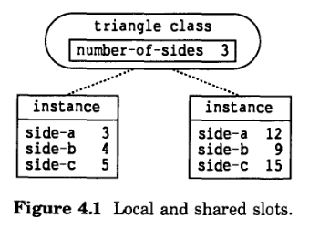
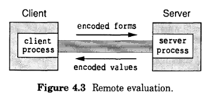

# 4 方法编程

锁程序说明了CLOS的核心功能。本章描述了其他有用的技术，包括如何编写方法来执行以下操作：

- 表示信息而不将其存储在槽中
- 给访问器泛型函数添加行为
- 专注于不止一个参数
- 专注于常见的 Lisp 类型，例如字符串和数组
- 专注于单个 Lisp 对象

我们在本章中使用了三个例子。第一个例子将三角形表示为类的实例，并演示了存储与三角形相关的信息的不同方法。第二个例子是一个安装程序，用于在不同的操作系统上安装各种软件产品；展示了如何编写专门处理多个参数的方法。第三个例子是一个支持远程求值的程序，它说明了专门针对 COMMON LISP 类型和单个 Lisp 对象的方法。

## 4.1 实现选择：方法 vs 槽

CLOS支持不止一种方式来表示与实例或类相关的某些种类的信息。本节介绍共享槽的概念，并讨论在槽中表示信息与在方法中表示信息的优缺点。

**本地槽和共享槽**

有两种槽。本地槽存储有关特定实例状态的信息。每个实例都使用自己的值维护其各自的槽副本。这是默认的槽。本书前面提到的所有槽都是本地槽。

共享槽存储了整个类的状态信息。共享槽只有一个值；它与类相关联并由类的所有实例共享。如果一个实例更改了共享槽的值，则所有实例读取该槽时都会看到新值。

例如，我们可以定义一个名为 `triangle` 的类。每个实例将其三个边的长度存储在名为 side-a、side-b 和 side-c 的本地槽中。这些必须是本地槽，以便每个实例都可以跟踪自己的维度。

假设三角形类是处理几何形状的程序中的几个类之一。形状协议规定泛型函数 `number-of-sides` 返回给定形状的边数。对于三角形类，我们可以将该信息存储在名为 `number-of-sides` 的共享槽中，并为其提供读取器方法.共享槽是合适的，因为三角形类的所有实例都具有相同的边数。



图4.1 显示每个实例存储其本地槽 `side-a`、`side-b` 和 `side-c` 的单独值，但共享槽 `number-of-sides` 只有一个值。本地槽存储在每个实例中，共享槽存储在类本身中。

`defclass` 表达式定义槽并控制槽是本地的还是共享的。槽选项`:allocation` 指定一个槽是本地的还是共享的。默认是 `:allocation :instance`，这意味着槽是本地的。要指定应该共享一个槽，请提供 `:allocation :class` 槽选项。

下面的 defclass 形式为三角形类定义了三个本地槽和一个共享槽:

```lisp
(defclass triangle (shape)
  ((side-a :accessor side-a :initarg :side-a)
   (side-b :accessor side-b :initarg :side-b)
   (side-c :accessor side-c :initarg :side-c)
   (number-of-sides :reader number-of-sides
                    :initform 3
                    :allocation :class)))
```

读取器 `number-of-sides` 可用于三角形的任何实例。读取器方法返回名为 `number-of-sides` 的槽的值，该槽由三角形类的所有实例共享。

**有用的三角形函数**

在下面的示例中，我们根据三角形的对边标记三角形的每个角度。角A 与 `side-a` 相对，并与 `side-b` 和`side-c` 相邻。图4.2显示了角度和边是如何相互关联的。


在这里，我们定义了两个有用的函数来处理三角形，我们将在后面的示例中用到它们： 

```lisp
;;; 给定三条边的长，返回三角形的面积
;;; 算法: area = a b (sin C) / 2
(defun area-of-triangle (a b c)
  (let ((angle-c (three-sides-to-angle c a b)))
    (* a b (sin angle-c) .5)))


;;; 给定三角形的三条边长，返回与 b 边和 c 边相邻的 A 角的角度和对边 a
;;; 余弦定律: a ^ 2 = b ^ 2 + c ^ 2 - 2bc(cos A)
(defun three-sides-to-angle (a b c)
  (acos (/ (- (+ (expt b 2) (expt c 2))
              (expt a 2))
           (* 2 b c))))
```

我们将在第144页的[重新定义CLOS元素的示例]()中扩展了三角形示例。

**表示有关实例的信息**

在 shape 程序中，我们可能需要确定给定形状的面积。有两种方法可以表示形状的面积：在方法中计算它，或者将面积存储在本地槽中。例如，以下是表示三角形面积的方法：

**方法**

定义一种基于三角形边长计算面积的方法。

```lisp
(defmethod area ((tri triangle))
  (area-of-triangle (side-a tri)
                    (side-b tri)
                    (side-c tri)))
```

**本地槽**

定义一个名为 `area` 的本地槽，用于存储每个三角形的面积和槽的读取器方法。

```lisp
(defclass triangle (shape)
  ((side-a :accessor side-a :initarg :side-a)
   (side-b :accessor side-b :initarg :side-b)
   (side-c :accessor side-c :initarg :side-c)
   (number-of-sides :reader number-of-sides
                    :initform 3
                    :allocation :class)
   (area :reader area :initarg :area)))
```

我们必须在第一次创建三角形时计算其面积。一种有效的方法是定义一个名为 `make-triangle` 的构造函数，它初始化区域：

```lisp
(defun make-triangle (side-a side-b side-c)
  (make-instance 'triangle
                 :side-a side-a
                 :side-b side-b
                 :side-c side-c
                 :area (area-of-triangle side-a side-b side-c)))
```

由于许多程序需要进行这样的初始化，CLOS提供了一种专门用于此目的的技术，称为初始化方法； 我们将在第 159 页的[使用方法控制初始化]()中讨论它们。

每当任何边长发生变化时，也有必要重新计算面积，我们在第 71 页的[定义访问器的辅助方法]()中对此进行了演示。

无论您选择哪种实现方式，客户端都以相同的方式来获取面积：通过调用 `area` 泛型函数。内部表示的选择取决于程序员。每次使用一种方法计算面积的效果是：需要的存储空间更少，对象创建和边长更新速度更快，但查询面积的速度较慢。将区域存储在槽中的效果是：查询面积的速度更快，但可能需要更多的存储空间，对象创建和边长更新更慢。

**表示关于类的信息**

我们已经提到需要表示与类相关的信息，例如三角形的边数。CLOS提供了两种方法来做到这一点：

**方法**

定义一个返回信息的方法。将边的数量“存储”在方法主体中而不是存储在槽中。

```lisp
(defmethod number-of-sides ((tri triangle)) 3)
```

**共享槽**

为泛型函数 `number-of-sides` 定义一个共享槽和一个读取器方法。前面给出的三角形的两种 `defclass` 表达式显示了如何定义共享槽（使用槽选项 `:allocation :class` ）和读取器方法（指定槽选项 `:reader number-of-sides`）。

这里的权衡是在查询速度和更新与类相关的信息的便利性之间。当一个方法存储信息时，查询可能会更快，因为不需要访问槽。这种技术还可以节省存储空间，因为信息存储在一种方法中，而不是存储在槽和读取器方法中。然而，改变信息的唯一方法是重新定义方法。这种办法确实可行，但是它需要编程（定位方法的定义、编辑和编译它），而不是仅仅使用程序（调用泛型函数 `:writer`）。在某些应用程序中，您可以合理地假设与类关联的信息永远不会改变，因此更新不是问题。例如，我们知道三角形的边数始终为 3，因此无需更新该信息。然而，在其他情况下，可能需要更改与类关联的信息。

当信息存储在共享槽中时，您可以使用泛型函数 `:writer` 方便地更改它。但是（取决于CLOS实现），查询可能会更慢并且可能会使用更多的存储空间。

## 4.2 访问器编程

本节描述如何修改访问器泛型函数的行为，并讨论访问槽的各种方法。

**自动生成的访问器**

通过为 `defclass` 提供槽选项 `:accessor` ，您要求CLOS为读取器泛型函数生成一个方法，为写入器泛型函数生成一个方法。reader 方法简单地返回 slot 的值，writer 方法将新值写入 slot。

这些是 primary 方法，其行为与任何其他 primary 方法一样，这意味着您可以编写辅助方法来执行额外的计算。也就是说，您可以定义 `:before` 方法和 `:after` 方法来增强读写器泛型函数的 primary 方法的行为。

**为访问器定义辅助方法**

这里我们继续使用三角形的例子。回想一下，三角形类的定义提供了 `:accessor` slot 选项来为名为 `side-a` 的读取器和名为 `(setf side-a)` 的写入器生成方法。

之前，我们提到了将三角形的面积存储在槽中并在每次三角形的边长发生变化时重新计算面积的可能性。要使用这种方法，我们需要一种方法, 当每一次将新值存储到 `side-a`、`side-b` 或 `side-c` 中的任意一个槽时运行。我们可以通过为写入器泛型函数 `(setf side-a)`、`(setf side-b)` 和 `(setf side-c)` 定义 after 方法来做到这一点。

您可以使用 `defmethod` 为 reader 泛型函数或 writer 泛型函数编写辅助方法。第一个参数是泛型函数的名字，对于 reader 来说是一个符号，对于 writer 来说是一个列表，例如 `(setf symbol)`。在写入器泛型函数的方法中，lambda-list 中的第一个参数是要写入槽的新值的参数。例如： 

```lisp
(defmethod (setf side-a) :after (new-length (tri triangle))
  (setf (area tri)
        (area-of-triangle new-length
                          (side-b tri)
                          (side-c tri))))

```

这是一个 after 方法，它在 `(setf side-a)` 的 primary 方法之后运行。每次调用 writer 函数 `(setf side-a)` 时，此方法都会计算三角形的面积并将其存储在 `area` 槽中。我们需要为 `(setf side-b)` 和 `(setf side-c)` 编写类似的 after 方法，以确保在任何边长发生变化时更新面积。

**定义访问器primary方法**

`:accessor`、`:reader` 和 `:writer` 槽选项是CLOS的便利功能。您可以使用 `defmethod` 自己实现读写槽的 primary 方法。reader 方法的主体将使用原始的 `slot-value` 来读取 `slot` 的值，而 writer 方法将使用 `setf` 和 `slot-value`。

例如，在我们之前对三角形类的定义中，我们提供了 `:accessor` 选项来定义 `side-a` 的读取器和写入器。或者，我们可以手动为读取器和写入器定义primary 方法。

```lisp
;;; 定义读取器 side-a
(defmethod side-a ((tri triangle))
  (slot-value tri 'side-a))

;;; 定义写入器 (setf side-a)
(defmethod (setf side-a) (new-side-a (tri triangle))
  (setf (slot-value tri 'side-a) new-side-a))
```

通常，手动定义访问器的 primary 方法(primary)没有任何好处，因为在几乎所有情况下，您都希望 primary 方法简单地读取或写入槽的值。当你需要做一些特殊的事情时，你可以提供一个 before-方法或 after-方法来与 primary 方法一起工作，而不是提供一个特殊用途的 primary 方法。

**访问器 vs slot-value**

访问器的 primary 方法的实现（无论该方法是由CLOS自动生成还是手动定义）都是依赖 `slot-value` 来完成的。您可以使用 `slot-value` 读取任何槽的值，也可以使用带有 `slot-value` 的 `setf` 来写入槽的值。了解使用 `slot-value` 和使用访问器之间的区别很重要。

程序的客户端应该使用访问器来读取和写入槽，因为访问器通常是公开的接口。相反，`slot-value` 是访问器的底层实现，并不打算在其他上下文中使用。要调用 `slot-value`，您需要知道 slot 的名字，这严格来说是程序的内部细节。思考一下，如果开发人员更改了类的内部实现，比如，更改槽的名字或将信息存储在方法而不是槽中来更改该信息的内部表示会发生什么：调用已公开的泛型函数接口的代码仍然可以正常工作。但是，对槽直接读写的代码就失效了。（译注：这一段直译过来会比较绕，这里并没有尊重原作，只是转述大概的意思。）

`slot-value` 直接访问槽，而不调用任何访问器方法。如果程序依赖访问器方法来完成与访问槽相关的必要工作，这就是一个弊端。回想一下，三角形示例对 `side-X` 槽的写入者使用 after 方法来更新面积；如果使用 `slot-value` 的 `setf` 写入边长的值，则 area 槽的值将不正确，因为不会调用访问器方法。

您只应该在两种情况下使用`slot-value`：1.您想手动定义访问器； 2.您想在不调用任何访问器方法的情况下访问槽。在调试程序时，后一种用法是很有帮助的。

**使用with-accessors和with-slots**

访问槽的另一个方式是使用 `with-accessors` 或 `with-slots`，这两个宏允许您通过使用变量名来访问槽。在 `with-accessor` 的主体中，使用变量与调用相应的访问器泛型函数具有相同的效果。相反，`with-slots` 将变量的使用转换为对 `slot-value` 的调用，因此不会调用访问器方法。

这些宏的目的是通过支持快捷语法来简化频繁访问槽的代码体。因此，使用 `with-accessors` 是调用访问器的快捷方式，使用 `with-slots` 是调用 `slot-value` 的快捷方式。使用这些宏可以产生更简洁的代码，尤其是当方法的主体经常使用访问器或槽值时。

在三角形例子中，我们可能需要一个方法来返回与a边相对且与b边和c边相邻的角A。在这里，我们展示了两种等效的访问边的方法。

调用读取器：

```lisp
(defmethod andle-A ((tri triangle))
  (three-sides-to-angle (side-a tri)
                        (side-b tri)
                        (side-c tri)))
```

使用`with-accessors`：

```lisp
(defmethod angle-A ((tri triangle))
  (with-accessors ((a side-a)
                   (b side-b)
                   (c side-c))
      tri
    (three-sides-to-angle a b c)))
```

您还可以通过使用带有变量的 `setq` 或 `setf` 来写入槽的值。下表显示了如何在所示方法中的 `with-accessors` 表达式的主体中使用变量：

| This Form      | Translates to This Form   |
| -------------- | ------------------------- |
| a              | (side-a tri)              |
| (setq a value) | (setf (side-a tri) value) |
| (setf a value) | (setf (side-a tri) value) |

`with-accessors` 宏要求您为每个访问器（例如 `side-a`）指定一个变量（例如 `a`）。虽然你可以将变量名指定为与访问器相同的符号，但该语法并不简短，您必须总是列出变量和访问器名字。

不同的是，`with-slots` 宏有的语法更简短：您列出要访问的槽，然后您可以通过它们的名字访问它们。这里我们展示了两种直接访问 `slot` 的等效方法——调用 `slot-value` 和使用 `with-slots`：

```lisp
;;; 使用 slot-value 去访问槽
(defmethod angle-A ((tri triangle))
  (three-sides-to-angle (slot-value tri 'side-a)
                        (slot-value tri 'side-b)
                        (slot-value tri 'side-c)))

;;; 使用 with-slots 去访问槽
(defmethod angle-A ((tri triangle))
  (with-slots (side-a side-b side-c)
      tri
    (three-sides-to-angle side-a side-b side-c)))
```

下表显示了如何在所示方法中在 `with-slots` 表达式的主体中使用变量：

| This Form      | Translates to This Form               |
| -------------- | ------------------------------------- |
| a              | (slot-value tri 'side-a)              |
| (setq a value) | (setf (sloe-value tri 'side-a) value) |
| (setf a value) | (setf (slot-value tri 'side-a) value) |

请注意，当您使用 `with-slots` 或 `with-accessors` 时，实例表达式只会被求值一次。

**读取未绑定的槽**

如果一个槽没有被初始化，并且没有通过写入器存储任何值，则该槽是未绑定的。如果您尝试读取未绑定槽的值，则会发出错误信号。

默认行为（发出错误信号）来自于泛型函数`slot-unbound`。也就是说，如果您尝试读取未绑定的槽，CLOS将调用异常处理程序`slot-unbound`。泛型函数 `slot-unbound` 有一个系统提供的默认方法来发出错误信号；如果您想更改在某个类的实例中读取未绑定槽时发生的情况，您可以专门化此泛型函数。

## 4.3 多重方法

许多面向对象的程序可以用只专门化一个参数的方法来编写。但是，有时编写专门化多个参数的方法很有用。这些被称为多重方法。

使用多重方法的技术适用于多个参数的类型的操作。

我们通过讨论一个安装场景来介绍多种方法。假设一家公司销售各种软件产品，每种软件产品都可以在多种操作系统上运行。安装过程不依赖于软件产品的类型和操作系统的类型。这家公司希望提供一个通用的安装专业程序来自动化安装过程。

目前，该公司在两个操作系统 Genera 和 Unix 上支持两个软件产品 Life 和 Adventure。公司计划在未来支持更多的软件产品和操作系统，所以安装程序应该是可扩展的。在此示例中，我们使用以下软件产品和操作系统表示： 

- 软件产品以`life`类和`adventure`类为代表
- 所有的软件产品都建立在 `basic-product`类的基础上
- 操作系统由`genera`类和`unix`类表示
- 所有的操作系统都建立在`basic-os`类的基础上

**用多重方法检查参数**

我们希望提供一个顶级函数，用于在我们支持的任意操作系统上安装我们支持的任意产品。我们可以使用泛型函数 `install` 来做到这一点，它期望一个软件产品作为它的第一个参数，一个操作系统作为它的第二个参数：

```lisp

(defgeneric install (software-product operation-system)
  (:documentation "Installs software on the operation system."))
```

当两个参数都有效时，下面的方法1适用。也就是说，第一个参数是 `basic-product` 类型，第二个参数是 `basic-os` 类型：

```lisp
;;; Method 1
(defmethod install ((sw basic-product) (os basic-os))
  body)
```

方法1 就是一个多重方法； 它专门针对两个参数。此方法仅在两个参数都有效时适用。此方法的主体将执行安装。（我们暂时将方法的主体留空。）

如果用户使用无效的参数调用 `install` 怎么办？ 也就是说，如果第一个参数不是软件产品，或者第二个参数不是操作系统，或者两者兼而有之，那该怎么办？CLOS将查找可应用的方法，但没有找到，并按照“没有可应用的方法”的行发出错误信号。

这样的错误消息并不能清楚地说明错误是由程序中的错误还是由用户提供的错误输入引起的。对于安装工具，我们应该给用户一个信息更丰富的错误消息。我们可以提供三种方法来完成这项工作。

```lisp
;;; Method 2
(defmethod install ((sw basic-product) non-os)
  (error "Cannot install because ~A is not
a recognized operation system." non-os))

;;; Method 3
(defmethod install (non-product (os basic-os))
  (error "Cannot install because ~A is not a
recognized software product." non-product))

;;; Method 4
(defmethod install (non-product non-os)
  (error "Cannot install because ~A is not a
recognezed software product and `A is not
a recognized operating system."
         non-product non-os))
```

我们打算，对于任何一对参数，只调用一个方法。如果两个参数都有效，则应调用方法 1 来执行安装。否则，应调用方法 2、3 和 4 中最合适的方法，以提供信息丰富的消息。

这些方法被正确编写以实现其预期目的。由于它们都是primary 方法，我们知道只有最具体的适用方法被调用。CLOS通过首先找到一组适用的方法来选择该方法，然后按优先顺序排列这些方法。接下来的两节讨论多重方法的适用性和优先顺序。

**多重方法的适用性**

CLOS允许相同泛型函数的方法专门化任何所需的参数。安装方法利用了这种灵活性：

| Method   | Lambda-list                        |
| -------- | ---------------------------------- |
| Method 1 | ((sw basic-product) (os basic-os)) |
| Method 2 | ((sw basic-product) non-os)        |
| Method 3 | (non-product (os basic-os))        |
| Method 4 | (non-product non-os)               |

调用 `install` 时，CLOS会查找适用的方法。如果泛型函数的相应参数满足每个专用参数，则该方法适用。“满足”表示参数属于参数专门化的类型； 它是类本身的实例或子类的实例。

非专门化参数等价于作为参数专门化器的 `t` 类。由于所有对象都是 `t` 类型，因此实参始终满足非专门化参数。因此，方法 4 适用于任何两个参数，无论它们是什么类型。

假设使用两个有效参数调用 `install`。这里，`*life*` 是 `life` 的一个实例，`*genera*` 是 `genera` 的一个实例。

```lisp
;;; 这里 install 使用两个有效参数调用
(install *life* *genera*)
```

方法 1 和 2 都适用，如下测试所示：

```lisp
;;; 方法1 是适用的，因为下面的测试为 真
(typep *life* 'basic-product)
(typep *genera* 'basic-os)

;;; 方法2 也是适用的，因为下面的测试为 真
(typep *life* 'basic-product)
(typep *genera* t)
```

同样，方法 3 和 4 也适用：

```lisp
;;; 方法3 也是适用的，因为下面的测试为 真
(typep *life* t)
(typep *genera* 'basic-os)

;;; 方法4 同样适用
(typep *life* t)
(typep *genera* t)
```

之前，我们说过，如果每个专用参数都满足泛型函数的相应参数，则该方法适用。该规则也适用于多重方法。我们可以通过注意必须满足所有必需参数来澄清这一陈述，并且任何未专门化的必需参数都被视为好像它们具有名为 t 的类作为它们的参数专门化。

> **多重方法适用规则**
> 如果泛型函数的相应参数满足其每个必需参数，则该方法适用。
> 未专门化的必需参数等价于专门针对名为 t 的类的参数参数。

当CLOS找到多个适用的primary 方法时，只调用最匹配的那一个。因此，CLOS必须按优先顺序排列适用的方法。我们继续这个例子，并按优先顺序排列方法 1 到 4。

**多重方法的优先顺序**

CLOS通过从左到右考虑方法所需的参数，相对于它们的参数专用器，按优先级顺序排列两个适用方法。数学家称之为字典顺序。

在这里，我们展示了第一个必需参数的参数专门器的类，用于四种方法： 

| Method   | First Parameter <br>is Specialized by |
| -------- | ----------------|
| Method 1 | basic-product   |
| Method 2 | basic-product   |
| Method 3 | t               |
| Method 4 | t               |

泛型函数对应参数的类优先级列表决定了这些类中的哪一个更匹配。第一个参数 `*life*` 的类是 `life`，它的类优先级列表是:

<pre>
    (life basic-product t)
</pre>

由于 `basic-product` 比 `t` 更匹配，因此方法 1 和 2 比方法 3 和 4 更匹配。为了对方法 1 与方法 2 的优先级进行排序，CLOS继续处理下一个所需参数并比较这对参数专用器 ：

| Method   | Second Parameter <br>is Specialized by |
| -------- | -------- |
| Method 1 | basic-os |
| Method 2 | t        |

第二个参数`*genera*`的类是`genera`，它的类优先级列表是 

<pre>
    (genera basic-os t)
</pre>

由于 `basic-os` 比 `t` 更匹配，因此方法 1 比方法 2 更匹配。使用相同的过程，我们发现方法 3 比方法 4 更匹配。因此，方法的优先顺序为 

<pre>
    (method-1 method-2 method-3 method-4)
</pre>

仅通过查看方法的 lambda-list，可能感觉方法 1 是最具体的（因为它专门化了两个参数），而方法 4 是最不具体的（因为它没有专门化任何一个参数）。然而，方法 2 和 3 中的哪一个更匹配，直观上并不明显：

| Method   | Lambda-list                 |
| -------- | --------------------------- |
| Method 2 | ((sw basic-product) non-os) |
| Method 3 | (non-product (os basic-os)) |

CLOS将方法 2 列为比方法 3 更匹配，因为比较参数专门器的顺序是从左到右。也就是说，lambda-list 中参数的顺序会影响方法的优先级。由于方法 2 的最左侧参数专用器比方法 3 的最左侧参数专用器更匹配，因此方法 2 比方法 3 更匹配。剩余的参数专用器不予考虑。

参数的从左到右的优先顺序是任意默认值。您可以使用 :argument-precedence-order 选项来更改它 defgeneric; 请参阅第 98 页的[方法继承摘要]()。

**install的实现**

通常，软件产品的安装需要几个不同的步骤，这些步骤必须按一定的顺序执行。我们可能会发现所有安装都包含四个独立的步骤：

1. 从磁带恢复软件
2. 编译软件系统
3. 配置站点以识别新的软件
4. 验证软件产品的安装

我们可以通过调用4个泛型函数来实现 `install`。这个框架使得在可共享模块中编写代码变得很方便。

```lisp
;;; Method 1
(defmethod install ((sw basic-product) (os basic-os))
  (restore-product sw os)
  (compile-product sw os)
  (configure-site sw os)
  (verify-product sw os))
```

接下来，我们考虑四种安装操作中的每一种都需要哪些方法。

**恢复**

这可能需要使用系统相关功能来从磁带恢复数据。由于此操作仅取决于操作系统的类型，因此可以针对每种类型的操作系统通过一种primary 方法来实现： 

```lisp
(defmethod restore-product (sw (os genera)) body)
(defmethod restore-product (sw (os unix)) body)
```

参数 `sw` 用于描述要从磁带恢复的产品。`restore-product` 中唯一取决于产品类型和操作系统类型的部分是源文件应存储的路径名。`restore-product` 方法的主体调用 `get-source-pathname` 以获取此信息：

```lisp

(defgeneric get-source-pathname (product os)
  (:documentation "Returns a string."))

(defmethod get-source-pathname ((sw life) (os unix))
  "/bin/games/life.lsp")

(defmethod get-source-pathname ((sw adventure) (os unix))
  "/bin/games/adventure.lsp")

(defmethod get-source-pathname ((sw life) (os genera))
  "sys:games;life.lisp")

(defmethod get-source-pathname ((sw adventure) (os genera))
  "sys:games;adventure.lisp")
```

**编译**

该操作可能可以使用一种默认方法完成

```lisp
(defmethod compile-product (sw os)
  (compile-file (get-source-pathname sw os)))
```

**配置**

此步骤配置站点以识别新软件包。它可能包括更新一些配置文件，例如指定存储软件生成的任何错误消息的位置。此步骤可能取决于软件产品的类型和操作系统的类型： 

```lisp
(defmethod configure-site ((sw life) (os genera)) body)
(defmethod configure-site ((sw adventure) (os genera)) body)
(defmethod configure-site ((sw life) (os unix)) body)
(defmethod configure-site ((sw adventure) (os unix)) body)
```

**验证**

这会在软件产品上运行一个测试套件，以确保安装成功。由于无论操作系统的类型如何，对于给定的软件产品，内部测试的工作方式都是相同的，因此这些方法只专注于软件产品参数：

```lisp
(defmethod verify-product ((sw life) os) body)
(defmethod verify-product ((sw adventure) os) body)
```

至此，程序的设计已经完成，只剩下实现了。我们已经勾勒出一个完全基于primary 方法的实现。这个草图可能无法解释安装的每一部分。如果我们确定必须添加到此草图中的行为，我们总是可以使用 before 和 after 方法。

这种设计产生了一个合理的协议。要添加对新软件产品或其他操作系统的支持，我们只需要实现安装操作子集的方法。这种设计有效地将操作系统的复杂性与软件产品分开：

- 我们可以通过为`configure-site`、`verify-product`和`get-source-pathname`定义方法来添加一个新的软件产品
- 我们可以通过定义 `configure-site`、`restore-product` 和 `get-source-pathname` 的方法来支持新的操作系统

## 4.4 COMMON LISP 类型的方法

CLOS提供了对应于一些（并非全部）标准 COMMON LISP 类型的类。此类的名字与类型的名字相同。例如，有一个类名为array，对应于类型数组。提供这些类的唯一原因是：使您能够编写专门针对 COMMON LISP 类型的方法。

**与COMMON LISP的type对应的类**

我们已经看到了一个对应于 COMMON LISP 类型的类的例子——`t`类，它对应于类型 `t`。该类作为所有类优先级列表中的最后一个（最不具体的）类出现，包括用户定义的类和CLOS提供的类。

表 4.1 列出了 COMMON LISP 类型对应的类以及每个类的类优先级列表。该表改编自“COMMON LISP Object System Specification”，并获得了作者的许可。

| Class      | Class Precedence List                |
| ---------- | ------------------------------------ |
| array      | (array t)                            |
| bit-vector | (bit-vector vector array sequence t) |
| character  | (character t)                        |
| complex    | (complex number t)                   |
| cons       | (cons list sequence t)               |
| float      | (float number t)                     |
| integer    | (integer rational number t)          |
| list       | (list sequence t)                    |
| null       | (null symbol list sequence t)        |
| number     | (number t)                           |
| ratio      | (ration rational number t)           |
| rational   | (rational number t)                  |
| sequence   | (sequence t)                         |
| string     | (string vector array sequence t)     |
| symbol     | (symbol t)                           |
| t          | (t)                                  |

这些类具有多重继承。它们之间的类/子类关系与 Steele 的 COMMON LISP: The Language 中描述的类型/子类型的关系是平行的。考虑向量类型： 

- 类型`vector`是`sequence`和`array`的子类型
- `vector`类是`sequence`类和 `array`类的子类

对于每个COMMON LISP类型对应的类，如果 COMMON LISP: The Language 指定了类型/子类型关系，则相应地可以确定类/子类的关系。然而，在某些情况下，没有指定类型/子类型关系，CLOS工作组决定了优先顺序。例如，类型 `string` 是 `array`和 `sequence` 的子类型，但 COMMON LISP 没有指定 `array` 和 `sequence` 之间的类型/子类型关系。CLOS工作组决定在 `string` 的类优先级列表中 `array` 应该在 `sequence` 之前，

每个类必须有一个完全指定的类优先级列表，以便CLOS选择方法的优先级。CLOS工作组没有规定所有 COMMON LISP types 都应该有对应的类的一个原因是某些类型与其他类型的关系不明确，并且很难确定类型的优先顺序。例如，考虑如果参数是实例 `7` 会发生什么，并且有两种方法适用：一种专门针对 (integer 0 10)，另一种专门针对 (integer 5 15)——应该认为哪种方法更匹配？ 由于某些类型的语义不适合严格的优先顺序，因此这些类型没有对应的类。

如果一个 COMMON LISP 类型没有对应的类，您就不能定义专门针对该类型的方法。CLOS不支持作为类型说明符的类的列表，例如

```lisp
(integer 0 10)
(string 25)
(not number)
(vector (mod 256))
```

**内置类**

通常，对应于 COMMON LISP 类型的类被实现为“内置类”，这意味着它们不具有使用 `defclass` 定义的类的所有属性。内置类以一种特殊的、系统相关的方式实现，以利用机器的架构或其他原因。在大多数情况下，用 `defclass` 实现这些类是没有意义的，因为它们并不完全适合该模型。

如何实现与 COMMON LISP 类型对应的类由每个CLOS实现决定。这些类中的任何一个都可以实现为内置类或用户定义的类。

尽管内置类在某些方面遵循CLOS模型（它们具有多重继承；它们具有实例；它们从 `t` 继承，并且您可以定义专门针对它们的方法），但它们在其他方面与模型不同。这些是内置类和用户定义类之间的显着区别：

- 结构。用户自定义类的结构是以槽的形式存在的。但是，内置类的内部结构通常不是用槽来表示的。例如，在大多数CLOS实现中，符号的值可能不存储在槽中。

- 创建实例。要创建用户定义类的实例，可以使用 `make-instance`。但是，CLOS不允许使用 `make-instance` 创建内置类的实例。您使用独立的机制来创建实例，例如使用 `cons` 函数创建 `cons` 的实例。

- 用作超类。CLOS不允许您包含内置类作为任何用户定义类的直接超类。该规则的唯一例外是名为 `t` 的类，它自动成为每个类的超类。

-从`standard-object`继承。回想一下，`standard-object`被隐式包含为用户定义类的超类。相反，`standard-object` 不是内置类的超类。这种区别使得实现可以提供仅用于用户定义类的默认方法。

CLOS规范定义了一组关于内置类的实现要遵循的要求，但它也允许实现支持该领域的扩展。以下是您可能会遇到的两个扩展：

-CLOS实现可以提供其他 COMMON LISP 类型的类，除了那些需要的。这可能包括路径名、包或其他类。所有这些类都必须遵守 Steel 的 COMMON LISP: The Language 中定义的类型/子类型关系所隐含的优先级。

- 如前所述，CLOS实现可以选择将任何 COMMON LISP 类型的类实现为内置类（遵循上述限制）或用户定义类。例如，CLOS实现可以使用 `defclass` 自由定义字符串类。完成此操作后，您可以对字符串类执行任何可以对 `defclass` 定义的其他类执行的操作。

请注意，依赖于CLOS扩展的程序不容易移植到其他CLOS实现。

**COMMON LISP类型的方法示例**

我们可以通过实现一个用于执行远程求值的简单网络协议来说明常见Lisp类型的定义方法。此程序使用户能够通过网络将 Lisp 表达式发送到另一台计算机，并接收对该表达式进行求值的结果。发送表达式的机器称为客户机，执行计算并将结果返回给客户机的机器称为服务器。

本程序中与常见 Lisp 类型相关的部分在于通过网络发送和接收 Lisp 对象。Lisp 对象生活在一个 Lisp 世界中，不可能或不希望传输实际的对象。相反，客户机将 Lisp 对象编码为适合通过网络发送的表示形式。另一方面，服务器对表示进行解码并且创建或获取一个与编码对象等效的 Lisp 对象。然后，服务器对计算的结果进行编码、传输，并由客户机进行解码。

图4.3显示了远程求值期间客户端和服务器机器之间的交互。



解码和编码类似于 Lisp 读取和打印操作：Lisp 读取器获取对象的输入表示并生成 Lisp 对象；printer 接受 Lisp 对象并生成适合打印的表示形式。像printer和reader一样，解码和编码方法只保留对象的“简单”特征。例如，数组的内容已编码，但任何填充指针均未编码。

编码的实现利用了与 COMMON LISP 类型对应的类。远程求值程序支持传输简单的 Lisp 对象，例如列表、整数、字符、字符串、符号和向量。我们提供对这些对象进行编码的方法；这些方法专门处理与各种类型的对象相对应的类。通过为用户定义的类提供编码和解码方法，可以将该模型扩展到用户定义类的实例。

尽管本示例的主要目的是展示编码和解码，但为了完整性起见，我们还描述了调用编码和解码泛型函数的顶级函数。

**一个简单的远程求值会话**

我们首先描述如何使用远程求值程序。我们创建一个流 `remote-eval-stream`，并调用函数 `remote-eval` 向该流发送表达式并接收结果。最后，我们关闭流： 

```lisp
(setq *my-stream* (make-remote-eval-stream server-machine))

(remote-eval *my-stream* "hello") => "hello"
(remote-eval *my-stream* '(+ 1 23)) => 24

(close *my-stream*)
```

**顶层函数**

`make-remote-eval-stream`创建到服务器的网络连接，并返回双向的8位二进制字节流。创建流后，将在服务器上启动一个进程以运行`eval-server`函数（定义在下面）。关闭此流将终止服务器进程并关闭网络连接。由于`make-remote-eval-stream`的实现必然特定于操作系统，所以这里不给出。

`remote-eval`实现客户端；它向服务器发送表达式，接收对该表达式求值的结果，然后返回结果。表达式在服务器环境中进行求值，任何副作用都会在该环境中发生。此示例不传输打印输出，不传输多个返回值，也不处理服务器上表达式求值生成的错误；可以添加这些功能中的任何一个。

```lisp
;;; This must be defined on the client machine.
(defun remote-eval (stream form)
  (encode form stream)
  (force-output stream)
  ;; Read the return value
  ;; The first byte is a control byte
  (decode (read-byte stream) stream))
```

`eval-server`实现了服务器端；它不断地读取发送给它的表达式，求值表达式，并返回结果。当流关闭时，此进程被终止。

```lisp
;;; This must be defined on the server machine.
(defun eval-server (stream)
  (loop (encode
         (eval (decode (read-byte stream) stream))
         stream)
        (force-output stream)))
```

**编码和解码协议**

程序的主要部分在于 Lisp 对象的编码和解码。为此，我们将使用一个简单的协议。为了对对象进行编码，我们首先在流上传输一个声明对象类型的控制字节。（控制字节是8位字节。）然后，我们编码并传输对象本身的表示；根据对象的类型，这一方法的实现会有所不同。解码时，我们从流中读取一个控制字节；此字节表示正在传输的对象类型。然后，我们对后面的字节进行解码，并将编码表示转换为 Lisp 对象。解码对象的实现取决于对象的类型。

编码任何一种对象（例如符号）的方法与解码该种对象的方法一起工作。这些方法必须使用相同的编码和解码技术。然而，用于编码和解码另一类型对象（例如字符）的方法如何使用与用于符号的技术完全不同的编码和解码技术。唯一的要求是任何给定类型对象的解码方法必须不理解该类型对象的编码方法是如何工作的。

我们的协议由两个泛型函数组成： 

```lisp
(defgeneric encode (object stream)
  (:documentation
   "Encode object and send the result to stream."))

(defgeneric decode (code stream)
  (:documentation
   "Based on the code, read an encoded representation
from the stream, decode, and create an object."))
```

这是一个可扩展的协议；扩展它以支持其他类型的对象是一件简单的事情。为此，我们将提供编码和解码方法。不需要更改调用`encode`和`decode`的代码。这是使用泛型函数而不是让调用方使用`typecase`来选择编码和解码各种类型对象的代码的一个明显好处。

此示例演示如何对少数类型的对象进行编码和解码。每种类型的对象都有相应的控制字节。这些控制字节是 
```lisp
(defconstant %positive-integer 1)
(defconstant %negative-integer 2)
(defconstant %character 3)
(defconstant %symbol 4)
(defconstant %string 5)
(defconstant %list 6)
(defconstant % vector 7)
```

**编码整数**

为了编码一个整数，我们发送指示正整数或负整数的控制字节，然后是整数的长度，然后是整数本身的绝对值。整数的长度始终以一个字节的形式发送。

```lisp
(defmethod encode ((num integer) stream)
  (cond ((minusp num)
         (write-byte %negative-integer stream)
         (setq num (abs num)))
        (t
         (write-byte %positive-integer stream)))
  (let ((n-bytes (ceiling (integer-length num) 8)))
    (dotimes (i n-bytes)
      (write-byte (ldb (byte 8 0) num) stream)
      (setq num (ash num -8)))))
```

要解码整数，我们需要一种解码正整数的方法和另一种解码负整数的方法。当代码为`%positive-integer`时，将调用解码正整数的方法。该方法将读取整数的长度，然后读取整数本身；然后它可以创建（读取）整数并完成。流上的下一个字节是新的控制字节，它是新编码对象的开始。

通过发送一个字节中的整数长度，我们隐式地限制了传输的整数的值：不能传输`(> (ceiling (integer-length (abs num)) 8) 255)`为真的`num`值，这意味着最大整数长度为2040。使用 Steele 的 COMMON LISP:The Language 第224页上的整数长度定义，最大正整数是一个`(1- (expt 2 (* 8 255)))`，最大负整数是该整数的负整数。因此，极限值非常大，超过 10 的 614 次方。

解码方法在下一节[单个 LISP 对象的方法]()第 94 页中给出

**编码字符**

要对一个字符进行编码，我们发送控制字节指示字符，然后在下一个字节中发送该字符的ASCII码。这个方法只发送字符的代码，而忽略任何字体或位。

为了允许服务器和客户端机器的本机字符集存在差异，我们在编码时将字符转换为它的ASCII码，在解码时将其从ASCII转换为本机字符集中的相应代码。从char到ascii的函数依赖于实现，这里没有提供。`char-to-ascii`必须返回一个小于256的值，这样它才适合8位字节。

```lisp
(defmethod encode ((char character) stream)
  (write-byte %character stream)
  (write-byte (char-to-ascii char) stream))
```

**编码列表和向量**

要对列表或向量进行编码，我们要确定适当的控制字节，然后调用`encode-sequence`来发送控制字节、序列的长度以及序列中每个元素的编码表示。

```lisp
(defmethod encode ((list list) stream)
  (encode-sequence list stream %list))

(defmethod encode ((vector vector) stream)
  (encode-sequence vector stream %vector))

(defun encode-sequence (seq stream code)
  (let ((length (length seq)))
    (write-byte code stream)
    (encode length stream)
    (dotimes (i length)
      (encode (elt seq i) stream))))
```

**编码字符串**

字符串是一个向量，所以对向量进行编码的方法也适用于字符串，它也适用于字符串。但是，为了提高效率，我们将为字符串提供一个方法。优化字符串的编码是很容易的，因为我们知道字符串的每个元素都是一个字符，将适合一个字节。当我们对字符串进行编码时，没有必要对字符串中的每个字符进行编码。反过来，就没办法知道vector的元素是什么，因此必须对每个元素进行编码。

要对字符串进行编码，我们发送控制字节指示字符串，然后是字符串的长度，然后是字符串中的每个字符。任何填充指针、位或字体都不编码。

```lisp
(defmethod enocde ((string string) stream)
  (let ((length (length string)))
    (write-byte %string stream)
    ;; careful to allow strings greater than 256 chars
    (encode length stream)
    (dotimes (i length)
      (write-byte (char-to-ascii (aref string i)) stream))))
```

当`encode`以字符串作为第一个参数时，有两个方法适用:专门针对string的方法和专门针对vector的方法。要确定哪个方法更匹配，CLOS会查询字符串的类优先级列表，它是

<pre>
    (string vector array sequence t)
</pre>

因为类string优先于类vector，所以专门针对string的方法比专门针对vector的方法更匹配。

**编码符号**

要对一个符号和它的包进行编码，我们发送控制字节指示符号、该符号名字的编码表示形式以及该符号的包的编码表示形式。注意，符号的值、函数定义和任何属性都不会被传输。同样，包必须存在于服务器端。

```lisp
(defmethod encode ((symbol symbol) stream)
  (write-byte %symbol stream)
  (encode (symbol-name symbol) stream)
  (encode (package-name (symbol-package symbol)) stream))
```

**设计和效率的考虑**

注意字符的方法是非常有效的;它发送一个控制字节，然后是ASCII字符代码。相比之下，符号的方法导致了大量的开销。该方法发送控制字节指示符号，然后发送该符号名字的编码表示，然后发送该符号包的编码表示。表4.2显示了包lisp中`+`符号的编码表示。

| Datum | Meaning                   |
| ----- | ------------------------- |
| 4     | %symbol                   |
| 5     | %string                   |
| 1     | %positive-integer         |
| 1     | length of the integer     |
| 1     | length of the string      |
| 43    | ASCII character code of + |
| 5     | %string                   |
| 1     | %positive-integer         |
| 1     | length of the integer     |
| 4     | length of the string      |
| 76    | ASCII character code of L |
| 73    | ASCII character code of I |
| 83    | ASCII character code of S |
| 80    | ASCII character code of P |

编码后的符号表示使用了五个控制字节。这是对符号名和它所属的包使用`encode`的结果。如果速度很重要，我们可以设计一种更有效的编码策略。然而，当前的策略有两个好处。首先，它允许在解码端进行错误检查:`decode`方法期望一个符号包含一个字符串(该符号的名子)，后面跟着另一个字符串(该符号所属的包)。其次，此方法调用了编码字符串的方法，而不是重复该方法完成的工作

编解码的总体设计简单、模块化、高效。这种设计很容易适应在几个方面对程序的改进和增加:

- 优化以提高效率

- 发送多个返回值

- 传输打印输出

- 处理在服务器上求值表达式时遇到的错误

- 扩展此协议以传输其他类型的对象


## 4.5 用于单个 LISP 对象的方法

到目前为止，我们已经看到了对泛型函数的参数类进行专门化的方法。也就是说，参数专门化针对的是类。有时，编写专门针对单个 Lisp 对象的方法是很有用的。在单 个Lisp 对象上专门化参数之一的方法称为个体方法。

**个体方法的适用性和优先级**

假设你有一个操作，当参数是一个数字时，它会以某种方式工作，但如果参数是整数 0，它的工作方式就会不同。方法2就是一个个体方法。它的第二个参数专门针对整数 0。专门化参数是列表`(eql 0)`。

```lisp
;;; Method 1
(defmethod divide ((dividend number) (divisor number))
  (/ dividend divisor))

;;; Method 2
(defmethod divide ((dividend number) (zero (eql 0)))
  (error "Cannot divide by zero."))
```

个体方法的 lambda-list 包含如下参数

<pre>
    (var (eql form))
</pre>

专门化参数是`(eql object)`，其中 object 是对表达式求值的结果。表达式只在定义方法时求值一次。

当以 0 作为第二个参数去调用`divide`时，两个方法都适用。每种方法的适用性规则如下。请注意，因为.适用性测试使用`eql`，所以方法2只适用于整数 0，而不适用于 0.0。

> **个别方法的适用性规则:**
> 对于形式 (eql object) 的形参专门化，如果泛型函数的实参是对象的eql，则泛型函数的实参满足形参专门化。换句话说，这个表达式必须为真:
> `(eql argument 'object)`

如您所料，方法2更匹配。个体方法的优先级规则如下

> **个体方法的优先级规则:**
> 当比较两个参数专门化时， (eql object) 形式的专门化参数总是比类更匹配。

**个体方法的例子**

考虑解码 LISP 对象的编码表示的作业。每个LISP对象根据其类型编码和解码，因此写入用于编码和解码每个不同类型对象的单独方法是有意义的。

编码器以 LISP 对象作为其参数，因此这些方法可以专注于对象的类。但是，解码器没有以 LISP 对象作为参数; 相反，它从流中读取并通过流中的对象中的控制字节来意识到对象的类型。因此，解码器无法提供针对类的方法，但它可以使用针对这些控制字节中的每一个的个体方法。

这里重复了解码的泛型函数`decode`

```lisp
(defgeneric decode (code stream)
  (:documentation
   "Based on the code, read an encoded representation
from the stream, decode, and create an object."))
```

`decode`的每个方法都专门化它的第一个参数，并且每个不同的控制字节只有一个方法适用。回想一下，`decode`调用时，第一个参数是一个字节(这是控制字节)，第二个参数是一个流。这里重复`remote-eval`的定义，以说明如何调用`decode`:

```lisp
(defun remote-eval (stream form)
  (encode from stream)
  (force-output stream)
  ;; Read the return value
  ;; The first byte is a control byte
  (decode (read-byte stream) stream))
```

**解码整数**

我们需要两个方法来解码整数，因为编码整数的方法根据整数是正还是负发送两个不同的控制字节。当第一个参数是指示正整数的控制字节时，第一种方法适用。类似地，当第一个参数是指示负整数的控制字节时，第二个方法适用。

```lisp
(defmethod decode ((code (eql %positive-integer)) stream)
  (decode-integer stream))


(defmethod decode ((code (eql %negative-integer)) stream)
  (- (decode-integer stream)))


(defun decode-integer (stream)
  (let ((num 0)
        (n-bytes (read-byte stream)))
    (dotimes (i n-bytes)
      (setq num (dpb (read-byte stream) (byte 8 (* i 8)) num)))
    num))
```

`%positive-integer`和`%negative-integer`在定义这些方法时只计算一次。

函数`decode-integer`完成了公共部分的工作;这两个方法都会调用它。将`decode-integer`实现为泛型函数是没有好处的。

**解码字符**

要解码字符，我们读取一个字节并将其从ASCII代码转换为本机字符集中的相应字符代码。函数`ascii-to-char`是依赖于实现的，并且在此处不提供。

```lisp
(defmethod decode ((code (eql %character)) stream)
  (ascii-to-char (read-byte stream)))
```

**解码列表和向量**

要解码列表或向量，我们读取序列的长度，然后在序列解码每一个元素。再次，我们可以使用函数来执行公共部分的工作。

```lisp
(defmethod decode ((code (eql %list)) stream)
  (decode-sequence stream 'list))

(defmethod decode ((code (eql %vector)) stream)
  (decode-sequence stream 'vector))

(defun decode-sequence (stream type)
  (let* ((length (decode (read-byte stream) stream))
         (seq (make-sequence type length)))
    (dotimes (i length)
      (setf (elt seq i)
            (decode (read-byte stream) stream)))
    seq))
```

**解码字符串**

要解码字符串，我们读取字符串的长度，然后是字符串的每个字符。

```lisp
(defmethod decode ((code (eql %string)) stream)
  (let* ((length (decode (read-byte stream) stream))
         (string (make-string length)))
    (dotimes (i length)
      (setf (aref string i) (ascii-to-char (read-byte stream))))
    string))
```

**解码符号**

要解码符号，我们首先解码名字，然后解码符号所属的包。请注意，如果它尚不存在此方法不会创建包。

```lisp
;;; Does not create the package.
(defmethod decode ((code (eql %symbol)) stream)
  (let ((code (read-byte stream)))
    (when (/= %string code)
      (error "The symbol's name must be a string."))
    (let ((symbol-name (decode code stream)))
      (setq code (read-byte stream))
      (when (/= %string code)
        (error "The symbol's name must be a string."))
      (let* ((pkg-name (decode code stream))
             (pkg (find-package pkg-name)))
        (when (null pkg)
          (error "Package named ~A not found." pkg-name))
        (intern symbol-name pkg)))))
```

## 4.6 方法继承综述

方法的继承涉及两种不同的机制。两者都作为泛型调度的一部分自动发生。

1. 选择一组适用的方法；
2. 按优先顺序排列适用的方法。

要选择一组适用的方法，CLOS需要了解泛型函数的参数以及为泛型函数定义的方法。以下一般规则考虑了所有类型的方法，包括仅专门化一个参数的方法、多重方法和个体方法：

> 方法适用的一般规则：
> 如果一个方法的每个必需参数都满足泛型函数的相应参数，则该方法是适用的。
>
> | Required Parameter | Test                    |
> | ------------------ | ----------------------- |
> | (var (eql form))   | (eql arg 'object)       |
> | (var class-name)   | (typep arg 'class-name) |
> | var                | (typtp arg 't)          |

在第一种情况下，对象是在定义方法时通过一次求值表达式获得的。在最后一种情况下，所需的参数是非专门化的，这相当于专门化了`t`类。任何参数都满足一个非专门化参数，因为每个 Lisp 对象都是 `t` 类型。

要按优先顺序排列适用的方法，CLOS需要了解以下内容：

- 适用方法的集合

- 泛型函数的每个必需参数的类的类优先级列表

- 泛型函数的参数优先顺序

在对两个方法的优先级进行排序时，CLOS会比较这些方法的参数专门化器。非专门化参数等价于名为 `t` 的类。

通常情况下，参数的优先顺序是从左到右，这意味着CLOS从比较方法A的第一个（最左边的）参数专门化器和方法B的第一个参数专门化器开始。如果两个参数专门化器不同，CLOS使用以下规则来确定哪个参数专门化器更匹配，并在此基础上对方法进行排序，而不考虑任何其他参数专门化器。但是，如果两个参数专门化器相同，CLOS就不能在此基础上对方法的优先级进行排序。CLOS继续处理下一对参数专门化器，依此类推，直到找到一对不同的参数专门化器；然后根据这对参数专门化器对方法进行排序。

如果两个方法具有所有相同的参数专门化器，则它们必须具有不同的限定符。在这种情况下，哪种方法更匹配并不重要。

> 参数专门化器的排序规则：
> (eql object) 的参数专门化器比类更匹配;
> 当两个参数专门化器都是类时，它们将根据泛型函数对应参数的类的类优先级列表进行排序。类优先级列表指示哪个类比另一个更匹配。

**参数优先顺序**

方法的优先级取决于泛型函数的参数优先级顺序。默认情况下，CLOS使用从左到右的参数优先级顺序，这意味着第一个参数（最左边的）在优先级排序中比以下参数更重要。您可以使用 `defgeneric` 的 `:argument-precedence-order` 选项来指定不同的顺序。

当CLOS对两个专门化不同参数的方法或多个参数的方法进行排序时，参数优先顺序很重要。考虑以下方法： 

```lisp
;;; 方法A
(defmethod install ((sw basic-product) non-os)
  body)

;;; 方法B
(defmethod install (non-product (os basic-os))
  body)
```

方法A专门化其第一个参数，但不指定其第二个参数。方法B 专门化了它的第二个参数，但没有专门化它的第一个参数。如果我们孤立地考虑第一个参数，则方法A更匹配，因为任何专用参数优先于非专用参数。然而，如果我们孤立地考虑第二个参数，方法B更匹配。参数优先顺序通过说明应首先考虑哪些参数来解决此冲突。
