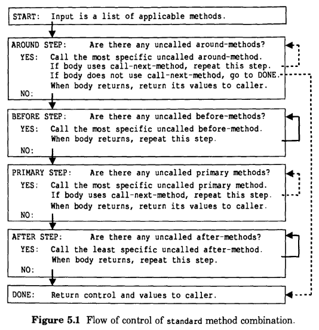

# 5 控制泛型调度

到目前为止我们写的所有示例程序都依赖于 before 方法，primary 方法和 after 方法。我们可以称之为CLOS的“核心框架”。本章介绍如何使用多种高级技术来拓展核心框架或完全替换核心框架。

## 5.1 核心框架

在核心框架中，控制流程如下：

1. 以“越具体的越优先”的排序依次调用所有 before 方法；

2. 调用最具体的适用的 primary 方法;

3. 以“越具体越靠后”的排序依次调用所有 after 方法。

在核心框架中，before 和 after 方法的返回值被忽略，仅仅返回 primary 方法的值。如果没有适用的 primary 方法，则会发出错误信号。

## 5.2 声明式和命令式技术

在核心框架的上下文中，您声明了方法的角色（通过其限定符）。我们称之为声明性技术。您将角色分配给一种方法，并依靠泛型调度过程根据核心框架内的角色调用适用的方法。

这种声明性技术适用于适合核心框架的程序。但是，有时您需要更直接控制泛型调度程序。CLOS提供了一些命令式的技术，使您可以明确控制下一步调用哪种方法。命令式的技术包括：

- 提供一个 around 方法来“包裹”核心框架；

- 调用被隐藏的 primary 方法

CLOS 供了额外的声明性技术，这两种技术都与熟悉的核心框架方法角色有所不同。您可以指定通用分派应该支持不同的方法角色，并使用完全不同的框架。

CLOS还提了一组内置框架，称为方法组合类型。方法组合类型控制支持哪些方法角色，调用各种方法的顺序，以及泛型函数的值是如何生成的。您可以使用一种内置的方法组合类型，也可以创建一个新的方法组合类型。因此，新的声明性技术包括：

- 使用内置的方法组合类型；

- 发明并使用一种新型组合式方法。

## 5.3 around 方法

around 方法通过在核心框架周围包装一层代码来扩展核心框架。around 方法通常执行一些计算并调用`call-next-method`来调用核心框架的方法。要指定一个方法是 around 方法，请在 `defmethod`表达式中包含关键字`:around`作为方法限定符。

around 方法提供了一种可能有用的新功能。它们可以设置在执行其他方法期间有效的环境。例如，around 方法可以设置一个`catch`或绑定一个特殊变量（动态变量）。在调用其他方法时，around 方法可以使用`with-lock`来捕获和持有锁。虽然可以使用 before 方法来捕获锁，使用 after 方法来释放锁，但这与在 around 方法中使用`with-lock`的效果不同:使用`with-lock`确保即使发生中止也会释放锁。

当只有一个 around 方法适用时，CLOS首先调用该 around 方法，并将其值作为泛型函数的值返回。(这与 before 和 after 方法有一个重要的区别，它们的值会被忽略。)如果这个 around 方法调用了`call-next-method`，整个核心框架就会被调用，`call-next-method`将核心框架的值返回给`around`方法。

around 方兴未艾与我们到目前为止看到过的方法都不同，因为 around 方法控制下一个调用哪个方法。如果 around 方法使用 `call-next-method`，则调用“下一个方法”。但是，如果 around 方法不使用`call-next-method`，则不会调用其他方法。因此，around 方法可以防止调用其他方法。

一般情况下，可以使用任意数量的 around 方法。总的来说，通用分派的工作方式是这样的:

1.CLOS调用最具体的 around 方法;它的值就是泛型函数的值。

2. 当 around 方法调用`call-next-method` 时:

  - 如果还有其他适用的 around 方法，则调用下一个最特定的 around 方法，并由`call-next-method`返回其值。
  - 如果没有则调用整个核心框架（before 方法， primary 方法， after 方法），并由 `call-next-method`返回其值。
  
**around方法的例子**

作为一个简单的例子，我们可以提供一个 around 方法来跟踪安装过程所花费的时间。around 方法的作用非常适合于定时安装的任务。下面的方法适用于所有受支持的产品和操作系统，它在通用分派中的角色确保它包裹了整个安装。这个方法顺序允许它在其他方法运行之前开始计时，并在其他方法返回之后完成计时。

```lisp
(defmethod install :around
  ((sw basic-produce) (os basic-os))
  (declare (ignore sw os))
  (let* ((start-time (get-internal-real-time))
         (result (call-next-method)))
    (if (null result)
        (format t "~&Installation completed in ~A seconds."
                (round (- (get-internal-run-time)
                          start-time)
                       internal-time-units-per-second))
      (format t "~&Installation failed."))
    result))

```

这个计算器的例子说明了 around 方法的一些有趣的方面：

- 这个方法使用`call-next-method`返回的值。这显示了我们在核心框架中没有看到的方法之间的通信方式。around 方法使用核心框架的结果来决定生成哪个输出，然后返回结果。around 方法通常(虽然不是必需的)返回一个或多个`call-next-method`的值。

- 这种方法只有在没有其他可应用的 around 时才有效。如果有一个更匹配的 around ，它将在这个方法之前被调用，所以这个方法不会为完整的安装计时。这是一个关于 around 方法是多么棘手的例子;通常，为了编写 around 方法，您需要明确了解其他适用的方法。因此，使用 around 方法可能导致非模块化代码。

- 这个 around 方法专门用于两个基本类，但它是通用分派调用的第一个方法(因为没有其他适用的 around 方法)。around方法允许您定义与不太具体的类相关联的代码，以便在更匹配的类提供的其他类型的方法之前执行一些计算。

- 虽然这个方法总是调用`call-next-method`，但是 around 也可以选择不调用`call-next-method`。因此，around 方法可以防止调用 before 方法、primary 方法和 after 方法。相反，before 方法不能在不使用抛出错误或其他函数放弃当前计算的情况下阻止调用其他方法。

## 5.4 调用被隐藏的 primary 方法

本节描述第二种命令式技术。CLOS允许您扩展核心框架的第二步: primary 方法的调用。在核心框架中，只调用最具体的 primary 方法。任何其他适用的 primary 方法都被最具体的方法“遮蔽”了。但是，最特定的 primary 方法可以调用`call-next-method`来调用下一个最特定的 primary 方法。被隐藏的方法可以返回值，它的调用者可以继续执行并利用这些值。

如果调用了一个泛型函数，并且没有适用的primary 方法，那么CLOS就会发出错误信号。另外，如果一个方法调用了`call-next-method`，而没有下一个方法，CLOS也会发出错误信号。您可以在方法的主体中使用`next-method-p`来确定是否存在另一个适用的 primary 方法。

任何 primary 方法都可以调用`call-next-method`，这将导致调用下一个最具体的 primary 方法。实际上， primary 方法可以多次调用`call-next-method`，每次都调用相同的“下一个方法”。

## 5.5 使用不同的方法组合类型

CLOS使您能够指定通用分派应该使用完全不同的框架并识别不同的方法角色。每个泛型函数都有一个方法组合类型，该类型定义泛型分派遵循的框架。方法组合类控制着：

- 所支持的方法限定符及其角色

- 调用方法的顺序

- 泛型函数生成返回值的方式

在泛型分派中，CLOS曾接受一组适用的方法，并将它们组合到实现泛型函数的 Lisp 代码中。这个 Lisp 代码称为有效方法。方法组合类型控制如何将适用的方法组合成有效的方法。

**默认的方法组合类型:standard**

默认的方法组合类型被命名为 `standard`。它支持没有限定符( primary 方法)的方法，也支持有以下限定符之一的方法:`:before`、`:after`或`:around`。标准方法组合类型支持在 around 方法和 primary 方法中使用`call-next-method`。我们已经讨论了方法被调用的顺序以及值是如何生成的，并且我们在[标准方法组合类型的总结]()第113页中总结了这些信息。

我们可以用标准的方法组合给出一个泛型函数的有效方法的粗略概念。假设适用的方法集合包括两种before 方法、两种primary 方法和两种after 方法。在本例中，没有适用的around-方法，也没有使用call-next-method。有效方法以最具体的第一顺序调用before 方法、最具体的primary 方法，并以最具体的最后顺序调用after 方法。返回 primary 方法的值。因此，有效的方法类似于:

```lisp
(multiple-value-prog1
 (progn (most-specific-before-method args)
        (least-specific-before-method args)
        (most-specific-primary-method args))
 (least-specific-after-method args)
 (most-specific-after-method args))
```

**progn方法组合类型**

假设我们需要实现一个函数来干净利落地关闭计算机资源，比如网络接口。网络接口是一个类的实例，它由几个超类构造而来。泛型函数 `shutdown` 应该允许每个类有机会做清理工作，为 shutdown 做准备。一个类可能会关闭硬件，其他类可能会清除挂起的输入和输出队列，并通知较高层的网络设备不再运行。

对于这个泛型函数，合理的做法是使用一个框架，以最具体的优先顺序调用所有适用的primary 方法。这个框架允许任何类提供一个方法来关闭。你可以将这样的框架可视化为一个Lisp表达式，它使用`progn`来调用所有适用的 primary 方法:

```lisp
(progn (method-1 args)    ; inform higher layers
       (method-2 args)    ; flush pending queues
       (method-3 args))   ; turn off hardware
```

CLOS提供了一组内置的方法组合类型，`progn`就是其中之一。除了 `standard` 方法组合类型外，任何内置方法组合类型都不能识别`:before`或`:after`方法。

**使用progn方法组合类型**

为了指定泛型函数应该使用不同类型的方法组合，我们使用 `defgeneric`的`:method-combination`选项，如下所示:

```lisp
(defgeneric shutdown (interface)
  (:method-combination progn))
```

为了编写与`progn`方法组合类型一起使用的primary 方法，我们提供符号`progn`作为方法限定符:

```lisp
(defmethod shutdown progn ((interface interface))
  body)
```

如果定义的方法限定符不能被泛型函数使用的方法组合类型识别，那么CLOS就会发出错误信号。

## 5.6 内置的方法组合类型

除了 `standard`(默认的方法组合类型)外，CLOS还提供了以下内置的方法组合类型:

<pre>
+            and        append
list         max        min
nconc        or         progn
</pre>

注意，这些方法组合类型与 Lisp 函数或特殊形式具有相同的名字;我们称它们为"运算符方法组合类型"。每种方法都定义了一个框架，该框架将对同名的 Lisp 操作符的调用中适用的primary 方法组合在一起。

primary 方法以最具体的排第一的顺序组合。例如，如果有三种主要的方法，从最具体到最不具体编号，那么有效的方法如下:

```lisp
(operator (primary-method-1 args)
          (primary-method-2 args)
          (primary-method-3 args))
```

操作符方法组合类型的语义由同名的Lisp操作符定义。例如，当使用 `progn` 方法组合类型时，操作符是特殊形式 `progn` 。因此，框架遵循 `progn` 的语义:调用所有的方法，并返回最后一个方法的值。类似地，当使用 `list` 方法组合类型时，结果是所有方法值的列表。

**运算符方法组合类型中的primary方法**

在标准方法组合中，不合格的方法是primary 方法。然而，当使用操作符方法组合类型时，情况就不是这样了;他们不接受不合格的方法。要与操作符方法组合类型一起使用的primary 方法必须具有方法限定符，该方法限定符是方法组合类型的名字。

例如，泛型函数`total-electric-supply`使用`+`方法组合类型:

```lisp
(defgeneric total-electric-supply (region)
  (:method-combination +))
```

一个用于 `total-electric-supply` 的 primary 方法必须有符号 `+` 作为其方法限定符:

```lisp
(defmethod total-electric-supply + ((city city))
  body)
```

操作符方法组合类型不支持在 primary 方法中使用 `call-next-method`。

**操作符方法组合类型中的 around 方法**

操作符方法组合类型支持 around 方法，以及其中`call-next-method`的使用。以关键字`:around`作为限定符的方法是一个 around 方法。在有效方法中，任何 around 方法围绕对操作符的调用。

通常，当您使用操作符方法组合类型时，您只提供 primary 方法。但是，around-methods受支持的原因与标准方法组合受支持的原因相同:允许您对通用分派过程进行额外程度的控制。例如，你可以提供一个方法来打印结果的英文描述，然后返回结果:

```lisp
(defmethod total-electric-supply :around ((region region))
  (let ((supply (call-next-method)))
    (format t "Available electricity in ~A is: ~A"
            region supply)
    supply))
```

通常，around 方法返回由`call-next-method`返回的任何值，尽管这不是必需的。

**运算符方法组合类型摘要**

操作符方法组合类型的作用如下:

- 支持 primary 方法和 around 方法，但不支持 before 方法或 after 方法

- 支持在 around 方法中调用 `call-next-method`， 但是不支持在 primary 方法中调用

- 以和 `standard` 方法组合类型相同的方式调用 around 方法

- 在对名字与方法组合类型名字相同的 Lisp 操作符的调用中，组合所有适用的 primary 方法，并以最特定的第一顺序调用这些方法

- 要求至少一个 primary 方法，如果不存在，则发出错误信号

## 5.7 定义新的方法组合类型

CLOS使得定义一个新的操作符方法组合类型变得很容易——这个框架将 Lisp 函数、宏或特殊形式中的所有适用的 primary 方法组合在一起。宏定义方法组合有短格式和长格式两种。短格式具有简单的语法，足以定义许多常用的方法组合类型。

**define-method-combination的短格式**

`define-method-combination`的简写形式定义了一种操作符方法组合类型。任何内置操作符方法组合类型都可以使用 `define-method-combination` 的缩写形式来定义。例如，如果`progn`方法组合类型还没有定义，我们可以这样定义它:

```lisp
(defin-method-combination progn
  :operator progn
  :identity-with-one-argument t)
```

第一个参数是方法组合类型的名字。`:operator`关键字指定了接收方法值的操作符。给方法组合类型指定与操作符相同的名字通常是合理的。带有一个参数的 `:identity-with-argument t` 选项意味着“当它被调用时，这是一个标识。”这个选项要求编译器在只有一个适用方法的情况下进行优化;它表明该方法的值应该作为泛型函数的值返回，而不是调用操作符。这对于诸如 `progn`、`and`、`+`、`max`等操作符以及所有其他内置操作符方法组合类型都是有意义的。

操作符方法组合类型支持 primary 方法和 around 方法，但不支持 before方法和 after方法。around 方法可以使用`call-next-method`，但 primary 方法不可以。primary 方法必须具有与方法组合类型的名字符号相同的方法限定符。有关相关信息，请参见107页的[内置方法组合类型]()。

**define-method-combination的长格式**

长格式的 `define-method-combination` 支持丰富而强大的语法，用于定义新的框架。当任何内置的方法组合类型(包括`standard`)都不合适时，并且框架不能用`define-method-combination`的简写形式定义时，可以使用它。因为我们相信大多数应用程序都能很好地适应一种内置的方法组合类型，所以在本书中我们不讨论 `define-method-combination` 的冗长形式的语法。有关更多信息，请参阅CLOS规范。

## 5.8 控制泛型调度的指南

声明式技术依赖于一个一致的框架，在这个框架中，方法根据它们在框架中的角色被调用;方法的角色由其限定符声明。通用分派自动实现调用适当的适用方法的过程。无需查看方法体中的代码，就可以预测方法的顺序。

相反，命令式技术允许方法本身通过调用`call-next-method`来改变通用分派的过程。这种技术提供了一种不同的功能，同时为程序增加了相当程度的复杂性。通常，你需要理解继承行为的实现，以便使用调用下一个方法;在某种意义上，这违背了模块化。然而，如果不使用命令式的技术，某些程序就写不出来。我们建议您只在真正需要时使用 around 方法和 `call-next-method`。

在`shutdown`示例中，我们使用了使用`progn`类型方法组合的声明性技术。但是，我们可以用不同的方式编写程序，使用`standard`方法组合类型。在这里，我们描述了两种可选的`shutdown`实现，并讨论了导致我们选择`progn`而不是标准方法组合类型的设计考虑因素。

- 命令式技术:`call-next-method`。每个类都可以提供一个 primary 方法，该方法执行所需的任何计算，然后调用 `call-next-method` 将控制权传递给下一个最具体的 primary 方法。最泛化的方法必须返回而不调用 `call-next-method`。<br> 这个方案有几个缺点。有必要检查所有的方法来理解实现。任何一个方法都可以通过不调用`call-next-method`来破坏实现。此外，这不是一个一致的模型;它要求最泛化的方法不调用`call-next-method`，而其他所有方法都必须调用`call-next-method`。(每个方法都应该使用`next-method-p`来确定是否有不太具体的方法要调用。)最后，这个方案可能需要几个额外的函数调用，这会增加开销。

- 声明式技术: before 方法。每个类都可以提供一个 before 方法。before 方法以最特定的优先顺序运行，因此可以通过这种方式实现所需的方法顺序。因为 `standard` 方法组合需要一个 primary 方法，所以至少有一个类必须提供一个 primary 方法。primary 方法不需要做任何事情;它可以简单地返回`nil`。<br> 这里的缺点是，方法声明的角色不能准确地反映它们的目的。我们期望一个主要的方法来完成大部分的工作，但是这个主要的方法对实现来说并不是必需的;它仅仅满足标准方法组合的要求。通常，after 方法在 primary 方法之前做辅助工作，但这些前置方法对实现不是辅助的;它们是实现。这个方案试图将一个程序强制放到`standard`方法组合框架中，即使这个框架并不适合这个程序。

这些技术依赖于所有方法都必须遵循的特殊约定。第一个约定依赖于`call-next-method`，第二个约定依赖于 before 方法。这两个约定对一种方法的处理与其他方法不同。

在本例中，定义新框架的声明性技术有一个很大的优点:它消除了必须由每个方法维护的临时约定的需要，而支持由通用分派过程自动维护的具体的、一致的框架。

## 5.9 泛型调度程序摘要

当调用泛型函数时，泛型分派过程负责选择适合泛型函数的实参的实现。这个过程包括四个步骤:

1. 选择一组适用的方法

2. 对可应用的方法进行优先级排序

3. 根据方法的作用和方法的组合类型，将方法组合成有效的方法

4. 调用有效方法并返回其值

关于这个过程的第一步和第二步的完整总结，请参阅第98页的[方法继承的总结]()。

在第三步中，CLOS选择泛型函数的最终实现，方法是将这些方法组合成一个称为有效方法的代码体。第三步的输入包括按优先级排序的适用方法集，以及方法组合类型。方法组合类型描述如何根据它们的限定符组合方法。默认情况下，泛型函数使用 `standard`方法组合类型。当您定义和使用一个新的方法组合类型时，您可以自定义第三步。方法组合类型对任何其他步骤都没有影响。

CLOS实现可以自由地优化通用分派过程，这样这些步骤中的一些是预先计算的，因此不会在每次泛型函数调用时执行。

## 5.10 标准方法组合类型概述

`standard` 方法组合类型是默认的。所有泛型函数都使用这个框架，除非`defgeneric`表达式使用`:method-combination`选项来指定另一个方法组合类型。

这一节总结了标准方法组合类型是如何工作的，包括它支持什么方法角色，各种方法是如何组合成一个有效的方法，以及值是如何处理的。

**识别方法的角色**

标准方法组合类型根据方法的限定符识别方法的四种角色:

| Qualifier | Method Role                               |
| --------- | ----------------------------------------- |
| none      | A primary method                          |
| :before   | Called before the primary method          |
| :after    | Called after the primary method           |
| :around   | Wrapped around all other kinds of methods |

`standard` 方法组合类型支持在 around 方法和 primary 方法中调用 `call-next-method`。

**控制流**

图5.1为标准方法组合中方法的控制流程。每一步都提出一个问题;这个问题的答案决定了控制流的下一步走向。注意 around 和 primary 的步骤，有一个相同的问题，只能通过执行方法的主体来回答:这个方法的主体是否使用了 `call-next-method`?如果是，则调用“下一个方法”。对于 around 方法，“下一个方法”是下一个最具体的 around 方法(如果有的话);否则，它就是整个核心框架。对于一个 primary 方法，“下一个方法”是下一个最具体的 primary 方法。



图5.1中的虚线显示了使用下一个调用方法控制的决策。例如，如果主体中有一个 around 方法和 `call-next-method` 没有被使用，控制流将直接转到 DONE，而不调用任何 before 方法、primary 方法或 after 方法。

如果一个方法的主体多次使用`call-next-method`，那么每次都会调用相同的“下一个方法”。

**错误**

图5.1没有显示可能的错误情况。在下列情况下，CLOS会抛出错误信号：

- 没有适用的 primary 方法

- primary 调用了 `call-next-method`,全是没有适用的 "下一个方法"

- 在 before 或 after 方法中调用了 `call-next-method`

**值**

总结一下，方法的值是如何处理的：

- 所有 before 和 after 方法的值都被忽略掉

- 每个 primary 和 around 方法的值返回给调用者

- 如果没有适用的 around 方法，那么泛型函数的最终值就是最具体的 primary 方法返回的值

- 如果存在任何适用的 around 方法，那么泛型函数的最终值就是最特定的 around 方法返回的值
