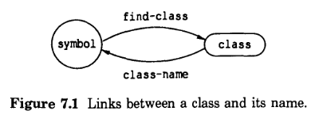

# 7 定义CLOS元素

在本章中，我们将描述定义类、方法和泛型函数时会发生什么。我们将讨论以下主题:定义CLOS元素的顺序，泛型函数及其方法的 lambda-list 的一致规则，表示CLOS元素的 Lisp 对象，以及这些对象与其名字之间的关系。

## 7.1 CLOS元素的定义顺序

CLOS非常灵活，允许你以各种不同的顺序定义CLOS元素:

- 当设计类组织时，你可以按任意顺序定义类;可以在定义类的超类之前先定义类。

- 您可以以任何顺序定义方法和泛型函数。如果在定义泛型函数之前定义了方法，CLOS会自动创建泛型函数。泛型函数的 lambda-list 是由方法的 lambda-list 导出的;泛型函数的所有其他方面都是默认的。如果你以后再使用 `defgeneric`，现有的泛型函数会被修改。

然而，有一些排序依赖关系:

- 在创建类的实例之前，必须定义该类及其所有超类

- 在定义专门用于类的方法之前，必须先定义该类本身

## 7.2 lambda-list的一致性

当一个 `defgeneric` 表达式被求值并且没有泛型函数的方法存在时，`defgeneric` 表达式建立一个参数模式，所有方法都必须遵循该模式。如果在求值 `defgeneric` 表达式之前定义了方法，则该方法建立了参数模式。参数模式派生自 `defmethod` 或 `defgeneric` 表达式的 lambda-list。它指定了必需参数的数量、可选参数的数量，以及是否使用 `&rest`、`&key` 或两者都使用。

一旦建立了模式，如果求值了与模式不匹配的任何 `defmethod` 表达式或 `defgeneric` 表达式，则CLOS会发出错误信号。要匹配模式，必须遵守以下CLOS一致性规则：

- 所需参数的数量必须与已建立的模式相同。

- 可选参数的数量必须与已建立的模式相同。方法可以为可选参数提供默认值，但`defgeneric`表达式不能。

- 如果建立的模式使用`&rest`或`&key`，那么所有的方法和`defgeneric`表达式必须使用`&rest`或`&key`，或者两者都使用。

对关键字参数进行特殊处理。一个`defgeneric`表达式可以声明关于`&key`参数的需求，无论参数模式是否在`defgeneric`表达式被求值之前建立。我们在这里说明关键字参数的规则，然后进一步解释它们。

- 如果`defgeneric`表达式指定了`&key`，那么它的关键字参数集必须被每个方法接受。换句话说，`defgeneric`表达式声明了所有方法必须接受的最小关键字集合。这些方法可以通过使用`&key`显式地命名它们、使用`&rest`而不是`&key`或指定`&allow-other-keys`来接受关键字。

- 每个方法可以命名和关键参数，除了由`defgeneric`表达式指定的集合;唯一的要求是所有的方法必须接受`defgeneric`所指定的最小集合。

对于使用`&key`形参的泛型函数，在调用泛型函数时，会检查关键字参数的有效性。可接受的关键字集由`defgeneric`表达式和适用的方法控制。如果`defgeneric`表达式或一个或多个适用方法接受关键字参数，则泛型函数调用将接受该参数。

一般来说，泛型函数将其所有参数传递给它调用的每个方法。然而，如果一个泛型函数调用一个没有显式接受关键字参数的方法，则不会发出错误信号。泛型函数检查关键字参数的有效性;这种检查不是由个体方法完成的。

如果`defgeneric`表达式或泛型函数的任何方法使用`&allow-other-keys`，则在调用泛型函数时接受所有关键字参数。

一般来说，如果定义的方法或泛型函数不遵守这些一致规则，则CLOS抛出错误。这可能发生在以下情况:

- 求值 `defmethod` 或 `defgeneric` 表达式时，该表达式与已建立的模式不匹配

- `defmethod`表达式不接受`defgeneric`表达式所指定的最小关键字参数集

- `defgeneric`表达式被求值，现有方法不接受`defgeneric`表达式指定的最小关键字参数集

## 7.3 表示CLOS元素的Lisp对象

使用`defclass`时，返回值是一个类对象。类似地，`defgeneric`返回一个泛型函数对象，`defmethod`返回一个方法对象。这些 Lisp 对象是CLOS的类、泛型函数和方法的内部表示。

在编写应用程序时，通常不需要直接处理表示CLOS元素的 Lisp 对象。相反，您可以通过名字来引用这些对象。例如，当您使用`defclass`时，您创建一个类对象并给它一个名字。稍后，您可以通过类的名字来引用该类——例如，在使用`make-instance`时。类似地，在定义一个泛型函数(使用`defgeneric`)、为它创建方法(使用`defmethod`)和调用它时，可以通过名字来引用它。

CLOS程序员接口可以分为两个独立的级别。宏`defclass`、`defmethod`和`defgeneric`都在“宏级别”，具有方便的语法，允许您处理对象的名字。宏级别是通过“函数级”实现的，它处理对象而不是名字。大多数应用程序都可以完全用宏来编写。函数级提供了更大的灵活性，例如支持匿名类和泛型函数。

## 7.4 名字和对象之间的映射

本节描述CLOS元素的名字与表示这些元素的 Lisp 对象之间的关系。

### 类

使用`defclass`时，返回值是一个类对象。这个类对象有一个名字，它是一个符号。实际上，类名和类对象之间有两种关联。`defclass`宏会自动建立这两种关联。

一个关联是由类对象本身维护的。你可以使用`class-name`来查询类对象的名字，然后使用`(setf class-name)`来改变这种关联:

```lisp
(class-name class-object)
(setf (class-name class-object) symbol)
```

另一个关联由符号维护。您可以使用 `find-class` 查询具有该名字的类的符号并使用 `(setf find-class)` 更改该关联：

```lisp
(find-class symbol)
(setf (find-class symbol) class-object)
```

您使用 `class-name` 来询问“这个类对象的名字是什么？” 然后您使用 `find-class` 来询问“具有此名字的类对象是什么？”



图 7.1 显示这两个关联是独立的。更改与名字关联的类（由符号维护）不会影响与类关联的名字（由类对象维护）。因此，这两个关联可能变得彼此不同步。

### 泛型函数

泛型函数的命名与普通函数的命名一样。泛型函数对象存储在符号的"函数"单元中;该符号是泛型函数的名字。你可以通过使用`symbol-function`来查询与之关联的泛型函数的符号，然后使用`(setf symbol-function)`来改变这种关联。

由于泛型函数和普通函数的命名方式相同，COMMON LISP 通过包将相关函数和符号保存在一起，这种技术对于泛型函数和普通函数一样有用。同样，一个符号不能同时命名普通函数和泛型函数。

在 Lisp 中，函数不需要有名字;您可以使用`lambda`来定义一个匿名函数。CLOS不要求泛型函数有名字。要创建匿名泛型函数，可以使用`generic-function`宏。它具有与`defgeneric`相同的语法，除了泛型函数的名字没有参数。

### 方法

方法没有名字。方法由其实现的泛型函数、参数专门化和限定符来标识。很少需要直接访问方法。通常，只需定义方法，它们由通用分派过程自动调用。当您想要使用`remove-method`打破泛型函数和方法之间的关联时，就会出现需要访问方法的一种情况。我们在第136页的[移除泛型函数和方法]()中给出了一个例子。

### 参数专门化

CLOS区分参数专门化的名字和表示它们的对象。只有参数专门化名字出现在`defmethod` 的 lambda-list 中，而函数级的操作符使用参数专门化对象。

| Name       | Corresponding Object                      |
| ---        | ---                                       |
| 类名        | 该名字的类对象，由find-class获取              |
| (eql form) | (eql object), 其中，object 是 form 的求值结果 |

## 7.5 删除泛型函数和方法

本节描述如何“删除”泛型函数或方法的定义，以确保它永远不会被调用。

### 泛型函数

可以通过打破名字和对象之间的关联来删除泛型函数。就像普通函数一样，可以通过使用`fmakunbound`来实现。

### 方法

可以通过打破方法对象和泛型函数之间的关联来删除方法。尽管CLOS没有提供方便的宏来完成这项工作，但是您可以使用CLOS函数级别的`remove-method`和`find-method`这两个操作符。如前所述，函数级处理的是对象，而不是名字。要使用这些操作符，必须访问泛型函数对象、方法对象和参数专门化对象。`remove-method`的语法是：

    (remove-method generic-function-object method-object)
    
要访问泛型函数对象，使用泛型函数字的 `symbol-function`。要访问方法对象，请使用`find-method`泛型函数。`find-method`的语法为：

<pre>
(find-method generic-function-object
             ({method-qualifier}*)
             ({parameter-specializer-objects}*))
</pre>

参数专门化对象列表的元素数量必须与所需参数的数量相同。非专门化的必需参数使用名为`t`的类作为其参数专门化器。

这里，我们展示了一个删除方法的例子。参数专门化名字是类名字，因此我们通过使用`find-class`来访问参数专门化对象。

```lisp
;;; The method to remove
(defmethod restore-product :before (sw (os genera))
  body)

;;; Removing the method
(let* ((generic-function (symbol-function 'restore-product))
       (method (find-method generic-function
                            '(:before)
                            (list (find-class 't)
                                  (find-class 'genera)))))
  (remove-method generic-function method))
```
