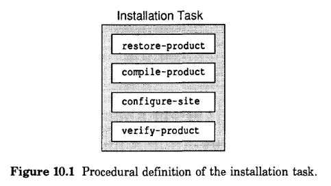

# 10 过程定义：初始化

在本章中，我们将讨论设计高级任务的“过程定义”的技术； 这需要将任务分解为单独的泛型函数，每个函数负责明确定义的任务部分。通常，泛型函数有默认行为。程序员使用这些泛型函数作为入口； 他们可以通过专门化一种或多种泛型函数来控制部分任务。

有些程序有几个相关的任务。任务的程序定义可以重叠，以共享代码。可以定义两个或三个任务来调用单个泛型函数。这种技术可以引出模块化程序； 它需要精心的设计，共享的工作得以共享，而单独的工作得以分开。我们详细研究一个例子：初始化的CLOS过程定义。

## 10.1 过程定义的例子

我们在第80页[安装的实现]()中使用了过程定义技术。如图 10.1 所示，安装任务分为四个泛型函数，每个函数执行一个单一的方面 安装。

稍后，在第207页[创建流的过程定义]()中，我们设计了一个过程定义，用于选择要创建的正确流类，并通过为 `make-instance` 提供适当的参数来创建流。

CLOS本身使用程序定义技术。我们已经看到 `make-instance` 有一个过程定义：它总是调用 `initialize-instance`。类重定义是另一个例子； 它总是调用 `update-instance-for-redefined-class`。同样，`change-class` 总是调用 `update-instance-for-different-class`。泛型函数 `initialize-instance`、`update-instance-for-redefined-class` 和 `update-instance-for-different-class` 被有意定义为入口点——可以用方法专门化的泛型函数。

某些错误情况也有过程定义：遇到错误时调用的泛型函数。默认方法发出错误信号，但您可以专门化泛型函数来执行不同的操作。泛型函数包括以下内容：

`slot-unbound`: 当尝试读取未绑定的槽时调用

`slot-missing`: 当试图访问实例的槽，但是实例中没有该槽时调用

`no-applicable-method`: 在调用泛型函数并且没有适用的方法时调用

`no-next-method`: 在使用 `call-next-method` 且没有可用的“下一个方法”时调用

## 10.2 隔离程序之间共享的工作

CLOS在几种情况下初始化实例：当第一次使用 `make-instance` 创建实例时，当实例因为其类被重新定义而被更新时，以及当您使用 `change-class` 更改实例的类时。此外，函数 `reinitialize-instance`（很少在应用程序中使用，但在元对象协议中的CLOS本身的实现中使用）执行基于initargs的实例的初始化。

在这些任务中的每一个中，初始化工作很相似但不完全相同。在面向对象的设计中，目标是分离出可以共享的工作，定义一次，然后在需要的任何地方使用它。在本节中，我们将描述CLOS如何以面向对象的方式定义这些相关过程。您可以在设计自己的程序时使用这种方法。四个相关的初始化过程都有些复杂，大部分应用程序不需要这么复杂； 尽管如此，该示例还是很好地说明了过程定义。

第一步是确定这些程序的共同点。这里我们重点关注每个任务中完成的初始化工作：

`initialize-instance`: 根据initargs进行初始化； 然后，对于仍然未绑定的任何槽，用它们的 initforms 的值填充这些槽

`reinitialize-instance`: 根据initargs执行初始化

`update-instance-for-redefined-class`: 根据initargs进行初始化； 然后，对于任何添加的仍然未绑定的本地槽，用它们的 initforms 的值填充这些槽

`update-instance-for-different-class`: 根据initargs进行初始化； 然后，对于任何添加的仍然未绑定的本地槽，用它们的 initforms 的值填充这些槽

我们已经确定了初始化的两个阶段：根据initargs执行初始化，然后用它们的 initforms 的值填充一些未绑定的槽。CLOS安排这两个阶段由一个泛型函数 `shared-initialize` 完成，该函数被提到的所有四个泛型函数调用。这四个函数的要求略有不同； 这些差异是通过向 `shared-initialize` 提供参数来管理的。共享初始化的语法是

    (shared-initialize instance slots-for-initform &rest initargs)

## 10.3 用initforms填充未绑定的槽

对于这两个更新函数，对于添加的本地槽，使用初始化表达式填充未绑定槽的阶段已经完成。对于`initialize-instance`，这个阶段是对所有槽执行的;对于`reinitialize-instance`，它不会对任何槽执行。

泛型函数 `shared-initialize` 接受一个称为 `slot-for-initform` 的必需参数，指示哪些槽要用它们的 initform 填充。此参数是槽名字的列表，或 `t` 表示所有槽，或 `nil` 表示没有槽。下表显示了调用者（四个泛型函数的默认方法）如何提供 slot-for-initform 参数： 

| `shared-initialize` 的调用者  | *slots-for-initform* 的值 |
| ---------------------------- | ------------------------ |
| initialize-instance                 | t                 |
| reinitialize-instance               | nil               |
| update-instance-for-redefined-class | 添加本地槽          |
| update-instance-for-different-class | 添加本地槽          |

## 10.4 通过initargs执行初始化

如第159页[使用方法控制初始化]()中所述，`initialize-instance` 根据initargs执行初始化。如果在对 `initialize-instance` 的调用中给出了槽填充 initarg，则槽将被该值填充，即使槽已经有一个值。initargs 也可以由用户定义的初始化方法使用，这些方法执行应用程序所需的额外工作。

在大多数情况下，不需要更新函数以使用初始初始化参数。然而，有时，应用程序需要一个用于特殊目的的方法，而该方法需要一些参数作为输入。例如，`update-instance-for-redefined-class` 的方法可能需要除了四个必需参数之外的参数； 对于 `update-instance-for-different-class` 的方法也是如此。

initargs 在所有初始化任务中都很有用，因此这是另一项可以共享的工作。因此，`shared-initialize` 接受一个由initargs组成的 `&rest` 参数。`shared-initialize` 的每个调用者选择是否提供 initargs。

用户可以直接提供initargs给`make-instance`； 这些initargs被传递给 `initialize-instance`，然后被传递给 `shared-initialize`。但是，当重新定义类或更改实例的类时，用户不能提供 initargs。那么initargs在这些更新过程中有何用处呢？ 您可以为 `update-instance-for-redefined-class` 或 `update-instance-for-different-class` 定义 around 方法。around 方法计算initargs并将它们传递给 `call-next-method` 的调用； 使用这些initargs调用默认方法，并将它们传递给 `shared-initialize`。因此，around 方法是允许更新函数使用initargs的入口点。

## 10.5 专门化程序的一部分

程序定义使用户能够将程序的一个或多个方面作为一个整体进行专门化。初始化方案认识到某些工作只适用于一项任务（例如类重新定义），而其他工作则适用于所有初始化任务。过程定义将四个初始化任务彼此分开，并通过调用 `shared-initialize` 将它们组合起来。

| Specializing this Generic Function  | 效果                                         |
|-------------------------------------|-------------------------------------------- |
| initialize-instance                 | 创建实例                                     |
| reinitialize-instance               | 重新初始化实例                                 |
| update-instance-for-redefined-class | 重新定义类                                    |
| update-instance-for-different-class | 改变类                                       |
| shared-initialize                   | 创建实例 重新初始化实例 重新定义类 改变类 |

五个初始化函数中的每一个都有一个默认的primary 方法。例如，`update-instance-for-different-class` 的默认方法使用适当的参数调用 `initialize-instance`。反过来，`initialize-instance` 的默认方法根据其参数根据initargs和 initforms 执行初始化。通常，程序员通过提供 after 方法而不是 primary 方法来专门化这些泛型函数。

## 10.6 将initarg名字声明为有效

所有五个初始化函数都接受 initargs。如第 160 页[Initial-”Initialization Arguments]()中所述，initarg 名字必须声明为有效。如果使用无法识别的initarg名字调用泛型函数，则会发出错误信号。

| 任务 | 声明initarg名字有效的初始化方法 |
| ------------ | ------------------------------- |
| 创建实例      | `make-instance` `initialize-instance` `shared-initialize` |
| 重新初始化实例 | `reinitialize-instance` `shared-initialize` |
| 修改类       | `update-instance-for-different-class` `shared-initialize` |
| 重新定义类    | `update-instance-for-redefined-class` `shared-initialize` |
