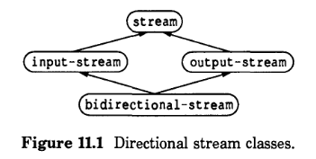
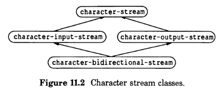

# 11 开发一个高级CLOS程序：流

本章说明了实现 Common Lisp 流的面向对象的基础，其行为在 Steele 的 Common LISP: The Language 中指定。流天然适合面向对象的模型。许多种类的相关流可以用多重继承来建模。

这个例子比本书中的其他考试例子更具挑战性。我们的目标是演示如何通过使用CLOS技术将问题分解为可管理的模块来解决大型问题。流基础的设计指定了每个模块的职责。实现由模块本身组成，它们是类、泛型函数和方法。设计是具有挑战性的部分——但如果做得好，实现就相对简单。（您会注意到其中一个模块（磁盘流）的实现实际上非常复杂，但复杂性是由于磁盘设备本身的处理，无论流的设计如何，这都是必要的。）

我们首先总结什么是 Common Lisp 流，以及它们是如何创建和使用的。然后我们描述我们的整体设计并展示说明CLOS和面向对象风格的实现部分。这个例子开发了流的基础，并说明了如何编写一些熟悉的 Common Lisp 流函数来使用该基础。例如，我们展示了如何使用此基础编写 `read-char`、`write-char`、`read-byte` 和 `write-byte`，但我们省略了其他函数的定义，例如 `read-line` 和 `write-line`。

外部接口由 Common LISP: The Language 指定，在以下章节中：

| ------------ | ------------------------- |
| Chapter 21   | Streams                   |
| Section 22.2 | Input Functions           |
| Section 22.3 | Output Functions          |
| Section 23.2 | Opening and Closing Files |

此示例并非旨在成为流的实际实现； 这是一个可以填满整本书的主题。在大多数情况下，我们忽略了效率考虑。流需要访问设备以进行 I/O，因此我们假设（并记录）一组我们在方法中调用的磁带和磁盘 I/O 的低级原语。这些原语是真实 I/O 系统中可能存在的简化版本。我们不包含实现这些原语的 Lisp 代码，因为它依赖于设备、冗长且复杂，并且可能与面向对象编程无关。

此示例的价值在于将实质性问题分解为单独的功能组件以及为这些组件之间的通信指定协议的技术。方法主体的细节不如整体模块化重要。在您阅读时，我们鼓励您关注这些部分如何组合在一起，而不是陷入任何一个部分的细节中。

## 11.1 流概述

设计和开发面向对象程序的第一步是了解您要解决的问题。 我们首先描述我们需要建模的所有对象类型以及对对象的操作。 有了这些信息，我们将能够设计一个班级组织。

Common Lisp 流用于将数据从源传输到目标。 例如，当您使用文本编辑器时，您使用编辑器命令将缓冲区的内容保存到文件中，就会使用流来传输数据。

**流的种类**

有不同类型的流，用于不同的目的。 下面的流类型与数据流的方向有关：

- 输入流：将数据从外部源带入LISP。 一个例子是`*standard-output*`绑定的流。
- 输出流：将数据从Lisp发送到外部目的地。 一个示例是`*standard-output*`绑定的流。
- 双向流：在输入和输出方向上传输数据。 一个例子是`*query-io*`绑定的流。

以下流类型与正在发送的数据的类型有关，这是流的元素类型：

- 字符流：传输字符
- 字节流：传输二进制字节的数据，其中“字节”指的是具有特定位数的整数

流有两端;它们把两个事物联系起来。一端连接到LISP，另一端连接到某种设备。输入流将数据从设备带入LISP，而输出流将数据从LISP发送到设备。

设备可以是磁盘、磁带、网络、终端或其他类型的设备。在本例中，我们支持磁盘和磁带设备。以下流类型与流所连接的设备有关:

- 磁盘流：从磁盘接收数据或发送数据到磁盘
- 磁带流：从磁带接收数据或发送数据到磁带

使用流时，该流有三个方面：方向，元素类型和设备类型。 例如，当将编辑器缓冲区的内容保存到磁盘文件时，您使用的是一个字符流，输出流和磁盘流的流。

COMMON LISP 定义了定向流的概念; 谓词`input-stream-p`，`output-stream-p`和`bidirectional-stream-p`用于确定流的方向。 COMMON LISP 还定义了元素类型流的概念，提供`stream-element-type`函数来查询一个流的元素类型。 设备流不是 COMMON LISP 的概念; 它们属于我们的流基础的设计。

**流的类型决定了它的操作**

一个流的类型决定了可以在该流上执行哪些操作。 输出流支持诸如`force-output`和`finish-output`的操作。 字符输入流支持`read-char`; 字符输出流支持`write-char`。 双向字符流同时支持字符输入和输出操作。 类似地，一个字节输入流支持`read-byte`; 字节输出流支持`write-byte`; 而双向字节流同时支持`read-byte`和`write-byte`。

流的设备类型也控制着可以在流上执行的操作。在本例中，磁带设备支持顺序访问，磁盘设备支持顺序访问和随机访问。因为我们在使用磁盘设备时有更大的控制权，所以磁盘流比磁带流有更大的能力，而磁带流仅限于顺序操作。

**创建和使用流**

创建流的一种方法是打开文件。函数`open`返回一个连接到指定文件的流。`open`的参数控制流的类型。例如，要创建一个字符输出流(用于将字符传输到文件)，你可以使用适当的`filename`参数来求值这个表单:

    (open filename :direction :output :element-type 'character)
    
文件流的设备类型从`filename`参数中提取。如果文件名指定磁盘设备，则流将为磁盘流。当您完成使用文件时，您可以关闭流。已关闭的流不允许任何输入或输出操作。

    (close filename)
    
使用`open`时，您正在创建文件流。 文件流支持删除和重命名等文件操作。 我们的流基础提供了对文件流的较低级别支持; 可以在此基础上构建文件流。 

## 11.2 设计我们的流基础

我们有以下设计目标：

- 组织多个流 class，以准确地反映不同种类的流之间的关系
- 将公共行为抽象成可以在若干上下文中使用的不同模块。 换句话说，我们将定义一组类，每个类都有支持定义良好的流行为方面的方法。 我们希望共享几个类中通用的代码，以避免重复代码，并使该程序整体更小，更简单，更易于维护。
- 计划扩展我们的基础。我们将定义一个内部协议，在我们的实现中使用它，并将它作为文档供其他程序员使用。

**有关类的组织**

为了达到既定的目标，我们定义了这些类组:

+ 所有流的基础`stream`
+ 定向流，包括`input-stream`, `output-stream`, `bidirectional-stream`
+ 元素类型流，包括`character-stream`, `byte-stream`
+ 设备流，包括`disk-stream`, `tape-stream`

我们的设计有效地将流定义为“构建在流类上的对象”。因此，客户端可以通过使用`typep`和`streamp`来确定一个对象是否为流。以下两种形式是等价的:

    (typep object 'stream)
    (streamp object)
    
这些类中的每一个都是构建块，仅用于处理流的一个方面。一个完整的流由指定了方向、元素类型和设备的构建块组成。一个完整的例子是`character-disk-input-stream`:该类继承自`character-stream`、`disk-stream`、`input-stream`和`stream`。

设备流在不知道元素是字符还是字节的情况下操作数据元素。每个元素类型流操作数据时都知道数据类型，但不知道究竟是何种设备。我们希望隔离设备流领域内特定于设备的操作，并隔离元素类型流中所有特定于数据类型的操作。

这种设计使得客户端很容易扩展我们的流程序。要添加对新元素类型的支持，客户端只需要为特定于流的元素类型的泛型函数提供方法。新的元素类型流立即可以和支持内部协议的所有类型的设备一起工作。类似地，在引入新设备时，需要为设备特定的泛型函数添加方法，新设备将立即与所有类型的元素一起工作。

有三种基本的方向流类型，每一种都是建立在`stream`之上的:`input-stream`、`output-stream`和`bidirectional-stream`。如图11.1所示，`bidirectional-stream`建立在`input-stream`和`output-stream`的基础上。



这种模式反映在其他类组中。图11.2显示了字符类的组织。

尽管没有在这些图中显示，但每个字符流类都是建立在一个定向流类上的。也就是说，`character-stream`是建立在`stream`之上的，`character-input-stream`是建立在`input-stream`之上的，依此类推。



设备流类遵循相同的模式。例如，我们将为磁盘设备定义以下类:`disk-stream`、`disk-input-stream`、`disk-output-stream`和`disk-bidirectional-stream`。

**流的外部协议**

流的外部协议在 Common LISP: The Language 中指定。在这个例子中，我们实现了以下 Common Lisp 流操作的子集:

| 流类型 | 操作 |
| --------------- | ------------------- |
| 所有流 | `input-stream-p`,`output-stream-p`,<br>`close`,`stream-element-type` |
| 输出流 | `force-output`,`finish-output` |
| 输入字节流 | `read-byte` |
| 输出字节流 | `write-byte` |
| 双向字节流 | `read-byte`, `write-byte` |
| 输入字符流 | `read-char` |
| 输出字符流 | `write-char` |
| 双向字符流 | `read-char`, `write-char` |
| 磁盘流    | `set-position` |

`set-position`是对 COMMON LISP 的扩展。它的契约：

`set-position` *stream new-position* `&optional` *eof-error-p eof-value*

将当前位置（文件指针）设置为指定的位置。元素位置是文件中元素的编号，其中第一个元素为0, 下一个是1,依此类推。如果 *new-position* 超出了文件末尾，则 *eof-error-p* 和 *eof-value* 决定了是否抛出错误或返回一个替代值，否则，返回新的位置（文件指针）。

我们稍后将在第207页[创建流的过程定义]()讨论如何创建和打开流。

**流的内部协议**

我们定义内部协议的目的是对不同流类之间的通信进行编码。这使得每个类都可以实现定义良好的内部协议的一个方面，并依赖于其他类来实现其它的方面。内部流协议包括以下操作:

+ `bytes-per-element` *stream* 支持所有元素类型的流。返回存储该类型的一个元素所需的字节数（8-bit）。返回值是一个正整数。

+ `storage-unit-size` *stream* 支持所有设备类型的流。返回该设备通常的读写单元的字节数(8-bit)。对于磁盘流，就是磁盘扇区的大小。对于磁带流，就是磁带记录的大小。

+ `make-element-array` *stream* 支持所有的流。 创建一个数组以用作输入或输出的缓冲区。 数组的大小与设备相适应（请注意，低级设备元语读取和写入固定大小块），并且与流的元素类型相适应。 这可以根据`storage-unit-size`, `stream-element-type`和`bytes-per-element`来实现。

+ `ensure-open-stream` *stream* 支持所有流。在访问一个流之前检查流是否已打开。如果试图访问一个已关闭的流，则抛出错误信号。

+ `read-next-element` *input-stream* 支持所有设备的输入流。使用低级的设备原语读取数据的一个元素，第二个返回值是`t`（到达文件末尾）或`nil`。

+ `write-next-element` *output-stream* 支持所有输出流。使用低级设备原语写入数据的一个元素。

+ `force-output-internal` *output-stream* 支持所有输出流。`force-output`的内部实现。

+ `finish-output-internal` *output-stream* 支持所有输出流。`finish-output`的内部实现。

## 11.3 使用流的示例进行实验

如果您打算尝试这个示例中的代码，请记住，我们重新定义了几个重要的 Common Lisp 函数，这些函数在流上操作。您可以为测试此示例定义一个包，并指定应该隐藏某些 Common Lisp 符号。这使您能够保留之前的流函数定义，这是保持 Lisp 可用所必需的。(如果 Common Lisp 指定流函数是泛型的，就不需要对现有的定义进行阴影处理;您可以简单地向现有的泛型函数添加方法。)

```lisp

(setq *clos-streams-package*
      (make-package 'clos-streams 
                    :nicknames '("cs")
                    :use 'lisp))

(shadow '(input-stream-p
          output-stream-p
          force-output
          finish-output
          close
          stream-element-type
          read-char
          write-char
          read-byte
          write-byte)
          'clos-streams)
```

您将注意到，我们通过几个`defgeneric`形式声明泛型函数的返回值。这是记录泛型函数的部分契约(预期返回值)的一种方便的方法。尽管 Common Lisp 没有将`values`指定为可识别的声明说明符，但我们可以通过如下方式将`values`声明为一个说明符:

    (proclaim '(declaration values))
    
如果我们忽略了将`values`声明为声明，编译器可能会给出声明不被支持的警告。

## 11.4 定向流

这里我们定义了类`stream`、`input-stream`、`output-stream`和`bidirectional-stream`。我们还定义了每个类提供的方法。然后，我们将提到这段代码中特别有趣的方面。

该程序根据类定义对方法和泛型函数进行了分组。例如，在`stream`类定义的下面，您将找到所有流支持的泛型函数的定义。类提供的所有方法都位于类定义之下。我们还通过代码中的注释将外部接口与内部接口分开。

这种风格很适合这个例子;另外的程序可能会适合其它不同的风格。严重依赖于多方法的程序不能以这种方式对方法进行分组，因为多方法被附加到多个类上。一种替代方法是将类、方法和泛型函数根据它们支持的协议组合在一起。

**定义定向流**

```lisp
;;;; stream 类

;;; 这个基础类必须被所有的流继承
(defclass stream ()
  ((state :initform 'open :accessor stream-state))
  (:documentation "Foundation of all streams."))

;;;; 所有流都支持的外部协议

;;; Common LISP: The Language 第 332 页
(defgeneric input-stream-p (stream)
  ;; 输入流应该覆盖这个默认方法
  (:method ((stream stream)) nil))

;;; Common LISP： The Language 第 332 页
(defgeneric output-stream-p (stream)
  ;; 输出流应该覆盖这个默认方法
  (:method ((stream stream)) nil))

;;; Common LISP： The Language 第 332 页
(defgeneric close (stream &key abort)
  (:documentation "Rrevents further I/O operations on stream")
  (:method ((stream stream) &key abort)
           (declare (ignore abort))
           (setf (stream-state stream) 'closed)))

;;; Common LISP： The Language 第 332 页
;;; 必须为 元素类型流 提供实现
(defgeneric stream-element-type (stream)
  (:documentation "Returns the type of elements of stream"))
  
;;;; 所有流均支持的内部协议

(defun ensure-open-stream (stream)
  "Prevents access to a stream if it is not open."
  (let ((state (stream-state stream)))
    (unless (eq state 'open)
      (error "Attempt to use stream ~A which is -A"
             stream state))))

;;; 必须为元素类型流实现 bytes-per-element
(defgeneric bytes-per-element (stream)
  (declare (values n-bytes))
  (:documentation "Returns length of one element, in 8-bit bytes."))

;;; 必须为设备流实现 storage-unit-size
(defgeneric storage-unit-size (stream)
  (declare (values n-bytes))
  (:documentation "Returns size of i/o buffer, in 8-bit bytes."))

(defun make-element-array (stream)
  "Returns array of correct size and element type for stream."
  (make-array (/ (storage-unit-size stream)
                 (bytes-per-element stream))
              :element-type (stream-element-type stream)))
              
;;;; input-stream 类和它的方法

;;; 这个基础类必须被所有的输入流继承
(defclass input-stream (stream) ()
  (:documentation "Foundation of all input streams."))

;;; 覆盖默认的 primary 以返回 T
(defmethod input-stream-p ((stream input-stream))
  t)

;;;; 所有输入流都支持的内部协议

;;; 确保流在允许输入之前是打开的
(defgeneric read-next-element (input-stream)
  (declare (values element eof-p))
  (:method :before ((stream input-stream))
           ;; 此方法确保在 read 之前流是打开的
           ;; 它被所有元素类型的输入流继承，所以它保存了每一个方法，避免复制这些代码
           (ensure-open-stream stream)))

;;; 这个 stream 的默认方法会被 input-stream 覆盖。
;;; 定义它只是为了在这种情况发生时提供一个可理解的错误消息
;;; 并使所有外部函数不需要检查参数 stream 的类型
(defmethod read-next-element ((stream stream))
  (error "Cannot get input from stream ~A of type ~A."
         stream (type-of stream)))
         
;;;; output-stream 类和它的方法

;;; 这个基础类必须被所有的输出类继承
(defclass output-stream (stream) ()
  (:documentation "Foundation of all output streams."))

;;; 覆盖默认的方法以返回 T
(defmethod output-stream-p ((stream output-stream))
  t)

;;;; 所有输出流均支持的外部协议

;;; 尽管 COMMON LISP 暗示force-output和finish-output仅由字符流支持
;;; 但它们应该适用于所有输出输出流，下面我们就是这样做的。

;;; 此外，因为COMMON LISP指定force-output和finish-output的stream参数
;;; 是可选的，所以我们不能直接将这些操作作为泛型函数实现。因此，我们将
;;; force-output-internal和finish-output-internal定义为泛型函数，
;;; 它们都属于内部协议。

;;; 对流变量进行标准化（如果给定了 t 或 nil）
(defmacro standardize-output-stream-var (stream)
  `(setf ,stream (cond ((eq ,stream t) *terminal-io*)
                       ((null ,stream) *standard-output*)
                       (t ,stream))))

;;; Common LISP: The Language 第 384 页
(defun force-output (&optional (stream *standard-output*))
  (standardize-output-stream-var stream)
  (force-output-internal stream))

;;; Common LISP: The Language 第 384 页
(defun finish-output (&optional (stream *standard-output*))
  (standardize-output-stream-var stream)
  (finish-output-internal stream))

;;;; 所有输出流均支持的内部协议

(defgeneric force-output-internal (output-stream)
  (:method :before ((stream output-stream))
           ;; 流必须是打开的，否则就生成一个错误
           (ensure-open-stream stream)))

(defgeneric finish-output-internal (output-stream)
  (:method :before ((stream output-stream))
           ;; 流必须是打开的，否则就生成一个错误
           (ensure-open-stream stream)))

(defgeneric write-next-element (output-stream element)
  (:method :before ((stream output-stream) element)
           (declare (ignore element))
           ;; 默认方法确保在写入之前流是打开的。这个方法被所有元素类型的输出流继承
           ;; 因此它保存了每个方法，避免了复制这段代码
           (ensure-open-stream stream)))

;;; stream 的这个默认方法会被输出流覆盖。定义它只是为了在这种情况发生时给出一个
;;; 可理解的错误消息，并使所有的用户接口函数不必检查 stream 参数的类型
(defmethod write-next-element ((stream stream) element)
  (declare (ignore element))
  (error "Cannot do output to stream ~A of type ~A."
         stream (type-of stream)))
         
;;;; bidirectional-stream 类

;;; 这个类继承所有需要的方法，而不提供自己的方法。
(defclass bidirectional-stream
  (input-stream output-stream)
  ()
  (:documentation "A combinded input and output stream."))
```

**定向流的亮点**

这里定义了定向流之间的关系。 所有流都建立在类`stream`之上。 输入流建立在`input-stream`上，输出流建立在`output-stream`上。

与流有关的 LISP 谓词在这里定义，包括 `input-stream-p` 和 `output-stream`。这些方法的继承工作巧妙而有效。

+ `stream`类为`input-stream-p`和`output-stream-p`提供了默认方法，它们都返回`nil`。

+ `input-stream`类覆盖了默认的`input-stream-p`方法，返回 `t`。但是它继承了默认的`output-stream-p`方法。

+ `output-stream`类覆盖了默认的`output-stream-p`方法，返回 `t`。然而它继承了默认的`input-stream-p`方法。

+ `bidirectional-stream`类从它的超类`input-stream`,`output-stream`,`stream`继承了所有方法。`input-stream`提供的`input-stream-p`方法覆盖了由`stream`提供的默认方法，因此，一个`bidirectional-stream`流也被定义为输入流。与此类似，`bidirectional-stream`也被定义为输出流。

有时不可能将函数实现为泛型函数。 例如，Common Lisp 指定 `force-output` 的参数`stream`是可选的。 在 CLOS 中，方法不能专门化可选参数。 由于我们想要选择方法的`stream`参数，我们将 `force-output` 定义为一个普通函数，它处理它的参数，然后调用 `force-output-internal` 来完成它的工作。 我们将 `force-output-internal` 定义为需要流参数的泛型函数。 我们对`finish-output`做同样的事情。

我们将 `ensure-open-stream` 和 `make-element-array` 实现为普通的 Lisp 函数。 我们预计不同类型的流不需要针对这些操作的特殊行为。 流协议可以按照普通函数和泛型函数来实现。

## 11.5 磁带流

出于示范的目的，我们假设了一个非常简单的磁带系统。 磁带流不支持磁盘流的所有功能，因为磁带设备只支持顺序访问，而不是随机访问。 请注意，磁带流不支持`set-position`或附加数据。 我们也不提供双向磁带流。

**低级磁带接口**

在这里，我们指定了一个虚拟操作系统的接口，用于将流传输到磁带单元。 我们记录了这些原语，但不包括实现它们的 Lisp 代码。 我们假设这些原语存在，我们在磁带流的方法中会用到它们。

为了简单起见，磁带记录都是固定大小的，除了最后一条记录，它通常是不完整的（它不包含完整的磁带数据记录），因此更小。 这个磁带系统只支持一个连续的数据量，从磁带的开头开始到 EOF（文件结束）标记。

+ `open-tape-unit` *tape-unit-number* <br>返回一个标识磁带单元的“磁带句柄”。

+ `close-tape-unit` *tape-handle*<br>关闭磁带单元并释放磁带句柄。

+ `read-record` *tape-handle array element-type*<br>将下一个磁带记录读入数组。返回两个值，命名为`eof`和`eof-position`。如果数组包含一个完整的记录，则第一个值(`eof`)为`nil`;如果数组包含一个不完整的记录，则为`t`;在本例中，第二个值是一个数字，标记`EOF`的位置。

+ `write-record` _tape-handle array element-type_ `&optional` _(size *tape-record-byte-size*)_ <br>将数组的内容写入下一个磁带记录。 `size` 参数用于写入最后一条记录，该记录通常不完整，因此小于 `*tape-record-byte-size*`，`write-record` 不会写入超出给定大小的任何数组元素。

+ `write-eof-mark` *tape-handle*<br>将 `EOF` 标记写入磁带。

+ `rewind` *tape-handle*<br>将磁带单元倒带到磁带的开头。

**定义磁带流**

```lisp
;;;; tape-stream 类及它的方法

(defclass tape-stream (stream)
  ((unit :accessor tape-unit :initform 0 :initarg :unit)
   (tape-handle :accessor tape-handle :initform nil)
   (tape-record-size :allocation :class :initform *tape-record-byte-size*
                     :reader storge-unit-size)
   (element-buffer :accessor element-buffer)
   (buffer-index :accessor buffer-index))
  (:documentation "A stream for accessing a tape device."))


(defmethod initialize-instance :after ((stream tape-stream) &key)
  (with-accessors ((tape-handle tape-handle)
                   (unit tape-unit)
                   (element-buffer element-buffer))
      stream
    (setf tape-handle (open-tape-unit unit))
    (setf element-buffer (make-element-array stream))))

;;; 关闭 tape 单元，然后清除 tape-handle
(defmethod close ((stream tape-stream) &key abort)
  (declare (ignore abort))
  (with-accessors ((tape-handle tape-handle))
      stream
    (when tape-handle
      (close-tape-unit tape-handle)
      (setf tape-handle nil))))

;;;; tape-input-stream 类及其方法

(defclass tape-input-stream (tape-stream input-stream)
  ;; EOF 在缓冲区中的位置
  ;; 如果还未到达 EOF 则为 nil
  ((eof-offset :initform nil :accessor eof-offset)
   ;; 为这个继承的槽提供一个默认值
   (buffer-index :initform nil))
  (:documentation "A stream for getting input from a tape device."))

(defmethod read-next-element ((stream tape-input-stream))
  (with-accessors ((element-buffer element-buffer)
                   (buffer-index buffer-index)
                   (tape-handle tape-handle)
                   (eof-offset eof-offset))
      stream
    ;; 确保输入缓冲区包含了想要的数据
    (unless (and buffer-index
                 (< buffer-index (length element-buffer)))
      ;; The current buffer does not contain the desired element.
      ;; Read the next record,
      (multiple-value-bind (eof byte-offset)
          (read-record tape-handle element-buffer
                       (stream-element-type stream))
        (if eof
            (setf eof-offset (/ byte-offset (bytes-per-element stream))))
        (setf buffer-index 0)))
    ;; Return nil t if EOF is reached
    (if (and eof-offset (>= buffer-index eof-offset))
        (values nil t)
        ;; Otherwise return data element and update buffer index
        (progl (aref element-buffer buffer-index)
               (incf buffer-index)))))

;;;; tape-output-stream 类及其方法

(defclass tape-output-stream (tape-stream output-stream)
  ((buffer-index :initform 0))
  (:documentation "A stream for writing output to a tape device."))

(defmethod write-next-element ((stream tape-output-stream) element)
  (with-accessors ((element-buffer element-buffer)
                   (buffer-index buffer-index)
                   (tape-handle tape-handle))
      stream
    (unless (< buffer-index (length element-buffer))
      ;; index is past the end of the buffer, so we
      ;; need to write out the buffer and update index
      (write-record tape-handle element-buffer
                    (stream-element-type stream))
      (setf buffer-index 0))
    (setf (aref element-buffer buffer-index) element)
    (incf buffer-index)))

;;; For close :abort, rewind tape immediately and write EOF.
;;; For normal close, write out remaining buffered data (if
;;; necessary) and then write EOF.
(defmethod close :before ((stream tape-output-stream) &key abort)
  (with-accessors ((tape-handle tape-handle))
      stream
    (if abort
        (rewind tape-handle)
        ;; No need to write buffer out if there is no buffer-index
        ;; because that implies that no writing has begun
        (unless (zerop buffer-index)
          (write-record tape-handle element-buffer
                        (stream-element-type stream)
                        ;; include the size argument
                        (* buffer-index
                           (bytes-per-element stream)))))
    (write-eof-mark tape-handle)))

;;; Neither force-output-internal nor finish-output-internal
;;; should write an incomplete tape record to the tape device,
;;; because it would then be impossible to continue to do
;;; output at the correct tape position. Therefore the two
;;; methods below don't do anything.

(defmethod force-output-internal ((stream tape-output-stream))
  nil) ;nil is the documented returned value.

(defmethod finish-output-internal ((stream tape-output-stream))
  nil) ;nil is the documented returned value.
```

**磁带流的亮点**

磁带流的目的是隔离磁带设备的所有知识。 在我们的程序中唯一使用到与磁带有关的原语的部分只有磁带流。 磁带流的一个同样重要的方面是它们访问磁带设备, 进行输入和/或输出，而无需知道正在读取或写入的元素的类型。 磁带流在不知道数据是由字符、字节还是其他类型的数据组成的情况下处理数据。

这种模块化是我们的设计的基石。 模块化取决于责任的严格划分。 磁带流类负责访问磁带设备，它们必须依赖元素类型流类来处理特定的元素类型数据的所有工作。

我们磁带接口中的原语不支持`set-position`。 磁带设备从头到尾读取，或从头到尾写入，并且不能改变其当前位置的概念，只能倒带到磁带的开头。 此限制对磁带流有两个影响：

+ 磁带流不提供`set-position`的方法。 如果客户端尝试设置磁带流的位置，则会发出“无适用方法”错误信号。

+ 由于我们无法设置位置，因此无法实现 `force-output-internal` 或 `finish-output-internal`。 如果我们将不完整的磁带记录写入磁带设备，我们将无法继续在正确的磁带位置进行输出。 然而，即使我们不能实现这些泛型函数，我们也必须为它们定义方法。 调用时，这些方法只返回 `nil`。 这些方法的存在使客户端可以在所有输出流上使用`force-output`和`finish-output`。 当设备可以强制或完成输出时，它会这样做； 如果不能，则不会发出错误信号。

这种行为与我们定义的外部协议一致。 所有输出流都必须支持 `force-output` 和 `finish-output`，尽管实际发生的细节取决于设备。 即使设备不支持这些功能，也不应该发出错误信号，这是这两个函数合同的一部分。 这是不寻常的； 通常情况下，当没有为参数集实现泛型函数时，允许发出“无适用方法”错误是合适的。 

## 11.6 磁盘流

磁盘流需要直接访问磁盘。 出于示范的目的，我们假设一个虚拟操作系统的简单接口用于将流传输到磁盘文件。 在实际的实现中，这一层将是最低的文件系统支持。

**低级磁盘接口**

我们假设一个简单的操作系统支持固定大小的块（对应于磁盘扇区）的随机访问文件。 该接口假定该文件已经存在，否则 `open-disk-file` 将创建它。 如果块不存在，`disk-write` 创建块。 我们假设存在以下访问磁盘的原语：

+ `open-disk-filr` *file-name-string*<br>返回一个文件句柄，用于标识文件，并进随机访问。

+ `byte-length` *file-handle*<br>返回文件的长度（字节数）

+ `(setf byte-length)` *n-bytes file-handle*<br>以字节为单位设置文件的长度。 使用 setf 语法调用，如下所示：<br>`(setf (byte-length file-handle) n-bytes)`

+ `close-disk-file` *file-handle*<br>关闭文件并释放文件句柄。

+ `disk-read` *file-handle array block-number element-type* `&key` *(wait t)*<br>将文件中指定的块的内容读入数组，自动从磁盘内部数据格式转换为元素类型。 如果 *wait* 的值是 `t`，则磁盘读取在磁盘操作完成之前不会返回。 否则，`disk-read` 在请求操作操作后立即返回，返回一个标识符，可以传递给 `disk-finished-p` 以查看磁盘操作是否完成。 在磁盘操作完成之前，不应访问数组的内容。 也就是说，如果 *wait* 为 `nil`，则在 `disk-finished-p` 返回 `t` 之前不应访问该数组。

+ `disk-write` *file-handle array block-number element-type* `&key` *(wait t)*<br>将数组的内容写入文件中指定的块，自动从元素类型转换为磁盘的内部数据格式。 如果 *wait* 为 `t`，则磁盘写入在磁盘操作完成之前不会返回。 否则，`disk-write` 请求操作后立即返回，返回一个标识符，可以传递给 `disk-finished-p` 以查看磁盘操作是否完成。 在磁盘操作完成之前，不应访问阵列的内容。 也就是说，如果 *wait* 为 `nil`，则在 `disk-finished-p` 返回 t 之前不应访问该数组。

+ `disk-finished-p` *identifier*<br>如果操作完成，则返回 `t`。 如果 *wait* 为 `nil`，则标识符是 `disk-read` 或 `disk-write` 返回的值。

磁盘流比磁带流复杂得多。 磁盘写入原语支持关键字参数`wait`，我们将使用它来区分`force-output`和`finish-output`。 Common Lisp 指定`force-output`应该开始写入缓冲数据，但不应该等待写入完成。 相反，`finish-output` 写入缓冲的数据并一直等到写入完成。 这种区别意味着磁盘流具有一些异步活动，我们需要牢记那些在继续之前需要检查磁盘写入操作是否正在进行的情况。 

**定义磁盘流**

```lisp
;;;; THE DISK-STREAM CLASS

;; Disk streams are built on the basic class stream
(defclass disk-stream (stream)
  ;; Handle to file returned by OS
  ((file-handle :initform nil
                :accessor file-handle)
   ;; Name of the file for the OS
   (pathname :initarg :pathname
             :accessor disk-pathname)
   ;; Size of a disk sector, expressed in 8-bit bytes
   (disk-sector-size :allocation :class
                                 :initform *disk-sector-byte-size*
                                 :reader storage-unit-size)
   ;; Position of current element within file
   (element-number :initform 0
                   :accessor element-number)
   ;; Total number of elements in disk file
   (element-length :accessor element-length)
   ;; Element buffer, used for I/O
   (element-buffer :accessor element-buffer)
   ;; Index into element buffer or NIL if uninitialized
   (buffer-index :initform nil
                 :accessor buffer-index)
   ;; Disk block number of buffer,
   (block-number :initform 0
                 :accessor block-number))
  (:documentation "A stream for accessing a disk file."))

;;; This method does a lot of initialization, and some of
;;; it depends on happening in a certain order. Hence an
;;; initialization method is preferable to initforms,
;;; whose execution order is not defined,
(defmethod initialize-instance :after ((stream disk-stream) &key)
  ;; we use with-accessors for convenient access to the slots
  (with-accessors ((file-handle file-handle)
                   (element-length element-length)
                   (pathname disk-pathname)
                   (element-buffer element-buffer))
      stream
    (setf file-handle (open-disk-file (namestring pathname)))
    (setf element-buffer (make-element-array stream))
    (setf element-length (/ (byte-length file-handle)
                            (bytes-per-element stream)))))

;;;; EXTERNAL PROTOCOL SUPPORTED BY ALL DISK STREAMS

;;; set-position is an extension to COMMON LISP, which
;;; we include in the External Interface. It allows
;;; greater control when accessing disk streams.

;;; This sets the current position to the desired element
;;; position. If the element position is beyond the end
;;; of the file, eof-error-p and eof-value define whether
;;; an error or a value is returned. The element position
;;; is the element number in the file, where the first
;;; element is number 0, the next is 1, and so on.
(defgeneric set-position (disk-stream new-position
                          &optional eof-error-p eof-value)
  (:method ((stream disk-stream) new-position
            &optional eof-error-p eof-value)
    (with-accessors ((element-buffer element-buffer)
                     (buffer-index buffer-index)
                     (element-length element-length)
                     (file-handle file-handle)
                     (block-number block-number))
        stream
      ;; Don't allow setting position past end of file
      (if (> new-position element-length)
          (if eof-error-p
              (error "End of file in ~A" stream)
              eof-value)
          ;; Here, new-position is OK
          (multiple-value-bind (block-no offset)
              (truncate new-position (length element-buffer))
            ;; Unless current buffer is valid
            (unless (and buffer-index
                         ;; And contains the same block
                         (= block-number block-no))
              ;; Have to read in the desired block
              (setf block-number block-no)
              (disk-read file-handle element-buffer block-number
                         (stream-element-type stream)))
            (setf buffer-index offset)
            (setf element-number new-position))))))

(defmethod close ((stream disk-stream) &key abort)
  (declare (ignore abort))
  (with-accessors ((file-handle file-handle))
      stream
    ;; Checking and clearing the file-handle isn't essential
    ;; but is good practice in case CLOSE is called multiple
    ;; times, especially CLOSE then CLOSE :ABORT T
    (when file-handle
      (close-disk-file file-handle)
      (setf file-handle nil))))

;;;; THE CLASS DISK-INPUT-STREAM AND ITS METHODS

(defclass disk-input-stream (disk-stream input-stream) ()
  (:documentation "A stream for getting input from a disk."))

(defmethod read-next-element ((stream disk-input-stream))
  (with-accessors ((element-number element-number)
                   (element-length element-length)
                   (buffer-index buffer-index)
                   (element-buffer element-buffer)
                   (block-number block-number)
                   (file-handle file-handle))
      stream
    (cond ((< element-number element-length)
           ;; Make sure the input buffer contains the desired data.
           (unless (and buffer-index
                        (< buffer-index (length element-buffer)))
             ;; Unless at beginning, advance to next block,
             (if buffer-index (incf block-number))
             (disk-read file-handle element-buffer block-number
                        (stream-element-type stream))
             (setf buffer-index 0))
           ;; Update pointers and return data element,
           (incf element-number)
           (progl (aref element-buffer buffer-index)
                  (incf buffer-index)))
          (t ;; At EOF
           (values nil t)))))

;;;; THE CLASS DISK-OUTPUT-STREAM AND ITS METHODS

(defclass disk-output-stream (disk-stream output-stream)
  ;; disk-id is used to store the identifier returned
  ;; by disk-write, which we will use to find out if
  ;; the disk-write is still in progress,
  ((disk-id :initform nil
            :accessor disk-id))
  (:documentation "A stream for writing output to a disk."))

;;; This comes in useful when we need to ensure that
;;; there is no disk-write currently in progress,
(defmethod wait-for-disk ((stream disk-output-stream))
  (with-accessors ((disk-id disk-id))
      stream
    (unless (null disk-id)
      ;; process-wait is not part of COMMON LISP, but we
      ;; defined it earlier, in "Locks and Processes"
      (process-wait "Disk wait" #'disk-finished-p disk-id)
      (setf disk-id nil))))

(defmethod write-next-element
    ((stream disk-output-stream) element)
  (with-accessors ((element-buffer element-buffer)
                   (buffer-index buffer-index)
                   (block-number block-number)
                   (element-number element-number)
                   (element-length element-length)
                   (file-handle file-handle))
      stream
    ;; Ensure that no disk write is happening,
    (wait-for-disk stream)
    (unless (and buffer-index (< buffer-index (length element-buffer)))
      ;; Current buffer does not contain the desired element,
      (when buffer-index
        ;; Write out the old buffer and update the pointers,
        (disk-write file-handle element-buffer block-number
                    (stream-element-type stream))
        (incf block-number))
      ;; Need to read in next block in case we are
      ;; overwriting an existing file,
      (when (< element-number element-length)
        (disk-read file-handle element-buffer block-number
                   (stream-element-type stream)))
      (setf buffer-index 0))
    (setf (aref element-buffer buffer-index) element)
    (incf buffer-index)
    (incf element-number)
    ;; Update the EOF pointer as well, but defer the actual
    ;; setting of the EOF pointer on the disk until CLOSE (or
    ;; FINISH-OUTPUT) time to reduce overhead. FINISH-OUTPUT
    ;; should be called anyway when dealing with files which
    ;; are being read by other processes,
    (when (>= element-number element-length)
      (setf element-length element-number))))

;;; The methods for force-output-internal and finish-output-internal
;;; check whether a force-output-internal is already in progress.
;;; If so, they don't do an additional, unnecessary disk-write.
(defmethod force-output-internal ((stream disk-output-stream))
  (with-accessors ((buffer-index buffer-index)
                   (file-handle file-handle)
                   (element-buffer element-buffer)
                   (disk-id disk-id)
                   (block-number block-number))
      stream
    (unless disk-id
      ;; A force-output-internal is not already in
      ;; progress, so we start one.
      (when buffer-index
        ;; The current buffer contents are valid. Write them
        ;; out. Don't change any of the pointers in case
        ;; output is simply continued.
        (setf disk-id (disk-write file-handle element-buffer
                                  block-number
                                  (stream-element-type stream)
                                  :wait nil)))))
  nil) ;; nil is the documented returned value.

(defmethod finish-output-internal ((stream disk-output-stream))
  (with-accessors ((file-handle file-handle)
                   (buffer-index buffer-index)
                   (element-length element-length)
                   (disk-id disk-id))
      stream
    ;; Don't do anything if buffer is invalid
    (when buffer-index
      (unless disk-id
        ;; A force-output-internal is not already in
        ;; progress, so we start one.
        (force-output-internal stream))
      ;; Also, update the EOF pointer on the disk. It's OK
      ;; if the operating system causes this to hang until
      ;; the disk is updated. Note: this could be optimized
      ;; to do this only if the value has changed,
      (setf (byte-length file-handle)
            (* element-length (bytes-per-element stream)))
      ;; And then wait for it to finish,
      (wait-for-disk stream))))

(defmethod set-position :before ((stream disk-output-stream)
                                 new-position
                                 Soptional eof-error-p eof-value)
  (declare (ignore new-position eof-error-p eof-value))
  ;; Before a new disk block can be read in containing the
  ;; new position, we have to write out the old block if it
  ;; has been modified. Note: this could be improved by
  ;; seeing whether the new-position argument is still in
  ;; the same buffer, and not doing finish-output-internal
  ;; in that case,
  (finish-output-internal stream))

;;; This needs to be done before the primary methods are
;;; called, to prepare the file to be closed by first sending
;;; out any buffered output.
(defmethod close :before ((stream disk-output-stream) &key abort)
  (unless abort
    (finish-output-internal stream)))

;;;; THE CLASS DISK-BIDIRECTIONAL-STREAM

(defclass disk-bidirectional-stream
    (disk-input-stream disk-output-stream bidirectional-stream)
  ()
  (:documentation "A combined input and output disk stream."))


;;; Bidirectional streams do both reading and writing.
;;; Before reading, ensure that no disk-write is happening.
(defmethod read-next-element :before ((stream disk-bidirectional-stream))
  (wait-for-disk stream))
```

**磁盘流的亮点**

磁盘流类似于磁带流，因为它们隔离了磁盘设备的所有细节。 磁盘流负责处理与磁盘相关的所有工作，它们必须在不依赖数据元素类型的知识的情况下完成工作。

但是，磁盘流确实需要提供流的元素类型作为`disk-read`和`disk-write`的参数。 为此，磁盘流方法调用了泛型函数`stream-element-type`。 每个元素元素类型流都提供了`stream-element-type`的方法。 因此，当磁盘流方法需要有关元素类型的信息时，它们使用文档化的内部协议并依赖元素类型类来处理流的元素类型方面。

还值得注意的是，磁盘流在外部协议中引入了一项新功能：`set-position`。 由于磁盘原语支持读取和写入随机块，因此将这种能力直接提供给我们的流程序的用户很有用。 磁盘流支持`set-position`，因为这样做对磁盘设备有意义； 但是，并不要求所有设备流都必须支持`set-position`。

由于磁盘写入的异步行为（带有 `:wait`关键字参数的`disk-write` ）和`set-positon`功能，磁盘流比磁带流更复杂。 识别代码中我们使用`wait-for-disk`的位置是很有价值的，因为这为我们提供了一个讨论磁盘流模块化的框架。 一般的指导原则是，在我们修改数据缓冲区之前，我们必须等待磁盘完成写入。 缓冲区由`disk-read`和将元素写入数组的函数修改。

+ `wait-for-disk`是通过`disk-output-stream` 上的一个方法和 `disk-id` 槽实现的，它是`disk-output-stream` 的一个槽。 将`wait-for-disk`行为与磁盘输出流相关联是正确的，因为磁盘写入仅发生在磁盘输出流中。

+ input-only 的磁盘流无需调用 `disk-write`，这意味着仅输入的流永远不必等待磁盘。 `disk-input-stream`没有调用`wait-for-disk`的方法。

+ 一般来说，一个 output-only 的磁盘流需要在修改缓冲区之前等待磁盘。 这发生在 `write-next-element` 的方法中。

+ `set-position`的主方法附加到类`disk-stream`。 此方法无需等待磁盘即可调用`disk-read`，因为对于 input-only 流而言，等待是不必要的，而且实际上是不支持的。 但是，输出流必须在调用`disk-read`之前等待磁盘。 我们通过为`disk-output-stream`类提供`set-positon`的 before 方法来实现这种等待。 这个方法调用`finish-output`，它又调用`write-next-element`，必要时等待磁盘。

+ 双向磁盘流需要在调用`disk-read`或`disk-write`之前等待磁盘。 双向流继承了输出流已经实现的等待行为，但输入流中没有等待行为（因为 input-only 流不需要等待）。 因此，我们支持类 `disk-bidirectional-stream` 的 `read-next-element` 的 before 方法中的等待行为。

## 11.7 字符流

这里我们定义了我们的第一个元素类型流； 字符流执行处理字符元素类型所需的所有事情。 这些流比设备类型的流要简单得多。

**定义字符流**

```lisp
;;;; character-stream 类

(defclass character-stream (stream)
  ((bytes-per-element :allocation :class
                      :initform 1
                      :reader bytes-per-element)
   (element-type :allocation :class
                 :initform 'character
                 :reader stream-element-type))
  (:documentation "A stream for transmitting characters."))

;;;; 字符流支持的外部协议

;;; 因为 COMMON LISP 指定 read-char 和 write-char 的参数“stream”是可选参数
;;; 我们把这些函数实现为普通函数，read-char 和 write-char 泛型的一面位于函数
;;; 体中，它们在其中调用了泛型函数 read-next-element 和 write-next-element。

;;; 如果给出 t 或 nil，则标准化流变量。 这是针对字符输入流的，而不是针对字节输入流
;;; 因为字节流操作没有默认的流参数； 而是必需参数
(defmacro standardize-char-input-stream-var (stream)
  `(setf ,stream (cond ((eq ,stream t) *terminal-io*)
                       ((null ,stream) *standard-input*)
                       (t ,stream))))

;;; Common LISP: The Language 第 379 页
(defun read-char (&optional (input-stream *standard-input*)
                    eof-error-p eof-value recursive-p)
  (standardize-char-input-stream-var input-stream)
  (multiple-value-bind (element eof-p)
      (read-next-element input-stream)
    (cond (eof-p
           (if eof-error-p
               (if recursive-p
                   (error "End of file wihle reading from ~A" input-stream)
                   (error "End of file in ~A" input-stream))
               eof-value))
          (t
           element))))

;;; Common LISP: The Language 第 384 页
(defun write-char (character
                   &optional (output-stream *standard-input*))
  (standardize-char-input-stream-var output-stream)
  (write-next-element output-stream character))


;;;; 定向字符流

(defclass character-input-stream (character-stream input-stream)
  ()
  (:documentation "A stream for getting character input."))

(defclass character-output-stream (character-stream output-stream)
  ()
  (:documentation "A stream for writing character output."))

(defclass character-bidirectional-streal
    (character-input-stream
     character-output-stream
     bidirectional-stream)
  ()
  (:documentation "A combined input and output character stream."))
```

**字符流的亮点**

字符流处理字符元素类型。 泛型函数 `bytes-per-element` 和 `stream-element-type` 存储有关字符元素结构的信息。 由于这两个都是常量，我们选择将它们存储在具有读取器方法的类槽中。 或者，我们可以将信息存储在 `defmethod` 形式中，其中方法只返回常量。

字符流类假定每个字符都适合单个字节。 一些实现支持需要多于一个字节存储的字符。 我们的模型可以扩展到包括基于字符流的类； 这样的类可以提供一个名为 `bytes-per-element` 的类槽来覆盖由`character-stream`类定义的类槽。

Common Lisp 指定字符流支持 `read-char` 和 `write-char` 函数。 （Common Lisp 还指定了其他几个操作字符流的函数，但这个例子并没有将它们全都实现。）我们的流基础的真正好处在这里变得很明显：用术语定义 `read-char` 和 `write-char` 非常容易 读取下一个元素和写入下一个元素。 正如我们将在字节流中演示的那样，使用相同的基础实现字节输入和输出功能同样容易。

我们定义 `character-input-stream`、`character-output-stream`和`character-bidirectional-stream`来填充类型组织。 这些类都不提供自己的方法或槽。 然而，通过定义这些类，我们使客户端能够使用 `typep` 来确定对象是否属于这些流类型之一。

## 11.8 字节流

这里我们定义了几种字节流，每一种都用于处理不同大小的字节。

**定义字节流**

```lisp
;;;; byte-stream

(defclass byte-stream (stream) ()
  (:documentation "A stream for transmitting bytes of data."))

(defclass 8-bit-byte-stream (byte-stream)
  ((bytes-per-element :allocation :class
                      :initform 1
                      :reader bytes-per-element)
   (element-type :allocation :class
                 :initform '(unsigned-byte 8)
                 :reader stream-element-type))
  (:documentation "A stream for transmitting 8-bit bytes of data."))

(defclass 32-bit-word-stream (byte-stream)
  ((bytes-per-element :allocation :class
                      :initform 4
                      :reader bytes-per-element)
   (element-type :allocation :class
                 :initform '(signed-byte 32)
                 :reader stream-element-type))
  (:documentation "A stream for transmitting 32-bit words of data."))

;;;; byte-input-stream 类和方法

(defclass byte-input-stream (byte-stream input-stream) ())

;;; Common LISP: The Language 第 382 页
(defgeneric read-byte (byte-input-stream
                       &optional eof-error-p eof-value)
  (:method ((stream byte-input-stream)
            &optional eof-error-p eof-value)
    (multiple-value-bind (element eof-p)
        (read-next-element stream)
      (cond (eof-p
             (if eof-error-p
                 (error "End of file while reading from ~A" stream)
                 eof-value))
            (t element)))))

;;;; byte-output-stream 类和方法

(defclass byte-output-stream (byte-stream output-stream) ())

;;; Common LISP: The Language 第 385 页
(defgeneric write-byte (output-stream byte)
  (:method ((stream byte-output-stream) byte)
    (write-next-element stream byte)))


;;;; 其它 byte-stream 类

(defclass 8-bit-byte-input-stream (8-bit-byte-stream byte-input-stream)
  ())

(defclass 8-bit-byte-output-stream (8-bit-byte-stream byte-output-stream)
  ())

(defclass 8-bit-byte-bidirectional-stream
    (8-bit-byte-input-stream
     8-bit-byte-output-stream
     bidirectional-stream)
  ())

(defclass 32-bit-word-input-stream
    (32-bit-word-stream byte-input-stream)
  ())

(defclass 32-bit-word-output-stream
    (32-bit-word-stream byte-output-stream)
  ())

(defclass 32-bit-word-bidirectional-stream
    (32-bit-word-input-stream
     32-bit-word-output-stream
     bidirectional-stream)
  ())
```

**字节流的亮点**

字节流展示了模块化的另一个很好的用途。我们将字节流分为两部分:一部分支持方向(输入或输出)，另一部分支持结构方面(元素类型的结构)。

字节流的方向性方面包括 COMMON LISP 函数`read-byte`和`write-byte`;也就是说，字节输入流支持`read-byte`，而字节输出流支持`write-byte`。`byte-input-stream`和`byte-output-stream`类支持那些具有调用`read-next-element`和`write-next-element`方法的函数。因此，这两个类处理不同方向的字节流。

字节流的结构方面包括每个元素的字节数和元素类型，它们描述了元素类型的结构。 `8-bit-byte-stream` 和 `32-bit-word-stream` 类通过方法（访问存储信息的类槽的读取器方法）支持这些泛型函数。 因此，这两个类处理不同结构的字节流。

然后我们同时基于“不同方向性的字节流”和”不同结构的字节流“定义了新的类。 例如，`8-bit-byte-input-stream` 类继承自 `byte-input-stream` 和 `8-bit-byte-stream`。

## 11.9 实例化流

一个可用的流需要三个组件：方向类、设备类和元素类型。我们不期望用户手动创建到目前为止我们定义的任何一种流的实例，因为这些流都不完整。我们现在将定义完整的、可用的流，我们可以称之为”可实例化“的流。“可实例化”表示我们希望客户端创建这些流的实例。

**定义实例化流**

```lisp
;;;; 每一个可实例化的流需要三个组件：
;;;; 元素类型，方向，设备类型

;;;; 可实例化的 字符磁盘流

(defclass character-disk-input-stream
    (character-input-stream disk-input-stream)
  ())

(defclass character-disk-output-stream
    (character-output-stream disk-output-stream)
  ())

(defclass character-disk-bidirectional-stream
    (character-bidirectional-stream disk-bidirectional-stream)
  ())

;;;; 可实例化的 字符磁带流

(defclass character-tape-input-stream
    (character-input-stream tape-input-stream)
  ())

(defclass character-tape-output-stream
    (character-output-stream tape-output-stream)
  ())

;;;; 可实例化的 8-bit-byte 磁盘流

(defclass 8-bit-byte-disk-input-stream
    (8-bit-byte-input-stream disk-input-stream)
  ())

(defclass 8-bit-byte-disk-output-stream
    (8-bit-byte-output-stream disk-output-stream)
  ())

(defclass 8-bit-byte-disk-bidirectional-stream
    (8-bit-byte-bidirectional-stream
     disk-bidirectional-stream)
  ())

;;;; 可实例化的 8-bit 磁带流

(defclass 8-bit-byte-tape-input-stream
    (8-bit-byte-input-stream tape-input-stream)
  ())

(defclass 8-bit-byte-tape-output-stream
    (8-bit-byte-output-stream tape-output-stream)
  ())

;;;; 可实例化的 32-bit-word 磁盘流

(defclass 32-bit-word-disk-input-stream
    (32-bit-word-input-stream disk-input-stream)
  ())

(defclass 32-bit-word-disk-output-stream
    (32-bit-word-output-stream disk-output-stream)
  ())

(defclass 32-bit-word-disk-bidirectional-stream
    (32-bit-word-bidirectional-stream
     disk-bidirectional-stream)
  ())

;;;; 可实例化的 32-bit-word 磁带流不提供

(defclass 32-bit-word-tape-input-stream
    (32-bit-word-input-stream tape-input-stream)
  ())

(defclass 32-bit-word-tape-output-stream
    (32-bit-word-output-stream tape-output-stream)
  ())
```

## 11.10 用于创建流的过程定义

至此，我们已经完成了流的基础，并且已经实现了几个熟悉的 Common Lisp 流函数。 然而，我们忽略了流是如何创建的问题。 我们需要定义一个接口来创建流。 由于我们的目标之一是使流易于扩展，因此我们应该将此接口设计为可扩展协议并将它文档化； 该协议使程序员能够将新的流类挂钩到现有机制中并使新类普遍可用。

**为创建流定义一个协议**

用于创建流的接口将由 `open` 和其他需要创建流的函数使用。 创建流的大部分工作是由 `make-stream` 完成的，我们记录如下：

+ `make-stream` *device-type direction element-type name*<br>根据参数返回一个类型正确，且已打开的流。调用`select-stream-class`来选择类。调用`make-device-stream`为`make-instance`选择正确的参数并创建实例本身，`device-type`是一个符号，例如`tape`或`disk`。`direction`是符号`input`或`output`或`bidirectional`。`element-type`是一个类型说明符，`name`是一个字符串：对于磁盘，它表示一个路径名；对于磁带，它表示一个单元编号。

由于我们记录了 `make-stream` 调用的两个函数，因此我们正在为 `make-stream` 设计一个过程定义。 我们可以设想 `make-stream` 的定义如下：

```lisp
;;; 被任何一个需要创建流的函数调用
;;; make-stream 创建，打开并返回一个流
(defun make-stream (device-type direction element-type name)
  (let* ((stream-class (select-stream-class
                        direction element-type device-type))
         (stream (make-device-stream device-type stream-class
                                     name)))
    (setf (stream-state stream) 'open)
    stream))
```

我们需要进一步确定的 `make-stream` 过程的两个方面是:

- 通过 `select-stream-class`选择类
- 使用 `make-device-stream` 创建一个实例

我们指定 `make-stream` 调用 `select-stream-class` 以根据所需的方向、元素类型和设备选择适当的类。 从方向、元素类型和设备集合到流类的关联是通过调用 `add-stream-class` 来建立的。 在这个设计中，`select-stream-class` 和 `add-stream-class` 都是普通函数，程序员不打算专门化它们。 相反，我们希望程序员为每个可实例化的类调用 `add-stream-class`，以将流类与正确的方向、元素类型和设备相关联。 我们记录 `select-stream-class` 和 `add-stream-class` 如下：

+ `add-stream-class` *direction element-type device-type class*<br>设置从前三个参数到类的关联。 此关联由 `select-stream-class` 使用。 方向是关键字参数； `element-type` 是类型说明符； 设备类型是一个符号。

+ `select-stream-class` *direction element-type device-type*<br>返回符合参数的类。参数与 `add-stream-class` 的前三个参数相同。

就外部协议而言，`select-stream-class` 和 `add-stream-class` 的实现是无关紧要的。 实现这些操作的一种可能方法是使用关联表，如下所示：

```lisp
;;; 维护 select-stream-class 所需要的关联
(defvar *stream-selector* nil)

;;; 建立从前 3 个参数到类的关联
(defun add-stream-class (direction element-type device-type class)
  (setq *stream-selector*
        (acons (list direction element-type device-type) class
               *stream-selector*)))

;;; 根据参数选择合适的类
;;; 如果没有匹配的类，抛出一个错误
(defun select-stream-class (direction element-type device-type)
  (let* ((entry (assoc (list direction element-type device-type)
                       *stream-selector*
                       :test #'compare-stream-lists))
         (class (cdr entry)))
    (if (null entry)
        (error "Cannot create a ~A ~A stream for device-type ~A."
               element-type direction device-type)
        class)))

;;; 比较两个流列表是否相等
;;; 用于在 *stream-selector* 里比较 plist keys
(defun compare-stream-lists (list1 list2)
  (and (eql (first list1) (first list2))
       ;; 比较 element-type
       (equal-typep (second list1) (second list2))
       (eql (third list1) (third list2))))

;;; 测试两个类型是否相等
(defun equal-typep (t1 t2)
  (and (subtypep t1 t2) (subtypep t2 t1)))
```

关联列表中的键是方向、元素类型和设备类型的列表。 我们需要确保等价类型说明符正确选择元素类型：`(mod 256)` 和 `(unsigned-byte 8)` 是等价的，并且两者都应该产生一个元素类型为 `(unsigned-byte 8)` 的流。 我们使用 `equal-typep` 来比较类型说明符。

`make-device-stream` 的工作是使用正确的设备参数调用 `make-instance`。 我们期望程序员为任何新的实例化设备类型专门制作设备流。 在这个例子中，我们假设设备类型参数是一个符号，例如`disk`或`tape`——所以这些方法必须是专门处理这些符号的单独方法。

+ `make-device-stream` *device-type class name*<br>创建并返回一个流； 其主要目的是为设备类的 `make-instance` 提供正确的参数。 这个泛型函数旨在为每个设备类型专门化，`device-type` 是一个符号，例如`tape`或`disk`，`name` 是一个字符串：对于磁盘设备，它命名一个路径名； 对于磁带设备，它命名一个单元号。

总之，将新流挂钩到流创建机制的协议包括两个任务：
 
- `add-stream-class` 必须为新的可实例化流调用
- `make-device-stream` 必须专门用于新的设备类

**使用协议创建流**

```lisp
;;;; 泛型函数 make-device-stream

(defgeneric make-device-stream (device-type class name)
  (:documentation "Create an instance with correct initargs."))

;;;; make-device-stream 的方法

(defmethod make-device-stream ((device-type (eql 'tape))
                               class name)
  (make-instance class :unit (parse-integer name)))

(defmethod make-device-stream ((device-type (eql 'disk))
                               class name)
  (make-instance class :pathname name))

;;;; 添加 字符磁盘流

(add-stream-class :input 'character 'disk
                  (find-class 'character-disk-input-stream))

(add-stream-class :output 'character 'disk
                  (find-class 'character-disk-output-stream))

(add-stream-class :bidirectional 'character 'disk
                  (find-class 'character-disk-bidirectional-stream))

;;;; 添加 字符磁带流

(add-stream-class :input 'character 'tape
                  (find-class 'character-tape-input-stream))

(add-stream-class :output 'character 'tape
                  (find-class 'character-tape-output-stream))

;;;; 添加 8-bit-byte 磁盘流

(add-stream-class :input '(unsigned-byte 8) 'disk
                  (find-class '8-bit-byte-disk-input-stream))

(add-stream-class :output '(signed-byte 8) 'disk
                  (find-class '8-bit-byte-disk-output-stream))

(add-stream-class :bidirectional '(unsigned-byte 8) 'disk
                  (find-class '8-bit-byte-disk-bidirectional-stream))

;;;; 添加 8-bit-byte 磁带流

(add-stream-class :input '(unsigned-byte 8) 'tape
                  (find-class '8-bit-byte-tape-input-stream))

(add-stream-class :output '(unsigned-byte 8) 'tape
                  (find-class '8-bit-byte-tape-output-stream))

;;;; 添加 32-bit-word 磁盘流

(add-stream-class :input '(signed-byte 32) 'disk
                  (find-class '32-bit-word-disk-input-stream))

(add-stream-class :output '(signed-byte 32) 'disk
                  (find-class '32-bit-word-disk-output-stream))

(add-stream-class :bidirectional '(signed-byte 32) 'disk
                  (find-class '32-bit-word-disk-bidirectional-stream))

;;;; 添加 32-bit-word 磁带流

(add-stream-class :input '(signed-byte 32) 'tape
                  (find-class '32-bit-word-tape-input-stream))

(add-stream-class :output '(signed-byte 32) 'tape
                  (find-class '32-bit-word-tape-output-stream))
```

## 11.11 流中使用的技术概述

我们展示了一个使用 CLOS 和面向对象技术解决复杂问题的示例。 重要技术如下：

+ 识别代表程序操作的对象类型的类

+ 记录客户端用于创建和操作对象的外部协议

+ 最大限度地共享代码，同时最大限度地减少代码和信息（知识）的重复，通过:

  - 将类排列成一个组织，准确反映不同类型对象之间的交互
  - 记录一种内部协议，供不同类使用以相互通信
  
+ 提供一种将类本身链接到用于创建对象的外部接口的机制

尽管我们已经记录了外部和内部流协议，但我们需要记录流的实现以使其他程序员能够扩展流。 另一种方法是让程序员可以使用流的源代码。

## 11.12 记录流的实现

记录实现的任务是一项挑战，因为它要求您了解实现的哪些方面是内部的，哪些方面是外部的。 我们推荐一种保守的方法，即在严格的“需要知道”的基础上记录实施。 也就是说，只记录外部程序员为了扩展程序而必须理解的那些实现部分。（内部文档对维护人员很有用；然而，这与为其他程序员编写实现文档以供扩展是不同的问题。）

记录流类的存在和组织是很重要的。程序员需要知道为内部和外部协议中的泛型函数定义了哪些方法，这些方法附加到哪些类中，以及这些方法的作用。但是，我们可以省略这些方法如何工作的细节。有些方法根本不需要记录。例如，`wait-for-disk`的方法纯粹是磁盘流的内部方法。想要扩展流以处理其他设备或元素类型的程序员并不需要调用`wait-for-disk`，专门化它，甚至不需要知道它的存在。另一方面，如果我们想让程序员扩展磁盘流，我们确实需要为`wait-for-disk`提供文档。

我们可能会选择不公开类的槽，而倾向于文档化访问它们的方法。例如，记录`stream-state`和`(setf stream-state)`的方法可以为程序员提供足够的信息，以便查询流的状态并更改该状态。不需要公开它们是槽的读取器和写入器方法这一事实。
